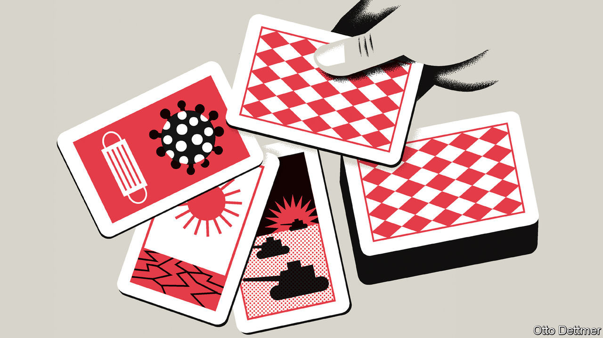

## Free exchange

# Psychological scars of downturns could depress growth for decades

> Research presented at the Jackson Hole conference models the effect

> Aug 29th 2020

FOR THE past 40 or so years, economists, central bankers and other eminences have gathered against the imposing backdrop of Wyoming’s Teton mountains every August, in order to chew over the great monetary challenges of the day. Not this year. As The Economist went to press the proceedings of the Jackson Hole symposium, organised by the Federal Reserve Bank of Kansas City, were unfolding online, thanks to covid-19. Those tuning in are all too aware of the economic damage wrought by the pandemic. But the headaches are only beginning. As one of the papers due to be presented at the conference explains, covid-19 is likely to reshape people’s beliefs about the world in ways that will complicate the already daunting task of restoring beleaguered economies to health.

The notion that a severe economic shock might do long-run damage is not new. Since the Depression macroeconomists have understood that deep downturns might tip an economy into a “liquidity trap”, in which interest rates fall to zero and monetary policy cannot easily provide a stimulating kick. Without a powerful dose of fiscal stimulus, the economy stays mired in a slump. Or a brutal recession may lead to “hysteresis” in the labour market, causing, say, a lasting increase in the unemployment rate. People out of work for long spells may become so disconnected from the labour market, as their skills and motivation erode, that even when demand recovers they struggle to find jobs. (In the 1980s Olivier Blanchard of the Massachusetts Institute of Technology and Lawrence Summers of Harvard University argued that this explained why unemployment was much higher in Europe than in America.) Both sorts of scarring could restrain economies as they leave the shadow of the pandemic.

Yet research also suggests that traumatic economic episodes can exert a drag on growth simply by altering people’s beliefs about the future. For example, Ulrike Malmendier of the University of California, Berkeley, and Leslie Sheng Shen of the Federal Reserve studied consumption patterns in the aftermath of downturns and find that periods of economic hardship and spells of unemployment tend to depress people’s consumption for some time, even after controlling for income and other variables. Consumers not only spend less but tend to opt for lower-quality or discounted items. Young people are especially affected, potentially prolonging the dampening effect on the economy. Pandemics unquestionably count as potentially scarring economic traumas. In one recent study of 19 of them, going back to the 14th century, Òscar Jordà, Sanjay Singh and Alan Taylor of the University of California, Davis, conclude that such outbreaks depress real rates of return for decades. They find that rates decline, on average, for about 20 years, and do not return to their previous level for 40 years. This effect, they speculate, could reflect the human toll exacted by past pandemics, which shrank the workforce and reduced the return on new capital investment. But they also reckon that an increase in saving by wary households could have a depressing effect.

New work by Julian Kozlowski of the Federal Reserve Bank of St Louis, Laura Veldkamp of Columbia University and Venky Venkateswaran of New York University, due to be presented at the conference, suggests that covid-19 could leave similar economic scars. As the authors explain, people’s investment decisions are shaped by their beliefs about the future. Their risk outlook is in turn influenced by their experience, and the addition of an extreme negative shock—like covid-19—to that stock of experience can lead to a mass revision of beliefs that lasts throughout their lifetimes. No doubt, even before the coronavirus spread this year, some people might have thought that highly disruptive pandemics could occur, based on experts’ warnings and an awareness of history. But the tangible, persistent and severe harms associated with an actual pandemic inform beliefs about the likelihood of another similar shock in a way that abstract knowledge cannot.

The authors build a model in order to assess how this effect on beliefs might influence the recovery from covid-19. After a very severe initial economic shock from the pandemic, output recovers but does not return to the previous growth trajectory. Part of that long-run depressing effect can be accounted for by “capital obsolescence”: the fact that some of the existing capital stock can no longer be used as efficiently as before, or at all. Office space, for instance, may be used less intensively, as a precaution. But people also revise down their expectations of the return on future investments because they expect pandemics to become more likely. This leads to less investment, other things equal, and slower growth. In the long term GDP is as much as 4% below its pre-crisis level. The authors reckon that the present discounted value of losses associated with capital obsolescence and changing beliefs may be as much as ten times larger than the cost of the initial shock. And most of the long-term loss stems from revisions to beliefs.

Psychological scarring could seriously complicate the policy response to covid-19. A rise in precautionary saving and decline in investment appetites will further depress interest rates, when their extremely low level is already constraining the size of the economic boost that monetary policy can provide. And pandemics are not the only shocks that could affect beliefs about risk. Those stemming from climate change also loom.

Governments do have tools to lessen the psychological damage wrought by crises. Spending on public goods like infrastructure could help, by raising the return to complementary private investments. So, too, might a more robust safety net, by limiting the cost to individuals of economic bets gone bad. A full recovery, though, might also require work to reduce the likelihood and potential harm of future shocks in the first place, through better pandemic preparedness, say, and efforts to slow climate change. Anything less leaves the job of rehabilitating the economy unfinished. ■

## URL

https://www.economist.com/finance-and-economics/2020/08/29/psychological-scars-of-downturns-could-depress-growth-for-decades
