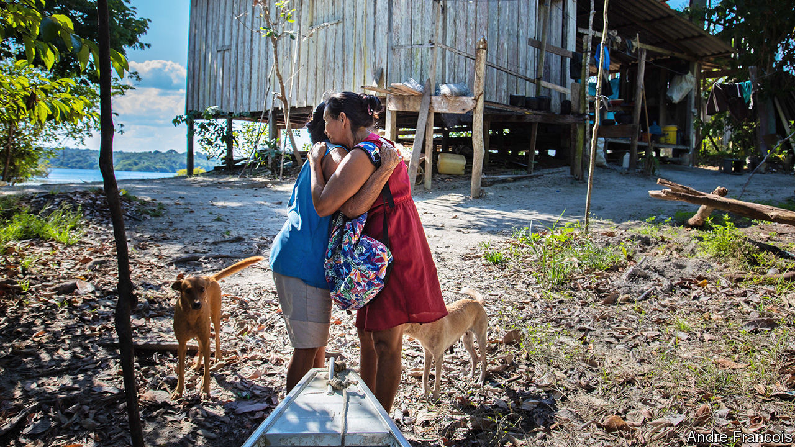
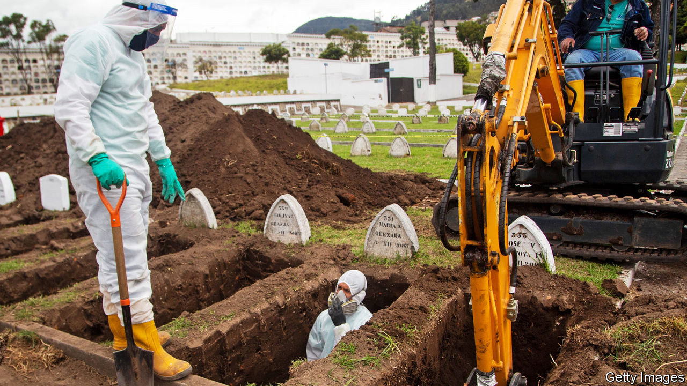
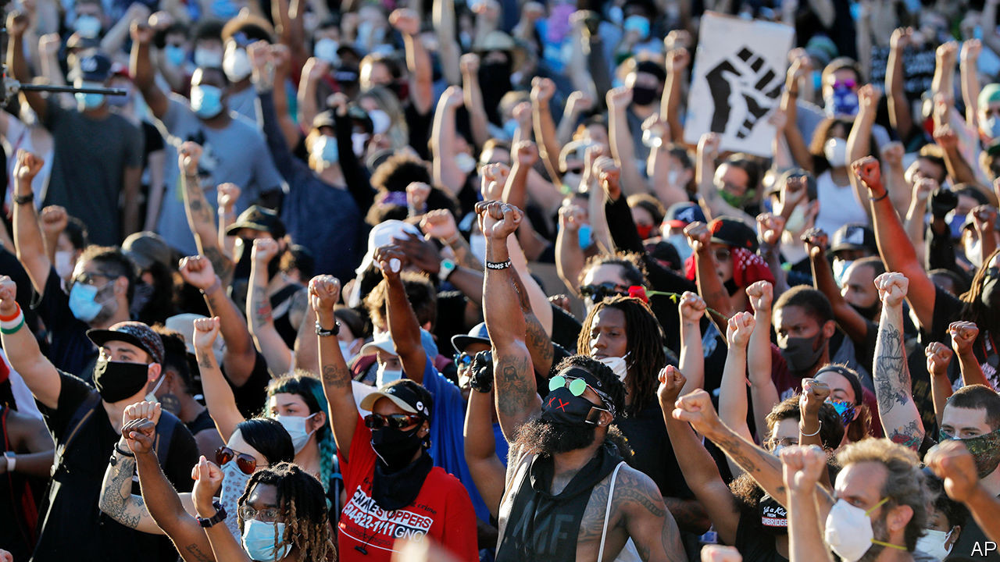

## The common tragedy

# Worldwide covid-19 is causing a new form of collective trauma

> Neighbours will have to confront it together

> Aug 29th 2020BEIJING, CODOGNO, HONG KONG, MANAUS, NEW YORK, PARIS AND QUITO

Editor’s note: Some of our covid-19 coverage is free for readers of The Economist Today, our daily [newsletter](https://www.economist.com/https://my.economist.com/user#newsletter). For more stories and our pandemic tracker, see our [hub](https://www.economist.com//news/2020/03/11/the-economists-coverage-of-the-coronavirus)

THE NIGHTMARE began in earnest for residents of Parque das Tribos when their cacique, or local chief, died of covid-19. Messias Kokama had battled politicians, developers and drug gangs to transform a dusty informal settlement on the outskirts of Manaus, a city of 2m people deep in the Brazilian Amazon, into a haven for some 600 indigenous families from 35 ethnic groups. He was 53 and said he wasn’t afraid of the virus. His death on May 13th shook the community.

By then, hospitals in Manaus were turning people away and cemeteries were digging mass graves. Ambulances wouldn’t come to Parque das Tribos (“Tribes Park”) because the city and the federal indigenous agency each claimed that indigenous city-dwellers fell to the other institution. Such neglect exacerbated their grief. Every few days another elder would start gasping for air. Those who made it back from hospital told horror stories of frigid wards packed with dying patients and doctors who didn’t speak their language. One resident fled the ICU. “He said he would rather die in a hammock than surrounded by tubes,” said his daughter-in-law, Cláudia Baré. Five weeks later, he did.

The pandemic has now subsided in Parque das Tribos. Burials in Manaus have fallen from more than 150 per day to the pre-pandemic norm of around 35. Sunbathers once again pack Ponta Negra beach on the banks of the Rio Negro. It scarcely seems imaginable that just two months ago, boats were arriving at the port with covid-19 patients who had died on the journey. Yet the chaos of the past few months is giving way to a second crisis. Lingering trauma and continued hardship will take much longer to overcome. Mr Kokama’s daughter, Mirian, is being treated for depression. His son, Miqueias, who is 33 and took over as chief, barely sleeps.

For some, the second half of 2020 will bring much-needed relief. For the time being the number of new recorded global infections has plateaued. In many countries it has dropped dramatically. Yet for those places hit hardest, a full recovery will depend on more than getting the virus under control. In a world paralysed by death, survivors are everywhere: ICU patients who faced the horror of covid-19 first-hand, doctors and nurses who cared for them, relatives forced to mourn over WhatsApp and Zoom, families who lost their livelihoods. Mental-health professionals say that no single event since the second world war has left so many people in so many places traumatised at once. How people fare in the months and years ahead will depend partly on how their countries—and, more importantly, their communities—respond.

In 1972 a dam burst at a coal mine in West Virginia and 132m gallons of sludge ripped through the Buffalo Creek valley, killing 125 people and destroying thousands of homes. The victims’ lawyers hired Kai Erikson, a sociologist, to study the aftermath of the flood. It had swept away not only physical belongings, but also relationships, routines, tradition and trust. He called this devastation “collective trauma”.

The way Mr Erikson saw it, traumatic experiences harm individuals, of course. But they can also change group dynamics. People stop trusting each other. It becomes harder to bring people back together and easier to open new wounds. If nothing is done, this can permanently damage a society—and even destroy it. In Buffalo Creek untreated grief and neglect en masse led to the demise of several towns.

Though the term may have been new, the experience of collective trauma was not. Mass trauma has now been identified in the context of wars, natural disasters and terrorist attacks. Research shows that people and communities are typically very resilient. Yet exposure to death puts them at greater risk of lasting affliction. Violence and disasters owing to negligence—such as the Buffalo Creek flood or the explosion on August 4th at a warehouse in Beirut that killed some 150 people—are more likely to lead to trauma than “acts of God” such as hurricanes or earthquakes.

Pandemics do not fall neatly into either category. During the Severe Acute Respiratory Syndrome (SARS) outbreak in Hong Kong in 2003, nearly 40% of the population experienced increased stress, 16% showed signs of trauma and only 25% believed they were very likely to survive if they contracted the disease even though the death rate was around 10% of people infected. A review of studies involving patients treated for SARS found that a third went on to develop symptoms of post-traumatic stress disorder (PTSD), a condition that can result in vivid flashbacks and difficulty sleeping. But past epidemics are imperfect proxies for covid-19. Its unprecedented reach across the globe and into nearly every aspect of life makes it more like a world war.

There were no large-scale psychological studies during the first or the second world wars, though the Holocaust would become the event most deeply associated with mass death and grief. Researchers in the early 2000s found roughly half of Holocaust survivors were still suffering from PTSD. Many had other disorders such as schizophrenia. Even among non-Jewish Europeans who were children during the war, 10-40% still had PTSD symptoms. In communities of survivors, research has shown that “inherited trauma” can be passed to subsequent generations, by growing up flooded with their parents’ memories, and possibly, through genes.

The suffering caused by covid-19 falls far short of the horrors of the Holocaust. Still, Krzysztof Kaniasty, a psychologist and disaster expert, points out that the pandemic presents nearly all the risk factors for PTSD. It has caused sudden death, life-changing events, large-scale social ruptures and chronic stressors like uncertainty and the added hassles of daily life.

The luckiest will suffer mildly from one or two of these effects. Yet more than at any other point in recent history, millions of people have been slammed by all of them. In the first large-scale survey of a developed country struck by covid-19, published in July by Psychiatry Research, 29% of 15,530 Britons surveyed met the criteria for a general psychiatric disorder. In Spain, where a shortage of protective kit has meant nearly a sixth of all covid-19 infections are of health workers, more than half are showing signs of PTSD. Another study found 86% of Bangladeshis are dealing with covid-related stress, resulting in insomnia, irritability and family problems.

There are signs of hope. In the long run people fare better when they perceive strong social support in the aftermath of a catastrophe and worse when they feel neglected or excluded. “Strong communities buffer against adverse traumatic effects,” says Joshua Morganstein of the Uniformed Services University in Bethesda, Maryland. His studies of health workers in Florida after hurricanes in 2004 and 2005 found lower rates of PTSD and depression among those who reported living in places with tight-knit social circles, which are better able to organise in times of crisis.

On February 21st the first case of covid-19 in Italy was diagnosed at a small hospital in Codogno, a serene town with cobbled streets not far from the river Po. Its inhabitants were soon experiencing drama of a sort they had seen only in films. Roadblocks were thrown up around the newly declared “red zone” and residents besieged pharmacies for personal protective equipment (PPE), which quickly ran out. “It was like being in a war with an invisible enemy,” says Rosa Cavalli, whose family owns one of the pharmacies.

But within days, 100 people were working as volunteers at an operation centre run by Italy’s disaster-response service. The struggling community radio station, which was renamed “Red Zone Radio”, began putting out twice-daily bulletins to counter fake news and conspiracy theories. “There was an initial moment of disorientation,” says Nicoletta Porcu, a psychologist who formed part of a crisis group with colleagues. But the outpouring of support helped the town emerge strengthened from the trauma.

Mr Kaniasty, the professor, has found that “received support” that might come in the form of a donation is less important for psychological outcomes than “perceived support”, the feeling that people can rely on their neighbours. As Codogno came out of lockdown in June, the degree of compliance with distancing rules—necessary for recovery—was astonishingly universal. The parish priest, Monsignor Iginio Passerini, was taken aback during confession to hear a young boy list among his sins that of having lowered his face mask outdoors.

Mass tragedies can teach groups of people how to avoid or mitigate them in future. Such “adversarial growth” helps explain why commuters in Hong Kong wore masks before any covid-19 cases had been reported. Most credit the territory’s scarring experience with SARS, which included tragic mistakes. But it also raised the profile of doctors. A record number of students applied to study medicine. The government added isolation wards in hospitals, trained infection specialists and stockpiled PPE.

Such investments paid off this year. Not a single covid-19 death was reported among Hong Kong’s hospital workers. The response earned the unpopular government a ratings boost, but a controversial security law has undermined public trust and may compromise its mass-testing strategy.

Covid-19 is easier to deal with than some traumas. It moves more slowly and is more dispersed than a natural disaster, buying governments time. Unlike a war or a terrorist attack, there is no direct human enemy to blame. Some find comfort in the fact that the whole world is going through hardship at once. When Wayne Bai, a worker at a telecoms company in Wuhan, made a business trip the day after the city’s lockdown lifted, he was denied a room at seven hotels. But his annoyance faded as the virus spread across the globe.

This universality has drawbacks, of course. One is that poor countries cannot turn as readily to rich ones for money or supplies. Aid workers who usually arrive after disasters would have been welcome in Guayaquil, Ecuador, where funeral services collapsed in late March, leading to a pile-up of bodies in homes. Zaida Rovira of the public ombudsman’s office recalls trying to console a 70-year-old who had spent four days with his brother’s body in the room they shared. At the Guasmo hospital, relatives had to enter refrigerated containers to look through hundreds of unlabelled corpses. More than 70 remain unidentified. Only recently did staff start collecting DNA samples after admitting sending photos of the bodies to relatives on WhatsApp may have led to misidentification.

Guayaquil, a tropical business hub of 2.7m people, is still counting the dead. They may top 10,000, which would give it one of the highest death rates of any big city. Yet it disappeared from headlines in April and has had to deal with its trauma alone. Most family members have received no psychological support. This points to yet another important characteristic of covid-19—its mental-health burden falls unequally in different parts of the world.

This exacerbates suffering in areas that failed to implement lessons from prior traumas. Parts of New Orleans where black people died of covid-19 at rates two to three times higher than white people were the same areas ravaged by Hurricane Katrina in 2005. Then, racist housing policies had herded minorities into low-lying areas. Now, a higher share of minorities work in front-line jobs cleaning hospitals or stocking shelves. They also have more underlying health problems like diabetes, often caused by poor access to primary care.

Good leadership can bring people together in a crisis. Polarising leadership has the opposite effect. In Brazil President Jair Bolsonaro has echoed his American counterpart’s claim that the economic fallout of covid-19 is a greater trauma than the death toll. In both countries social distancing is a political statement. Even when hospitals were full in Manaus, less than half of people stayed at home. The local governor tried to cast himself as responsible, but people stopped trusting him after his health secretary was arrested on charges of embezzlement tied to a fake respirator company, which she denies. Corruption was more blatant in Guayaquil. The ombudsman’s office is investigating reports that morgue staffers demanded $700 from relatives to return bodies, though most family members are too traumatised to sue.

Chaos at the top makes it harder to grapple with a harsh reality. Some stop believing altogether. Psychologists who set up a hotline in Manaus were surprised to discover that even callers who had lost relatives downplayed the virus’s role, claiming other ailments ultimately killed them. Many believe online conspiracy theories, such as one claiming the state had exaggerated the death toll to receive more federal money and another alleging that the coffins buried in mass graves were filled with rocks. Sônia Lemos, who ran the hotline, said locals were going through collective denial. “It’s a defence mechanism that saves people from feeling responsible.”

There is a danger that political divisions, social distancing and economic woes will over time lead to a loss of togetherness in the same way that displacement after the Buffalo Creek flood gave “a degree of permanence to what might otherwise have been a transitional state of shock”, in the words of Mr Erikson. Communities cannot grieve together because the disaster is ongoing and the threat has yet to disappear, says Judith Lewis Herman, a psychiatry professor at Harvard Medical School. She describes three stages of healing: re-establishing safety, remembrance and mourning, and reconnecting with others. Social distancing complicates all of them.

And so like the pandemic itself, the psychological fallout will require assessment and adaptation. Many doctors are still focused on saving lives, but governments and mental-health professionals should start thinking about “psycho-social” interventions. In France “medical and psychological emergency units” offer one model. They were launched to respond to mental-health concerns after a terrorist attack in 1995. People are offered psychological support immediately, near the scene, just as they would be offered paramedical services. Four years after 86 people were killed in Nice in a terrorist attack, the city has broadly returned to normal, says Frédéric Jover, the psychiatrist then running the unit. But empty streets this spring brought back ghastly memories. Nice reactivated its unit to help people struggling with bereavement, anxiety and isolation.

The fact that covid-19 is slower than a bomb or a flood gives governments and NGOs an opportunity to identify and deal with mental-health issues before it is too late. Fuelled by national protests against racism and police violence, advocacy groups in Louisiana are proposing policies for a “racially and economically equitable” covid-19 recovery. New York City’s health department is hosting virtual town-hall meetings for African-Americans, including webinars about bereavement.

But it will not be easy to sustain the recent surge in community organising and mutual-aid networks (such as WhatsApp groups to bring groceries to old people) that have sprung up across the country. Fatigue and forgetting can lead social networks to deteriorate, says Sarah Lowe of the Yale School of Public Health. “Often people are still recovering when resources are cut off.” One of her studies found that a year after Hurricane Sandy, which hit New York City in 2012, mental-health outcomes were similar across demographic groups. But two years on, the poor were faring worse.

Poor countries spend much less on mental-health services and their citizens have fewer resources to get help. So healing will have to come from the ground up. This will require the creation of spaces—physical or virtual—for people to come together. In Parque das Tribos Ms Baré organised a WhatsApp group to distribute food baskets. A local nurse used her free time to go door-to-door checking on covid-19 cases and eventually persuaded the city to send a mobile-health station. Mr Kokama’s family petitioned the courts for permission to bring his body back for a 30-minute, closed-coffin ceremony.

His friends and neighbours gathered on a recent Sunday, the first time since the funeral, settling into lawn chairs to watch local dance groups perform to raise money on Facebook Live. “This is still a cry for help,” said Luciana Vasconcelos as she painted her friend’s face red and black. She added that Parque das Tribos owes its existence to a kind of collective trauma: indigenous people leaving the forest for the city in search of a better life. A speaker boomed out traditional lyrics with modern beats, and a mobile phone on a tripod filmed the dancers, some in T-shirts, others in beads, all beaming with a stubborn sort of hope.■

## URL

https://www.economist.com/international/2020/08/29/worldwide-covid-19-is-causing-a-new-form-of-collective-trauma
