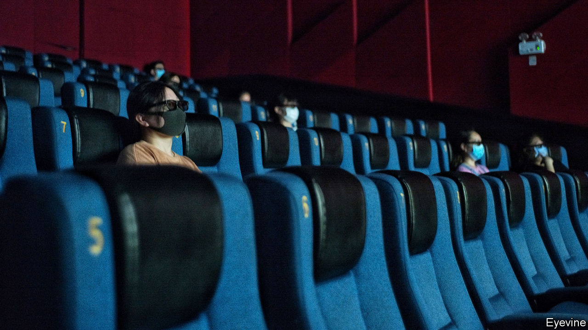

## Un-American activities

# How Hollywood should deal with Chinese censors

> Upholding freedom of speech means leaving the studios alone

> Aug 29th 2020

THE CURTAINS are still down at most American cinemas but in China the box office is back in business. This week audiences lined up—socially distanced, of course—to see films including “The Eight Hundred”, a war drama for which Americans will have to wait. Next week Disney will send its summer tentpole, “Mulan”, straight to streaming in most of the West, whereas Chinese filmgoers will get the chance to watch it on the big screen.

China’s box office increasingly props up Hollywood. China may overtake America as the world’s largest cinema market by revenue this year. Meanwhile, Chinese media companies are investing in American films. The result is that, from “Mulan” to “Pacific Rim” and “Kung Fu Panda”, Hollywood’s output is geared towards the Chinese market (see [article](https://www.economist.com//node/21791222)).

But it is also tailored to Chinese censors. Sometimes just the Chinese version of a film is altered to please them. But on occasion the version that global audiences see is changed, too. That is causing alarm. America’s attorney-general has accused the movie industry of “kowtowing”. Politicians have proposed penalties for studios that agree to censors’ edits. As it pushes deeper into this promising new market, Hollywood faces the growing risk of official interference—not just in China but at home, too.

China used to be an afterthought in Hollywood. In 2005 its box office took $275m. Last year the figure was nearly $10bn. A cinema-building binge has left China with almost as many screens as Europe and America combined. Such a market cannot be ignored: it can mean the difference between a blockbuster and a bomb. Hollywood studios would be foolish not to tailor films for their fastest-growing audience. Nor is it a bad thing if, after a century of American-dominated movies, the script allows for superheroes and princesses who are not Western.

Yet the fears over censorship are well-founded. Some of the Chinese bureaucrats’ demands are silly, like their insistence that dirty laundry be removed from a Shanghai skyline in “Mission: Impossible III”. But airbrushed underpants are not the end of it. Flags are removed and maps altered. To get a release in China, movies must avoid the “three Ts” of Tiananmen, Taiwan and Tibet. American actors who once liked to pose with the Dalai Lama know that a selfie could get them blacklisted by the Chinese authorities. The sanctions are asymmetric: when Liu Yifei, who plays Mulan, tweeted support for the police who put down pro-democracy protests in Hong Kong, Disney said nothing.

The trouble is that the proposed cures are often worse than the disease. Ted Cruz, a senator from Texas, wants studios that agree to censors’ demands to be banned from working with the Department of Defence, which lends its hardware as props. That would turn the government into an arbiter of what is politically acceptable—surely an idea more at home in the Communist Party than the Republican one. PEN America, a free-speech body, says studios should disclose any changes they make to their Chinese releases. A fine idea—but studios have little incentive to do so, and if forced, they might respond by ensuring the original cuts of their movies were inoffensive enough to pass without edits, thus subjecting the whole world to China’s censorship.

Fortunately, two factors should limit Hollywood’s kowtowing. First, bending too far for the Chinese market risks losing the American one. When the National Basketball Association apologised to “our Chinese friends” for the pro-Hong Kong tweet of a team’s manager, American fans’ indignation forced it to backtrack. Activision Blizzard, an American gaming firm, performed a similar U-turn after fans decried its punishment of an e-sports competitor who had spoken out about Hong Kong. Following Ms Liu’s tweet about the police, #boycottMulan started trending. Hollywood casting directors have long memories and are as allergic to controversy as any communist censor.

The other factor is the rise of streaming. Whereas the box office is global, streaming is not. Locked out of China, Netflix can commission documentaries like “Joshua: Teenager vs Superpower”, about a Hong Kong activist. The economics of streaming are all about exploiting niches, making it easier to say different things to different audiences.

All this calls for a dose of that rarest of Hollywood ingredients: realism. There is no way to eliminate the Chinese government’s influence on the global film industry. But Western policymakers should hold back from telling film-makers what they can say. Upholding freedom of speech starts with leaving them alone—and leaving the meddling to China. ■

## URL

https://www.economist.com/leaders/2020/08/29/how-hollywood-should-deal-with-chinese-censors
