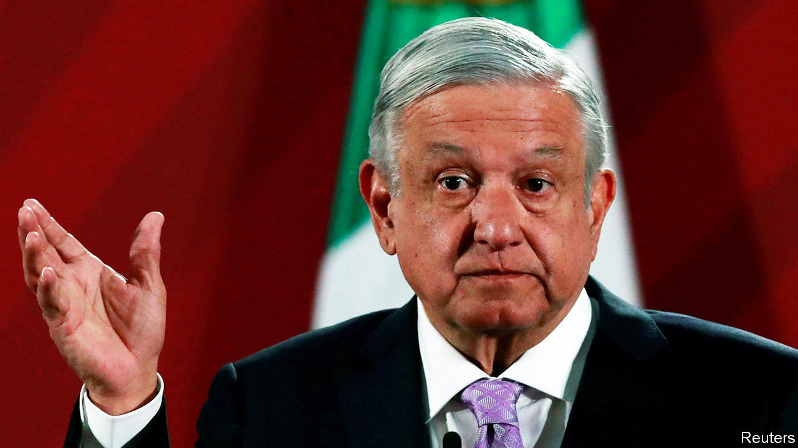

## Integrity theatre

# Mexico’s president shows how not to handle a scandal

> Rather than strengthening institutions to fight graft, Andrés Manuel López Obrador is grandstanding

> Aug 29th 2020

THE ALLEGATIONS are unproven but stunning. In a 63-page deposition, disclosed on August 19th, Emilio Lozoya, once head of Pemex, Mexico’s state oil firm, accuses 17 prominent Mexicans of corruption. According to Mr Lozoya, Enrique Peña Nieto, president in 2012-18, benefited from the payment of millions of dollars by Odebrecht, a Brazilian construction firm that has bribed officials across Latin America. The money financed his election campaign and coaxed legislators to vote for energy reforms (see [article](https://www.economist.com//node/21791232)). The governor of Veracruz gave him a Ferrari, Mr Lozoya says. Felipe Calderón, Mr Peña’s predecessor, oversaw corrupt dealings between Pemex and Braskem, a petrochemical firm part-owned by Odebrecht. Mr Lozoya fingers two candidates in the presidential election in 2018. The size of the pay-offs, and the status of alleged recipients, would make this the biggest scandal in Mexican history.

President Andrés Manuel López Obrador sees it as a vindication. AMLO, as he is known, has long argued that poverty and inequality are the fault of a “corrupt regime”. He won a landslide victory in 2018 by vowing not just to reduce graft but, implausibly, to eliminate it.

If he were serious, he would step back and allow a thorough, impartial investigation of Mr Lozoya’s charges, followed by trials. That would provide a model for punishing corruption and discourage future wrongdoing. The scandal might thus mark a turning point in Mexico’s losing struggle against bribery. That is what AMLO says he wants, but it looks unlikely. He would rather win applause for decrying fraud than build the institutions to investigate, punish and prevent it.

Some of those institutions are already in place, thanks to Mr Peña, of all people. He established an “anti-corruption system”, which provides for an attorney-general separate from the executive branch, an anti-corruption prosecutor and an oversight role for NGOs. However, his government ensured that the new apparatus would not work properly, by stalling appointments and blocking investigations. And AMLO has done little better. The attorney-general, Alejandro Gertz, is a political ally (he was AMLO’s security adviser during the election campaign). Mr Gertz chose an anti-corruption prosecutor without issuing a public call for candidates. Last year the budget for the prosecutor’s office was the lowest sum allocated since 2008.

In the Lozoya case these officials look like bystanders. The president plans to hold a referendum on whether former presidents should be prosecuted, in effect handing the prosecutors’ job to voters. That is incompatible with the rule of law. He also showed a video of officials counting cash at his morning press conference and had himself filmed flipping through Mr Lozoya’s dossier while offering a running commentary. Such grandstanding contrasts with the Lava Jato (Car Wash) anti-graft investigations in Brazil, which were conducted by independent judges and prosecutors, and went after three former presidents.

Few question AMLO’s personal probity, and his government has been less scandal-prone than its predecessors. But in some ways it may be encouraging corruption. AMLO cut the salaries of senior officials, increasing their temptation to seek pay-offs. The share of Mexicans who say they have paid bribes rose by 7.5% between 2017 and 2019, and the average amount of bribes they paid leapt by 70%, says an official survey.

Soon after Mr Lozoya’s testimony came out, a video surfaced of AMLO’s brother accepting bags of cash in 2015 from an official in the state of Chiapas to support Morena, AMLO’s political party. Of course the matter should be investigated, AMLO said. He insisted that there is no comparison between the misdeeds of past governments and anything Morena might have done.

His words ring hollow. Cleaning up Mexico requires building effective, independent institutions. This may be slower and duller than presidential showboating, but it is far more likely to work. Mexico needs the rule of law, not a strongman. ■

## URL

https://www.economist.com/leaders/2020/08/29/mexicos-president-shows-how-not-to-handle-a-scandal
