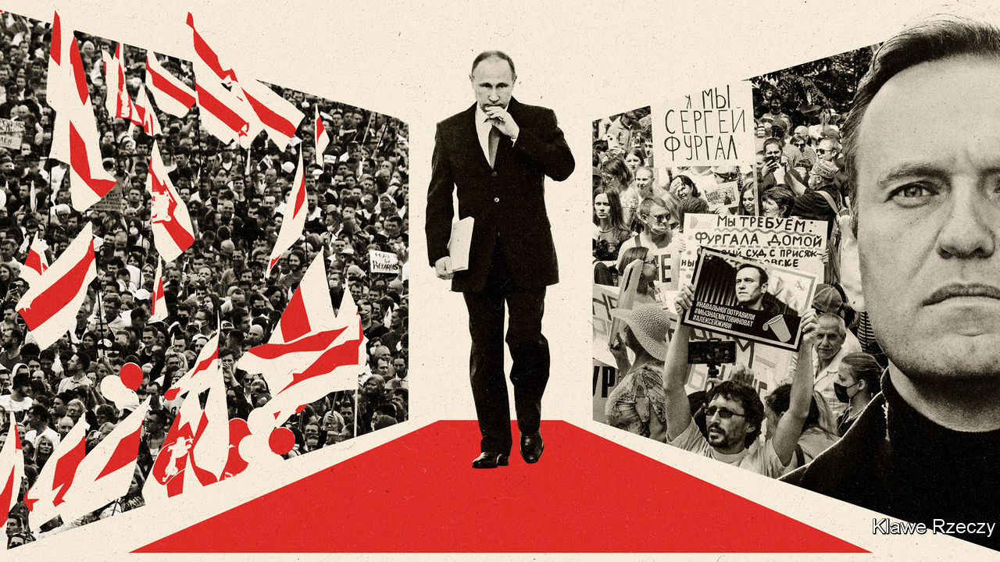

## What Putin fears

# Russians and Belarusians are tired of backwards-looking autocrats

> The old tools of truncheon and syringe may keep them in power. But for how long?

> Aug 29th 2020

NOTHING IS AS inspiring as seeing people take to the streets to demand their freedoms—and nothing is as terrifying for the dictators they are defying. In Belarus, among scenes that recall the revolts of 1989, people are turning out in their hundreds of thousands after a blatantly rigged election, heedless of the threat of state violence. In the Russian city of Khabarovsk tens of thousands march week after week to protest against the arrest of the local governor and the imposition of Moscow’s rules. Vladimir Putin is rattled. Why else is Alexei Navalny, an anti-corruption crusader and Mr Putin’s greatest popular rival for the Russian presidency, lying poisoned in a Berlin hospital bed?

Regimes that rule by fear, live in fear. They fear that one day the people will no longer tolerate their lies, thieving and brutality. They try to hang on with propaganda, persecution and patronage. But it looks increasingly as if Mr Putin is running out of tricks, and as if Alexander Lukashenko, his troublesome ally in Minsk, is running out of road (see [article](https://www.economist.com//briefing/2020/08/29/the-uprising-in-belarus-and-the-poisoning-of-alexei-navalny)). That is why, despite the Kremlin’s denials, they are falling back on the truncheon and the syringe. And it is why, as the protests roll on, they must be wondering whether state violence can secure their regimes.

Both leaders came to power promising relief from the chaos that followed the collapse of the Soviet Union. Mr Putin offered his citizens a deal: stay out of politics and you will get order and better wages. Mr Lukashenko promised Soviet-style continuity. Mr Putin was lucky that oil prices soared after he took over. Ordinary Russians benefited (though not nearly as much as the regime’s cronies). Mr Putin built a mafia state; Mr Lukashenko, an old-fashioned dictatorship. Both men seek to project an image of strength through tame media—Mr Lukashenko had himself filmed this week whizzing around in a helicopter and brandishing an AK-47 to face down the supposed Western plot to overthrow him. However, neither regime can reform itself. They may use state television to proclaim virtual change, but they struggle when it comes to the real thing.

Start with the economy. Belarus retains a theme-park version of the old Soviet system. When Mr Lukashenko went to gather support among the workers, he flew off to a state-owned tractor factory like some latter-day Lenin. The country’s exports largely consist of potash and petroleum products refined from Russian oil that used to be discounted. Russia is different from Belarus. Its economy is more open and less monolithic. Yet the commanding heights of industry and finance are in the hands of the oligarchs in the Kremlin’s trusted circle. Mr Putin has thus been unable to unleash competition and dynamism without upsetting the relationships that keep him in power. He has failed to diversify away from hydrocarbons, so the recent double shock of low oil prices and covid-19 has sent the economy reeling. As belts tighten, he has nothing to offer but nationalism and nostalgia.

That cocktail is losing its potency. For two decades Mr Putin has invoked an imaginary past of glory, plenty and certainty in the days of the Soviet and tsarist empires. His regime is a pioneer of disinformation. It invented the troll factory, and has created a media environment where, as one commentator put it, “nothing is true and everything is possible”. Yet Mr Putin’s offering looks tired next to that of Mr Navalny, whose popular YouTube videos are as skilful as the regime’s, but resonate with a growing sense of frustration. They are also grounded in exhaustive research into the regime’s corruption—and thus, in reality.

As well as failing to bring about economic and cultural renewal, both Mr Putin and Mr Lukashenko have failed to renew their regimes. Neither has a plausible successor. Mr Lukashenko has taken to trotting out his 15-year-old son, most recently in combat gear. Mr Putin cannot easily groom a successor lest it upset the factions he must keep sweet. This year he attempted to solve the problem by changing the constitution to allow himself to stay in power until 2036, when he will be 84. But that, too, was a sign of exhaustion. Mr Navalny, by contrast, has been busy organising opposition votes for regional elections to be held on September 13th. He may have been removed from the stage because if Russia had seen a popular movement like that in Belarus, he would have been its most plausible leader.

Mr Navalny’s poisoning is evidence that when these regimes run out of ideas, they resort to violence. And yet Belarus shows how hard a tool violence is to wield. Mr Lukashenko tried savage repression by arresting and torturing protesters but, so far, it has emboldened them and further undermined him. Sunday’s huge protests overwhelmed his threat to use force against them. He might have been willing to kill people in their hundreds or thousands, but he cannot afford to lose the loyalty of his security forces. Mr Putin recognises that blunt force used against the people could fuel further protests—it is why the Kremlin has largely left the demonstrators in Khabarovsk untouched in the hope that they will lose interest. But were the protests to start to spread from the far east, Mr Putin would face a similar calculus. He can arrest and intimidate the elites all he likes. The people, in sufficient numbers, are less easy to control.

What can other countries do about all this? The answer begins with defending the principle of human rights. Germany has correctly offered asylum to Mr Navalny. Its doctors can explain what was done to him—and be believed by ordinary Russians. The European Union and America have properly declined to recognise the results of Mr Lukashenko’s stolen election. Their refusal may be spun by propagandists in Minsk and Moscow as evidence that the protests are a covert operation by the West, but the people in the street do not believe it. Outside powers should warn Russia that any use of force in Belarus would be followed by severe sanctions. Mr Putin and Mr Lukashenko will not be restrained by moral, legal or diplomatic norms, but if they spill blood to stay in office there must be consequences.

How long these two dismal regimes will survive is anyone’s guess. Backward-looking autocracies can cling on for years. Mr Putin and Mr Lukashenko are not alone in taking power and promising a return to an imagined era of lost glory. But the pattern is clear. Although this may feel good at first, the people eventually become, in the words of one Belarusian protester, “sick of them”. And that is when dictators should be afraid.■

## URL

https://www.economist.com/leaders/2020/08/29/russians-and-belarusians-are-tired-of-backwards-looking-autocrats
