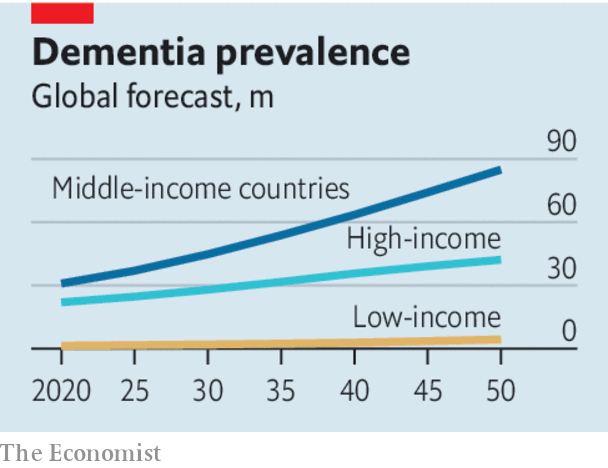

## The memory hole

# The rising prevalence of dementia is a global emergency

> It requires more research, better provision for long-term care and changes in individual behaviour

> Aug 29th 2020

OF ALL THE troubles facing the world, the rising prevalence of dementia might seem among the less pressing. The reason behind it—longer lifespans—is to be cheered; it does not advance at the speed of a viral infection but with the ponderous inevitability of demographic change; and its full effects will not be felt until far into the future. But the reality is very different. As our special report this week makes clear, dementia is already a global emergency. Even now, more people live with it than can be looked after humanely. No cure is in the offing. And no society has devised a sustainable way to provide and pay for the care that people with it will need.

“Dementia” is an umbrella term for a range of conditions, with a variety of causes, of which the most common is Alzheimer’s disease, accounting for 60-80% of cases. It usually starts with forgetfulness and a mild loss of cognitive functioning. But as it advances, people lose the ability to look after themselves. Many require round-the-clock care long before they die. It does not just affect the elderly, but they are much more likely to have it—and life expectancy globally has climbed from not much more than 30 a century ago to over 70 now, and over 80 in rich countries. By some estimates, 1.7% of 65- to 69-year-olds have dementia and the risk of developing it doubles every five years after that. At present, about 50m people around the world have the condition, a number expected to rise to 82m by 2030 and 150m by 2050. Most of the new cases are in the developing world, where populations are rising and ageing.

The problems these numbers will bring everywhere have already been felt in countries where people are older, and especially acutely during lockdowns—witness the difficulty of looking after people with dementia in their own homes, and the large numbers in overstretched care homes who receive little individual attention. As families shrink, single children and grandchildren will struggle to cope with their old folk. Already, dementia care has had a knock-on effect on general health care. Before the pandemic as many as a quarter of beds in British hospitals were occupied by people with dementia. There was nowhere else for them to go.

Not all the news is bad. Recent research has shown that behaviour such as smoking less, exercising more and losing weight in middle age has reduced the risk of dementia among old people in some Western countries in the past 30 years. And America’s Food and Drug Administration has promised to decide by March 2021 whether to license a drug said to be the first to stem cognitive decline in Alzheimer’s patients. But the risk of dementia still seems to be rising in much of the world and any new therapy in the foreseeable future is likely to benefit only some patients partially.

That is why governments should act now to lessen the social and economic harm from the growing prevalence of dementia. The first step is to recall the urgency with which many were promising to tackle the problem just a few years ago—in 2013, for example, when David Cameron, then Britain’s prime minister, used the rotating chairmanship of the G8 to convene a “dementia summit”, which promised to fund research with the goal of finding a “disease-modifying treatment” by 2025. Instead, funding for work on dementia has lagged far behind that for cancer or coronary heart disease. And as the pandemic hampers or prevents clinical trials and research, and sucks resources away from other areas, dementia risks again being left behind.

Governments also need to think about long-term care for people with dementia. The question that is most often asked is how to pay for it. Japan’s compulsory long-term-care insurance scheme, requiring everyone aged 40-65 to pay a premium, seems attractive, as it avoids penalising the young. But it is not self-financing. The increasing burden there as elsewhere will fall on individuals and the taxpayer.

And an even more fundamental question than who pays for care is: who will do it? Undertaken with humanity and dignity, it is extremely labour-intensive. Technology can help lighten the load—using remote monitoring to let people stay at home and, perhaps in future, robots to perform some basic tasks (see [article](https://www.economist.com//science-and-technology/2020/08/25/robots-that-can-walk-are-now-striding-to-market)). But looking after people with dementia requires people. The job is usually classified as low-skilled and is often poorly paid. In fact it demands huge reserves of patience, empathy and kindness. It should be better rewarded and more highly regarded even though that would add to the bill. In countries such as Japan and Britain, with acute shortages of care-workers, immigration will have to be made easier for those willing and able to do it.

Lastly, evidence suggests that as many at 40% of cases of dementia can be delayed or averted by changing behaviour earlier in life. The trouble is that public-health campaigns have a patchy record and they do nothing for dementia’s most intractable pre-existing condition—old age. No cure, insufficient financing and a tricky public-health message: perhaps that is enough to make you throw up your hands in despair. Instead, however, it only underlines how the solutions to dementia, like the disease itself, will take decades to unfold. It is yet another reason to start working on them right away. ■

## URL

https://www.economist.com/leaders/2020/08/29/the-rising-prevalence-of-dementia-is-a-global-emergency
