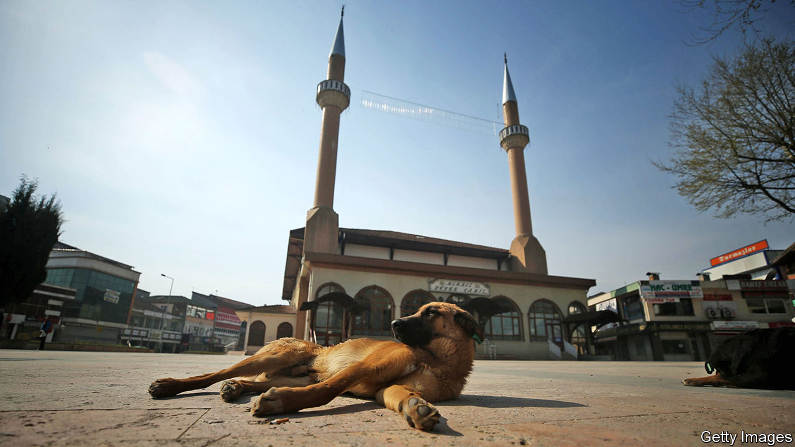

## Bone of contention

# Are dogs acceptable pets, Muslim scholars ask?

> Egypt’s Grand Mufti says they are. Others are dogmatically opposed

> Aug 29th 2020

AMONG THE many controversies that divide Muslim thinkers, the status of dogs is a minor one. But every now and then the debate is renewed. Earlier this month Egypt’s grand mufti, Shawki Allam, weighed in on the side of man’s best friend. Whereas some interpretations of Islam deem dogs impure, Mr Allam says: “It is possible to coexist with a dog and still worship God.” Citing the Maliki school of Islam, he claims that every living animal is pure.

Conservative clerics are not rolling over, though. They cite certain hadith (sayings of the Prophet Muhammad) to support their dogmatically anti-dog position. Angels will not enter a house if there is a dog present, says one. Another warns that a Muslim keeping a dog will lose out on some of the spiritual rewards from his good deeds. Yet there are caveats. Angels don’t seem to mind if the dog is outside. And dogs used for herding, hunting, farming and guarding appear to be exempt from the rules.

Perhaps the most contentious issue is a dog’s saliva. “Cleanse your vase which the dog licked by washing it seven times and the first is with earth (soil),” goes another hadith. But Mr Allam says that if you perform wudu (ablution) and a dog licks you, there is no need to rewash before praying. What about dog fur? Many scholars think it is clean and, therefore, petting is okay. But fierce debate ensues if the fur is wet.

The Koran itself says little about dogs. Scholars claim that the Prophet prayed among canines. A few years ago Osama al-Azhari, a religious adviser to Egypt’s president, Abdel-Fattah al-Sisi, was photographed shaking the paw of a dog. Conservatives growled. But Mr Azhari pointed to the story of the Seven Sleepers: a group of young men who hide in a cave to escape religious persecution. They take a 300-year nap while their dog, stretched out at the entrance of the cave, keeps watch. (Conservatives note that the animal was not in the cave.)

The current debate in Egypt may be more about power than pups. Mr Sisi wants to assert more control over Islam via Dar al-Ifta, the state’s Islamic advisory body led by Mr Allam, and at the expense of al-Azhar, a conservative seat of learning. Lately Dar al-Ifta has espoused relatively progressive views in order to win over the public. Mr Allam’s ruling on dogs was preceded by a condemnation of sexual harassment. In general, Mr Allam says he wants to make it easier for Muslims to practise their faith.

Islam is hardly the only religion to feature confusing and contradictory texts—or to have mixed feelings about canines. Dogs are often used as a symbol of evil in the Bible. They are also portrayed negatively in the Talmud. To many Muslims, the whole debate is a mastiff waste of time. Last year Iran tried to ban people from walking dogs in public. But the restriction had little bite, and many Iranians ignored it. More and more Egyptians appear to be keeping dogs as pets. Cats are also popular companions. Admired in Islam for their cleanliness, there is no debate about them.

## URL

https://www.economist.com/middle-east-and-africa/2020/08/29/are-dogs-acceptable-pets-muslim-scholars-ask
