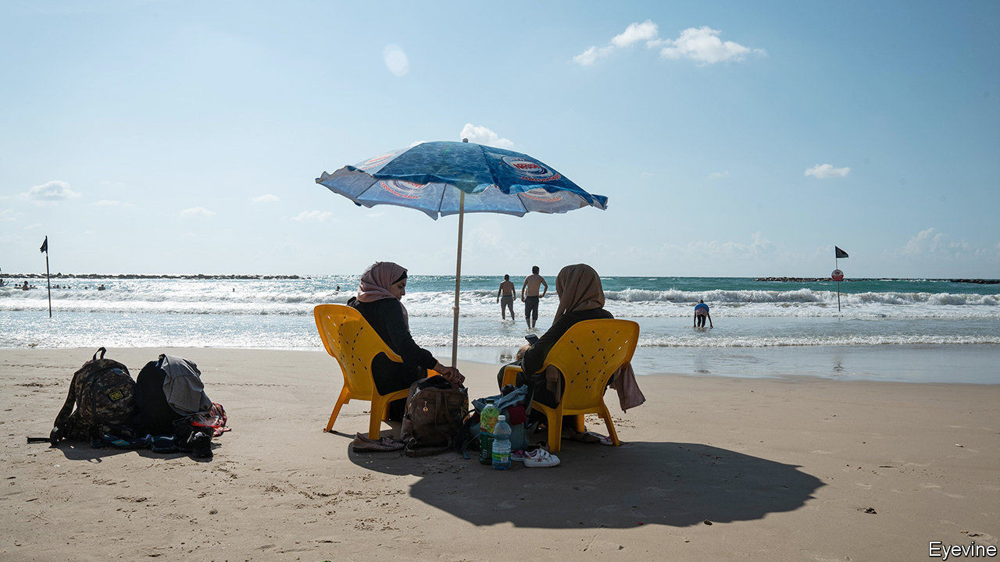

## A glimpse of the seaside

# Israel lets the Palestinians go to the beach

> But that may not ease their frustrations

> Aug 29th 2020TEL AVIV

THERE ARE no lifeguards at the southernmost beach in Tel Aviv, just before the rocky promontory where Jaffa begins. That doesn’t bother Palestinian children paddling in the shallow water. Few of them can swim. Some don’t even own bathing costumes. But many are seeing the sea for the first time—enough to bring them great joy. After their parents dry them off, families may take a stroll around the central square in Jaffa. Then it is back to the landlocked West Bank.

Such scenes have played out several times this summer on beaches up and down Israel’s Mediterranean coast. Only about 70,000 Palestinians out of the roughly 3m who live in the West Bank have work permits that allow them to travel outside the territory, which is under partial Palestinian control. But on some Saturdays Israel’s security forces turn a blind eye to families slipping through gaps in the security barrier that surrounds most of the territory. On the other side of the fence, friends and family members who live in Israel or unofficial tour operators are waiting to whisk them to the beach.

Israel appears to be trying to ease some of the hardship for the Palestinians, who have had a rough year. Unemployment in the West Bank, already high, spiked as covid-19 forced the Palestinian Authority (PA) to lock down the economy. The virus also led Israel to issue fewer travel permits for the Eid holidays. Then came the news this month that the United Arab Emirates (UAE) had agreed to establish full diplomatic relations with Israel, becoming only the third Arab country to do so. Hanan Ashrawi, a prominent politician, echoed the feelings of many Palestinians when she said it was like being “sold out by your friends”.

The Palestinians look increasingly isolated. They cut ties with America in 2017, after President Donald Trump recognised Jerusalem as Israel’s capital; the Palestinians want to share it as the capital of a future state of their own. They recalled their ambassador to the UAE this month. Earlier in the year the PA said it would stop co-ordinating with Israel because of its plans to annex parts of the West Bank, which Israel’s prime minister, Binyamin Netanyahu, says are “still on the table”. But the truth is that the PA needs Israel’s help to fight covid-19 and keep Hamas, the violent Islamist movement that runs Gaza, at bay. So co-operation continues behind the scenes.

Gaza has beaches, but precious little else. The territory has been under blockade by Israel and Egypt since 2007, when Hamas seized power. The situation seemed about to improve earlier this year, when Israel lifted some restrictions and some infrastructure projects were planned. But the progress quickly stalled.

Lately Gaza has been stuck in a vicious cycle. It begins with Palestinian militants attacking Israeli towns along the border with rockets or balloons carrying incendiary devices. Israel hits back with air strikes on Hamas positions. The cycle ends when Israel allows an emissary from Qatar to enter Gaza with suitcases full of cash that is meant to alleviate the suffering. Now there are also growing fears of a coronavirus outbreak in the territory.

Israel is hoping that frustration in the West Bank does not similarly boil over; hence the lax border controls. But there are risks. Would-be attackers could exploit the lack of security checks. Busloads of beachgoers might spread coronavirus. And a day at the beach may not soothe everyone’s frustrations. “I used to work here renovating houses,” says Marwan Halawa, a Palestinian from Hebron. “Tel Aviv has changed a lot.” His friend Issa is less wistful: “This is a Palestinian beach, no matter what they say in Abu Dhabi.” ■

## URL

https://www.economist.com/middle-east-and-africa/2020/08/29/israel-lets-the-palestinians-go-to-the-beach
