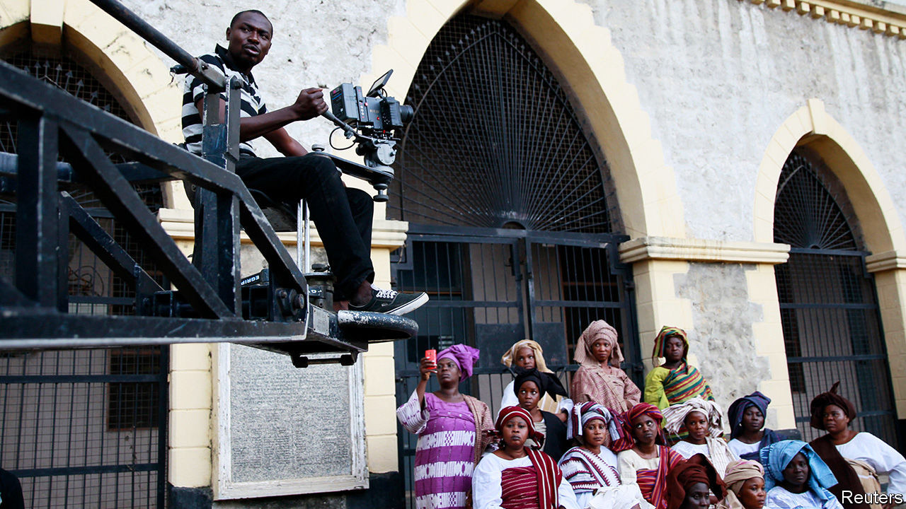

## Nollywood blues

# Nigeria’s film industry has taken a viral knock

> But covid-19 may force it to sharpen up

> Aug 29th 2020

IN THE PAST two decades Nigeria’s film industry has blossomed into a mighty national asset. Its romances, family sagas and tales of derring-do are lapped up by many millions of viewers at home, across the rest of Africa and in the African diaspora. It employs more than a million people and generates nearly $2bn a year from cinema tickets and DVD sales, TV rights, royalties and fees. Lagos, Nigeria’s commercial capital and film hub, is said to produce more films than there are stars in the sky.

Films like “Ije”, “The Wedding Party” and “2 Weeks in Lagos” have premiered at the poshest international festivals, from Toronto to Cannes. Netflix has set up partnerships. In 2018 it released its first Nigerian film, “Lionheart”. In June it teamed up with EbonyLife Films, based in Lagos, to embark on a string of Netflix-branded projects. “Death and the King’s Horseman”, a play premiered in 1975 by Africa’s first Nobel laureate in literature, Wole Soyinka, is to be adapted for the screen.

But covid-19 has given Nollywood a nasty viral knock. Emem Isong, a leading producer, laments the obstacles facing her latest TV series, “City Crimes”. She was only two weeks into her six-week filming schedule when a government-imposed lockdown forced her to stop. When production resumed in June, she had to cut her crew in half, buy protective equipment and contactless thermometers, expand accommodation (the crew normally share rooms) and disinfect her locations. The production took much longer. Her budget jumped by a third. She sorely wishes she had taken out an insurance policy.

Yet the pandemic may nudge the industry to tackle some of its shortcomings and improve its chaotic infrastructure. “Maybe this will motivate people to get their own production lots where you can accommodate artists and put all safety measures in place,” says Shaibu Husseini, a veteran film critic. There is a dearth of good film studios. Moses Babatope, who founded Filmhouse Cinema and FilmOne, a distribution and production company, looks forward to many “better practices”.

For one thing, Nollywood would benefit from a national umbrella organisation, overseen by government, that would set standards and would have protected the industry better against covid-19. There are a good two dozen associations and guilds within the industry, but no unifying body like those in Hollywood. The Nigerian government recently set up an ad hoc committee, including actors and comedians, to co-operate against the pandemic. “The industry is so individualistic in its approach,” says Mr Husseini. “Nollywood needs a collective front.”

That is a challenge. Some of Nigeria’s 200 ethnic groups, especially the big ones, have their own film associations. Hausa-language cinema, based in the northern Nigerian state of Kano, has its own label: “Kannywood”. “There are so many sub-sections,” says Mr Babatope. “For too long the mentality has always been about being giants in our little corners, as opposed to collective, harmonious growth...As we get better, as we get more investments, as we get more attention, you’ll find out that the best practices will rub off on us.” ■

Editor’s note: Some of our covid-19 coverage is free for readers of The Economist Today, our daily [newsletter](https://www.economist.com/https://my.economist.com/user#newsletter). For more stories and our pandemic tracker, see our [hub](https://www.economist.com//news/2020/03/11/the-economists-coverage-of-the-coronavirus)

## URL

https://www.economist.com/middle-east-and-africa/2020/08/29/nigerias-film-industry-has-taken-a-viral-knock
