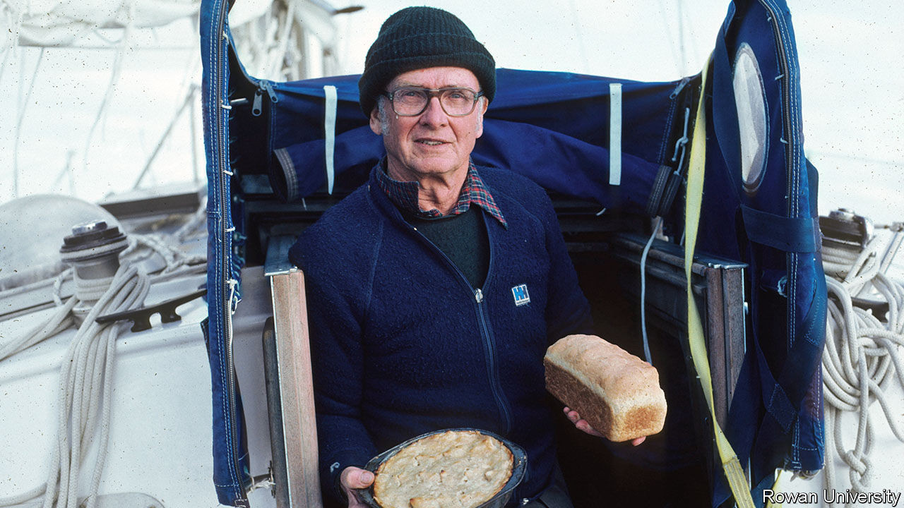

## Wind, sea and stars

# Marvin Creamer died on August 12th

> The first man known to have sailed round the globe without using instruments was 104

> Aug 29th 2020

WHEN FRANCIS DRAKE rounded the globe in 1577-80, he took an astrolabe, compass and cross-staff with him. As Ferdinand Magellan, the first known circumnavigator, started out in 1519, he had at least an astrolabe and compass. But when Marvin Creamer set sail from Cape May, New Jersey in 1982, into thick overcast and a howling gale, on a voyage of 30,000 miles requiring nearly a year at sea, he carried, to his delight, no instruments at all.

Well, to be quite accurate, there were a few. He had an hourglass, the only time-keeper, to mark the watches of his small crew. Down in the bilge, in a duffel bag, were a radio, sextant, compass and clock, in case of emergency. His wife Blanche, with whom he had had months of lively discussions about this voyage—she dead against him sailing off, he, at 66, desperate to go—had insisted on this. But he had had it sealed by the navy, intending never to get those “toys” out, and never did. Lastly, there was a transmitter somewhere on the Globe Star to give the little cutter-rigged sloop’s position regularly to the coast guard. But it did not tell him where he was, and that was vital. He was going by the stars.

The ancient sailors he so admired, the Vikings and Chinese traders, as well as more modern Polynesians, had gone the same way. None of them, as far as was known, had circled the globe; but it seemed to him that they might have made predictable landfalls, setting a course and then returning again. He meant to prove, and never had much doubt—5%, perhaps—that they could also have got further. Endurance or fame were not the point of this endeavour, which even he admitted looked insane. It was the intellectual challenge of finding out how the ancients might have done it.

To prepare himself he had done some hard study of oceanography and meteorology, in the gaps between teaching geography in the department he had founded at Glassboro State College, now Rowan University. And he had gone seafaring: first fishing on small outboards past the barrier islands off New Jersey, where he would venture out so far that his colleagues thought him either lost, or mad, and later sailing across the Atlantic to Ireland and Africa. It was on a voyage back from the Azores in 1974, when he had taken the dark-to-daylight watch and the compass-light kept failing, that he looked up and thought: why not? All he had to do at that moment was find Polaris, the Pole Star, put his shoulder in line with the keel, and steer straight on. It worked like a dream.

Star-steering had intrigued him since childhood, when his farmer-father taught him to observe the different positions of the setting sun from the south-west corner of the barn. On his voyage, a clear view of sunset or sunrise could tell him his position; but for latitude without a sextant he needed to make a geometry of the night sky, drawing an imaginary line between Polaris and his chosen navigation-star and watching where that star made its meridian transit. Finding a fixed point in the southern hemisphere was tricky until he learned to use Acrux and Gacrux, two of the brightest stars in the Southern Cross, as pointers to the southern celestial Pole. (Delta Orionis, right over the celestial Equator, was most useful for longitude.) Both north and south of the Equator, his calculations proved so accurate that almost all the Globe Star’s landfalls, on a route from Dakar via Sydney round to Bermuda, were within 15 miles of the target, and close to the dates he’d set.

Yet for much of the voyage he could not see the night sky at all. Crossing the Pacific, they had five sights of the stars in 5,000 miles. To estimate latitude and direction he had to be fiercely observant in daylight, too. He watched the sea most: its deep swell, the surface interaction of new waves with old ones, and the shadows they cast; its colour, whether blue in the deep or green in plankton-filled waters, and the wake of the boat. He guessed the Globe Star’s speed from the time bubbles took to move from bow to stern. His log showed that, having veered off the Horn in fog and with no landmarks, he was unsure whether they had rounded it or not. But he thought they had because the sea had gone from a dark transparent green to a lighter green and then turned dark again—the colour, an old mariner had told him, of the Atlantic.

He guessed they had, too, from the sudden icy breath of a north wind coming off the snow-covered Andes. The wind was always a useful indicator. Leaving Cape May, he had set course south-east for Senegal by keeping the freezing north-westerly at the midpoint of the back of his neck. After days in the doldrums, floating with no direction, the sudden nail-scraping squeak of a hatch told him that a dry wind was blowing up from Antarctica. Heavy cumulus clouds indicated land; diving petrels showed, specifically, the Falklands (as did theRAF fighter jets that buzzed them, so soon after the war). Red sand-streaks on the sails in the dew of morning proved they were close to the Sahara.

For him, having the time of his life, happily chewing day after day the canned hamburger which Blanche, once resigned, had nobly put up for him, all the interest and point of the circumnavigation lay in these essential observations. Of course, there were dramas. Twice they almost capsized, with the mast 45% underwater. Going through Drake Passage near the Horn broke the “indestructible” steel tiller, though he was a good enough mechanic to rig up another. More than once they nearly came to grief on rocky, unlit coasts. Passing Tasmania, in the worst weather of the trip, he had to haul down wet sails with a dislocated shoulder. A galley fire almost incinerated the boat, as well as the loaf he was baking. Frustrations, but par for the course. He was just thrilled to prove that the ancients could have undertaken serious long-distance sailing, without toys, more often than people thought.

Naturally he wrote a book about it. But publishers showed no interest. No one had mutinied in this story, or been lost overboard; it was academic rather than tragic. Besides, there were lots of sailing books, and circumnavigations were increasing. That was all true; but then again, how many of those sailors had estimated latitude by watching yager gulls, or knew they were approaching home when a housefly settled in the cabin? ■

## URL

https://www.economist.com/obituary/2020/08/29/marvin-creamer-died-on-august-12th
