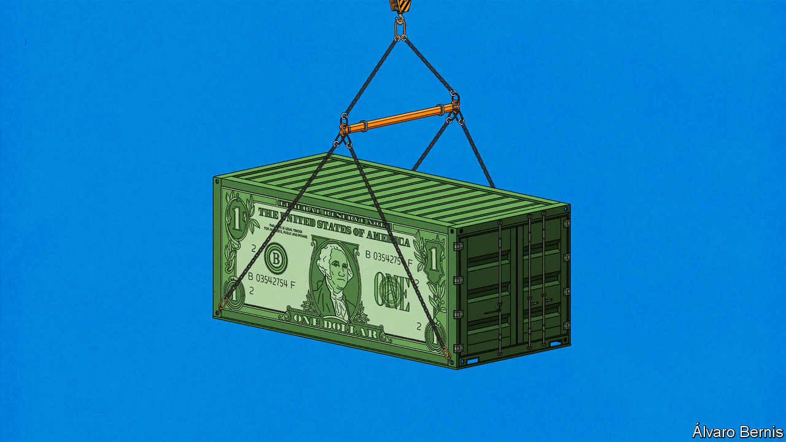
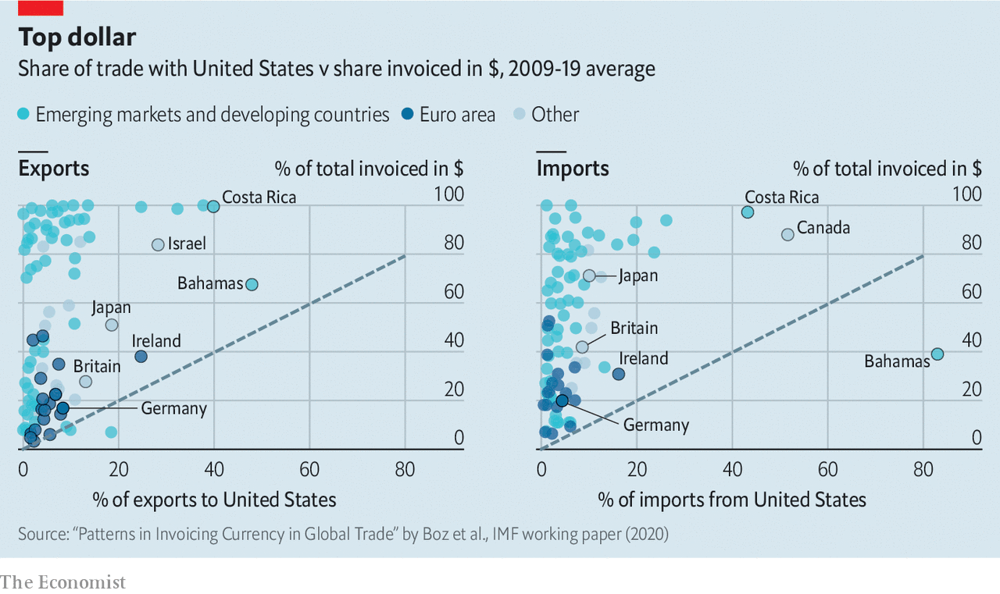

## Buck up

# Global trade’s dependence on dollars lessens its benefits

> Policymakers around the world yearn to be free of the greenback’s grip

> Aug 29th 2020

CRASHING CURRENCIES hurt. They make imports more expensive, cutting into household budgets and raising businesses’ costs. But economics has long held that this pain brings with it its own salve. More expensive imports should drive new demand for home-made replacements and thus for the workers who make them, geeing up the economy. What is more, a devalued currency means exports are suddenly cheaper to buyers abroad. That, too, should boost demand. When the value of the Colombian peso collapsed in the summer of 2014, it was on the basis of these assumptions that the country’s finance minister greeted the fall as “a blessing in disguise”.

It wasn’t. There were, the IMF opined in a subsequent report, a number of reasons for this, many specific to Colombia. But one problem was a factor which is embedded in the machinery of today’s international commerce. Colombia does not trade in pesos. It trades almost exclusively in dollars; 98% of its exports are invoiced in them. This is an extreme example of a general point. The amount of trade carried out in American dollars vastly exceeds the amount that America imports and exports. Although that may seem like a detail of book-keeping, it matters a lot. A growing body of evidence suggests that the dollar’s prominence in trade undermines the advantages which flexible exchange rates are meant to offer. And when the dollar strengthens, global trade tends to contract.

For decades, economists’ thinking about trade and currencies was summarised in a model created in the 1960s by two researchers at the IMF, Robert Mundell and J. Marcus Fleming. They assumed no special role for any dominant currency, but rather that traders would agree on prices in the exporter’s currency. A Colombian devaluation, say, would immediately turn peso-priced batteries into bargains abroad, encouraging foreign buyers to scoop up more of them. Meanwhile shoppers in Bogotá wanting to buy Brazilian T-shirts would resent being made to fork out more pesos to cover the price fixed in real.

This simplifying assumption was potentially consequential. As early as 1947, Joan Robinson of the University of Cambridge noted that the currency companies used for invoicing could mute the expenditure-switching effect. If the prices of Colombian exports were in dollars, not pesos, a devaluation would leave prices faced by American importers—and their demand—unaffected. But though that might matter in principle, did it matter much in practice?

In 1973 Sven Grassman of the Institute for International Economic Studies used Swedish data to answer in the negative. He found that in 1968 around two-thirds of Swedish trade had been indeed invoiced in the currency of the exporter. This “fundamental symmetry in international payment patterns” became known as “Grassman’s Law”. Swedish exports to America, which were mostly invoiced in dollars not kronor, were written off as the exception. That suggested that Mundell and Fleming were right.

Over the next decades more data further supported Grassman’s Law—always with the same American exception. But by the 1990s some researchers were beginning to doubt its validity. Their main argument was that the actual prices of goods did not vary as much or as quickly as would be expected if payments were in fact symmetrical. Grassman’s Law said that the price of Brazilian T-shirts in Colombian markets should vary with the peso-real exchange rate, for example. But such prices were in fact much stickier.

In the mid-2000s Linda Goldberg and Cedric Tille of the Federal Reserve Bank of New York compiled data describing 24 countries in the late 1990s and early 2000s. This confirmed that Grassman’s Law was wrong: exports were not generally priced in the currency of the country they came from. In 2001, for example, they found that South Korea invoiced 82% of its imports in dollars, despite only 16% of its imports coming from America.

Other work confirmed and updated their findings: the dollar has a huge role as a “vehicle currency” in which to invoice transactions to which no Americans are party, particularly in developing countries (see chart). Gita Gopinath of the IMF has compiled data covering just over half of world trade to show that the dollar’s share of invoicing was 4.7 times larger than America’s share of the value of imports, and triple its share of world exports. Another IMF study showed that the dollar’s share has not decreased in step with America’s declining share of overall trade.

The euro’s creators had hoped that it might supplant the dollar’s status. But even though almost half of trade is invoiced in euros, that is mostly because of how much trade involves countries that use the currency. Between 1999 and 2014 euro-denominated trade was only around 1.2 times the euro zone’s share of global imports.

Other would-be challengers appear to have failed even more miserably. Scant Chinese data suggest that in 2013 only 17% of Chinese trade was settled in renminbi, and in 2012 only around half of such settlements were invoiced in renminbi. In order to avoid financial sanctions, Russia has recently shifted away from the dollar when paying for imports from China. But the euro, not the renminbi, benefited most.

A lack of historical data makes it impossible to say whether Grassman’s Law held in the 1970s and has since weakened or whether it was the always an artefact of insufficient data. Whichever is true, economists busied themselves trying to work out why exporters used dominant currencies.

One suggestion is that using the same vehicle currency when setting prices for a certain market lets companies avoid erratic price movements relative to their competitors. Ms Goldberg and Mr Tille offered some support for this when they showed that dollar invoicing was more common in markets, such as precious metals, where competition is cut-throat. Another suggestion is that the rise of global supply chains saw more exporters importing some inputs. Invoicing imports and exports in the same currency would preserve their profit margins in the event of a devaluation.

The arguments for a vehicle currency do not necessarily mean that that currency has to be the dollar. But why would it not be? The dollar already dominates the financial world. Central banks stash 58% of their official foreign-exchange reserves in it. It is the global currency of choice when issuing securities. Banks use it for around half of their cross-border claims. According to SWIFT, a payments system, it is used in two-fifths of international payments.

Indeed the worlds of finance and trade are intertwined. Exporters borrowing in dollars will want to price their foreign sales in the same currency, to protect against a sudden devaluation which would increase the value of their debt. Assets denominated in dollars offer their owners more security, because they will hold their value relative to imports priced in dollars.

Having established the importance of dollar dominance for global trade, economists updated their understanding of exchange-rate gyrations. In America sticky prices set in dollars mean the demand for imports is impervious to exchange-rate shocks. A Colombian light aircraft priced at $50,000 will cost the same when the dollar is worth 3,000 pesos as when it is worth 4,000. The change will eventually have an effect—but it will be partial, and slow. One study has found that two years after an exchange-rate shift only 44% of its effect would be seen in prices in America. Another found that just as prices did not change much, neither did the volumes importers chose to buy. After a 1% dollar depreciation, they found that the volume of imports into America fell by a measly 0.003%.

All this allows America to enjoy what Ms Gopinath describes as a “privileged insularity”. Its adjustment to a dollar depreciation happens almost entirely through exports, which immediately become cheaper in foreign markets. Devaluations against the dollar in other countries, by contrast, see them suffer. It becomes harder to afford imports while they don’t get the added export oomph the old models suggested. Exporters’ dollar earnings will be worth more in local currency, which might tempt some of them to expand. But that takes time. And the benefits are often offset by the higher cost of imported inputs.

Around the world invoicing imports in dollars means that it is devaluations against the greenback, rather than against the currency of the country you are trading with, that count. Emine Boz of the IMF, Ms Gopinath and Mikkel Plagborg-Muller of Princeton University found that prices of imported goods were relatively unresponsive to bilateral exchange-rate movements. Over short-term horizons they were six times more sensitive to the dollar exchange rate. The price of Brazilian-made football shirts in Mexico will stay the same if the peso depreciates relative to the real, but not relative to the dollar. If the peso drops with respect to the dollar, though, those shirts will become less affordable and may no longer be sold.

During the East Asian crisis of 1997-99 South Korea, Malaysia and Thailand all experienced currency depreciations of at least 60% relative to the dollar—and saw their export volumes stagnate or fall. With prices set in dollars devaluations did nothing for their export competitiveness within the region. And demand for imports from elsewhere in the region—also priced in dollars—plunged. Ms Boz and her co-authors have found that, after accounting for the business cycle, a 1% appreciation in the value of the dollar translates into a 0.6% decrease in the volume of trade between countries in the rest of the world.

Dollar dominance means trade is vulnerable to the global financial cycle, too. A study by Valentina Bruno and Hyun Song Shin of the Bank for International Settlements found that a dollar appreciation leads banks reliant on dollar funding to shrink their credit supply. Companies reliant on those banks—and their dollar-denominated financing of trade—then slow their exports, an effect particularly marked in companies with longer supply chains. Trade is a finance-hungry business.

Policymakers around the world yearn to be free of the dollar’s grip. That seems unlikely. The dollar’s dominance is the product of millions of individual decisions, each seemingly optimal, which in concert lead to collective problems. Each dip in the dollar’s value leads to a rush of wishful chatter about the dollar’s demise, but for long as these optimisations continue to make sense it is hard to see how that wish can come true. At least, though, for a while, the chatter-inducing weakness will provide a fillip to trade. ■

## URL

https://www.economist.com/schools-brief/2020/08/29/global-trades-dependence-on-dollars-lessens-its-benefits
