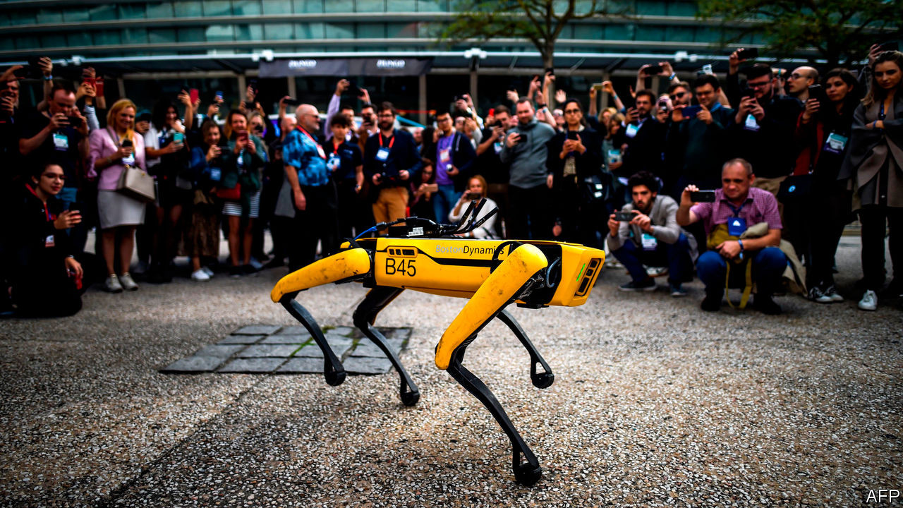
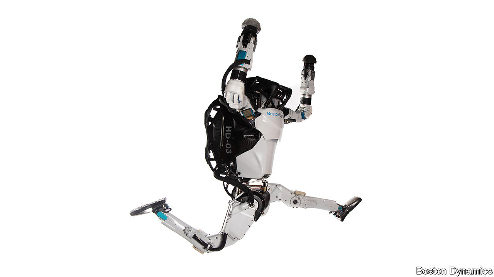

## Robotics

# Robots that can walk are now striding to market

> They will be able to go where people can, but existing bots cannot

> Aug 25th 2020

THEY MIGHT appear cutesy, but a pair of robots that turned up recently at the Ford Motor Company’s Van Dyke Transmission Plant, in Detroit, are practical working machines. They may, indeed, point to the future of automation. Putting robots into factories is hardly a new idea—some 2.4m of them are already at work in plants around the world. But most of these are little more than giant arms, bolted firmly to the ground, that weld and paint things. Those few that have the mobility to manage tasks like delivering components do so by scooting along on wheels. The new devices at Van Dyke are rather different sorts of beasts. They can walk.

This pair of bright-yellow quadrupeds look a bit like dogs, prompting one to be nicknamed Fluffy and the other Spot (which latter moniker is also the official name given to this model of robot by the firm that manufactures them, Boston Dynamics, a subsidiary of SoftBank). The pair are not there to amuse the factory’s human workers, though, but rather to perform an important task that Ford hopes will save it a ton of money. With laser scanners mounted on their backs, Fluffy and Spot can scamper around the 200,000 square-metre plant collecting data. Those data will be employed to build a detailed computer model of the entire manufacturing operation. This sort of model is called a digital twin, and Ford’s engineers will use it to work out how to rearrange the production line to produce a new gearbox.

Over the years, factory plans get out of date as things are moved around and new equipment is brought in. Surveying the transmission plant by hand would take weeks and cost some $300,000. Ford reckons that Fluffy and Spot, which can both climb stairs and crawl into hard-to-reach areas, will cut the time required by half and complete the job for “a fraction of the cost”. Although Ford is leasing the robots, Boston Dynamics has now put them on sale for $75,000 a pop. At that price they would soon pay for themselves doing tasks like the one being undertaken in Van Dyke.

The Spot range is the first of Boston Dynamics’s walking robots to be commercialised. More such machines are starting to appear from other firms and research groups. Some are also quadrupeds. Others are bipedal. The two-legged sort can be more agile and, if equipped with arms as well, are better suited to tasks like picking things up or operating controls. What all of these machines have in common is that they represent—forgive the pun—a huge step forward in robot locomotion.

If robots are to go where people go, they need to be able to move in the way that people move. Wheels are useless for navigating much of the world—just ask anyone who uses a wheelchair, says Aaron Ames, a robotics expert at the California Institute of Technology (Caltech). “We can make robots walk really well now,” he says. Such robots can, though, look a little odd. When a torso with two legs attached strolls out of Dr Ames’s laboratory it causes a bit of a sensation on Caltech’s campus. But this is something people are going to have to get used to, because many more are coming.

Problems remain, and improvements are needed. “But once we get there, we are going to have millions of walking robots in human environments,” says Jonathan Hurst, co-founder of Agility Robotics, a firm based in Albany, Oregon. It has just launched Digit, a bipedal, two-armed robot which has the look of an ostrich about it. At present, Digit costs $250,000. But it is early days. As more walking robots are put to work their development will accelerate and their production volumes increase, bringing the cost of a machine like Digit down to the tens of thousands of dollars.

This process is similar to the emergence of flying drones. They once cost millions, and had limited uses, until researchers worked out how to make small aircraft hover using multiple co-ordinated rotors. These devices could fly easily and autonomously. Prices fell to $500 or less, and multi-rotor drones are now employed for all manner of jobs, from cinematography to aerial surveying to delivering packages. Some in the field of robotics think walking robots have started down a similar path.

What changed? “We now understand the mathematics of locomotion to a much greater degree,” explains Dr Ames. Old-school walking robots, such as Asimo, a famously cheesy android unveiled in 2000 by Honda, a Japanese carmaker, have stilted gaits. They shuffle along, placing one foot forward, checking their balance, moving the other foot, rechecking their balance, and so on. “When you are walking, you don’t do that,” he says. “Your feet are just coming down and catching yourself.”

The way that humans walk is sometimes described by biomechanists as controlled falling. Making a stride involves swinging a leg out and placing it down with small subconscious corrections to maintain stability as the mass of the body above it shifts forward. Each leg works like a spring. These movements are predictable, and in recent years researchers have found out how to model them mathematically. Together with better actuators to operate a robot’s limbs, and sensors which can measure things more accurately, these models have made it possible to recreate this style of walking in robots. It does not require any fancy machine learning or artificial intelligence to do so, just good old-fashioned computation, adds Dr Ames.

The difference between Asimo’s gait and that of the new breed of bot is striking. Whereas Asimo’s chunky legs look leaden, Digit strides confidently along on a lean pair of limbs, happily swinging its arms as it goes. Atlas (pictured), an experimental humanoid made by Boston Dynamics, is more capable still. It can walk, run, jump and even perform backflips. Asimo did a lot of celebrity photo-opps, but it never went into production. Honda quietly stopped work on the project in 2018, to concentrate on more “practical” forms of robotics, such as mobility devices for the elderly.

It is easy to conclude, as many do, that these new walking robots simply mimic nature. But that is not quite the case. A quadruped, being a stable platform, is a good starting point from which to design a walking robot. After co-ordinating the four limbs, getting a good balance and fitting a system of vision that lets the robot work out where to put its feet, Spot’s designers ended up with a dog-oid. Michael Perry, head of business development for Boston Dynamics, says that is not surprising because nature has been developing efficient designs for a long time.

Another example of art evolving to imitate nature occurred during the design of Digit. This inherited its ostrich looks from Cassie, a two-legged torso which Agility sold to a number of research groups. Cassie’s developers had to find a way to stop some of the robot’s actuator motors from working against each other. Their solution turned out to look like a pair of bird’s legs.

Cassie subsequently acquired arms and evolved into Digit as the result of the engineers’ attempts to solve another problem. When it swung a leg forward Cassie’s body twisted a little, which sometimes caused the robot to fall over if it was walking quickly. In nature, some animals use tails to improve their balance when manoeuvring at speed. Borrowing this idea, Agility’s researchers attached a pair of tail-like appendages, one on each side of the robot’s torso, to improve its mobility. That worked. Then they turned the appendages into a pair of arms. These can catch the robot should it fall, and help it get up again.

The arms can perform other useful tasks, too, such as moving boxes in a warehouse. Digit can carry up to 20kg. Distributing and delivering goods is likely to be an important application for walking robots, reckons Dr Hurst, especially now that e-commerce has boomed as a result of restrictions imposed in the wake of covid-19. Some automated distribution centres are set up for conventional fixed and wheeled robotic systems, but these have usually been built this way from scratch. Most warehouses are designed around people. Robots with legs, which move in a similar way to human workers, would fit right in.

With further development, walking robots will undertake more complex tasks, such as home deliveries. Ford is working on this with a Digit robot that rides in the back of a van. Though robots with wheels already make some deliveries, reaching many homes is tricky, and may involve climbing steps or stairs. “Legs are how you would want to get up to most front doors to deliver a package,” observes Dr Hurst.

Exactly how this might be done remains to be seen. Unless they are on a preprogrammed mission, most mobile robots require an operator to provide basic instructions to, say, proceed to a certain point. The robot then walks there by itself, avoiding obstacles and climbing or descending steps and stairs along the way. This means a walking robot making door-to-door deliveries might need some kind of digital map of the neighbourhood, to know in advance the paths it can traverse and the flower beds it should avoid. That might involve a big data-acquisition effort, much like those used to build digital maps for driverless cars. Similarly, in a factory or a warehouse, a walking robot would need to be shown the ropes by a human being before it was let loose to work on its own.

A fully autonomous robot that could walk into an unknown environment and decide for itself what it needed to do remains a long way off. One of the hardest tasks for such a device would be caring autonomously for someone at home. The robot would have to be able to make numerous complex decisions, such as administering the correct medicine, deciding whether or not to let strangers into the house or knowing when to take the dog for a walk. Yet many roboticists think they will get there, or at least close to it, one day.

In the meantime, the new generation of robots now being developed will keep building up the machines’ capabilities. At Boston Dynamics Mr Perry reckons that, besides surveying, Spot will find many roles in inspection and maintenance. Such robots can, for instance, enter hazardous environments like electrical substations without them having to be taken off the grid, as is necessary whenever a human engineer goes inside.

Instead of just looking for problems, Spot’s next trick will be to take action to resolve them, such as throwing a switch or turning a valve. It will do this with a single manipulator arm which makes it look less like a dog and more like a long-necked Brachiosaurus. A prototype of this configuration is already running around the company’s offices, opening and shutting doors.

This version of Spot should go on sale next year. As for Atlas, Boston Dynamics’s humanoid, that is currently too expensive to spawn a commercial version. But the lessons being learnt from it will help provide the engineering needed for other robots to come, says Mr Perry.

Some of these walking robots of the future may not be deployed on this world. At Caltech, Dr Ames thinks robots with legs will have advantages in planetary exploration—negotiating difficult terrain and entering caves, for example. Meanwhile, back on Earth, he and some colleagues at other institutions are using the new knowledge of robotic locomotion to develop lightweight prosthetic devices for those unable to walk easily, and powered exoskeletons for those who cannot walk at all. In a world not made for wheels, this raises the tantalising prospect that walking robots will one day help rid the world of wheelchairs. ■

## URL

https://www.economist.com/science-and-technology/2020/08/25/robots-that-can-walk-are-now-striding-to-market
