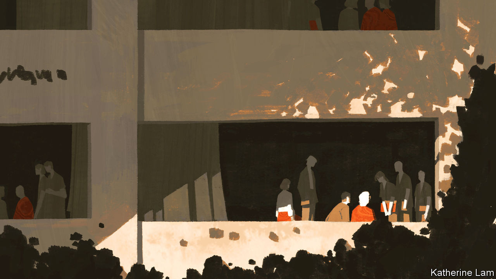
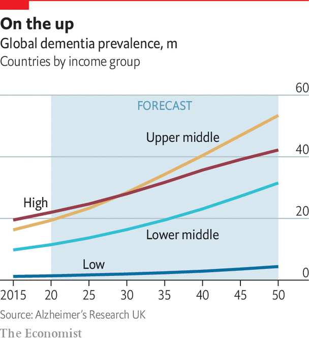

## Dementia

# As humanity ages the numbers of people with dementia will surge

> The world is ill-prepared for the frightening human, economic and social implications

> Aug 27th 2020

A FEW DAYS shy of her 90th birthday, tortured by leg ulcers and arthritis, Vera, one of some 850,000 Britons with dementia, has kept herself alive, it seems, to meet her first grandchild, due any moment now. But when the happy day comes and the baby is brought to her, she is confused. She recognises her daughter-in-law, but is puzzled by the bundle in her arms. “That’s nice, dear,” she says. “But why have you brought me a coconut?”

Dementia is a cruel condition, robbing people of their deepest joys and hopes. It may start as a “mild cognitive impairment” (MCI): forgetfulness or “senior moments”. But as it progresses, attacking mental agility and eating away memory, it steals much of what counts as identity. When severe, people become incapable of looking after themselves. They lose the ability to read, cook and shop. They forget to drink and get dehydrated, or become incontinent. They suffer delusions, or become frightened or angry, or they sink into an apathetic slump. They require care for all their waking hours, and often supervision when asleep.

The covid-19 pandemic has been a huge ordeal for people with dementia. The loss of routine and social contacts under lockdown have hastened cognitive decline. Dementia patients have proved highly susceptible to the virus—in Britain some studies suggest it has been the commonest “pre-existing condition” in those dying from covid-19. And deaths where “dementia” has been identified as the cause have also risen. In April it came second only to covid-19. Those with dementia often have conditions that make them vulnerable—above all, being old, but also being overweight, depressed, smoking, having high blood pressure or diabetes. And dementia makes it hard to understand the danger of the virus, or to remember social-distancing or hygiene precautions. Many have endured the pandemic in care homes, which have accounted for nearly half of all deaths from covid-19 in the rich world.

Dementia affects more than 50m people worldwide, a number that is rising fast. It has many causes and is imperfectly understood. But nobody doubts that its prevalence increases with age. By some estimates, 1.7% of 65- to 69-year-olds have dementia, and its incidence (the number of new cases) doubles every five years to the age of 90. Another estimate is that at the age of 85, between a third and a half of people have dementia.

In this sense dementia is collateral damage from one of humanity’s triumphs: increased lifespans. A hundred years ago life expectancy at birth was not much more than 30. By 1960 it had reached 52. Today it is about 70 for men and 75 for women, and in rich countries, over 80 apiece. Nonagenarians and even centenarians are no longer rare. Despite covid-19 medical progress will continue, further lengthening lives. Yet dementia is stubbornly resistant to efforts to find a cure. It was long seen as a natural part of growing old, the last of the seven ages of man defined by Shakespeare’s Jaques: “second childishness and mere oblivion”. Kate Swaffer, an Australian diagnosed with dementia in 2008 who chairs Dementia Alliance International, a campaigning group, sums up the advice she got: “Go home and prepare to die.”

Dementia used to be called “senile dementia” or simply “senility”. But a small minority of sufferers are not old at all. In 1906 Alois Alzheimer, a German psychiatrist, conducted an autopsy on Auguste Deter, a woman who had developed dementia in her 40s. He noticed abnormalities also found in the brains of older people with dementia. Of the dozens of forms of dementia identified, the pathology known as “Alzheimer’s disease” is the commonest, accounting for between 60% and 80% of cases. Next, each accounting for 5-10%, are vascular dementia, caused by an inadequate flow of blood to the brain, and Lewy body dementia.

All forms of dementia become more prevalent in old age, and so will become more widespread as life expectancy rises. As people in less well-off parts of the world enjoy longer lives, that is where three-quarters of new cases will arise. In 2015 the OECD estimated that by 2030 the number of cases of dementia would increase by 50% in rich countries and 80% in poorer ones. Some 82m people will have dementia by 2030 and 152m by 2050. Encouraging recent research in America and parts of Europe suggests that changing lifestyles may be bringing down the incidence of age-specific dementia. But it appears to be rising elsewhere, so global projections are unlikely to be revised downwards.

Dementia disproportionately affects women, even allowing for their longer life expectancy. In America two-thirds of people with Alzheimer’s are female, and 60% of carers at home are women. China has more people with dementia than any other country—an estimated 9.5m people (it includes Taiwan in its total). India, a younger country, with a median age of 28 compared with China’s 38, and lower life expectancy (70 compared with 77) had some 4m in 2018, mostly undiagnosed, a number that may reach 7.5m by 2030. Other places with big numbers are the European Union, with an estimated 9.1m in 2018, America (about 6m) and Japan (5m).

Set against the size of the world’s population, these numbers may seem manageable. That is illusory. Nowhere in the world, rich or poor, is equipped to deal with the scale of the problems created by dementia. No cure exists, and even the most hopeful new therapies will have only a mild impact. So all these dementia patients will need to be cared for—often for many years.

Humane care will require vast numbers of people, and huge sums of money. An estimate cited by the World Health Organisation (WHO) put the annual global cost of caring for people with dementia at $1trn in 2018, rising to $2trn by 2030, a total “that could undermine social and economic development globally and overwhelm health and social services, including long-term care systems specifically”. In Japan, governments have for decades tried to create systems to deal with the problem, but officials admit they are unsustainable. There will be neither money nor carers enough to cope. In 2018 the average lifetime cost of care for an American with dementia was put at nearly $350,000, with 70% being the costs of care at home by families. Many poorer countries have yet to confront the problem at all.

The covid-19 pandemic has shown the fragility of many health-care systems, and drawn attention to the large numbers of people with dementia who occupy hospital beds mainly because of a lack of alternative facilities to care for them. When the virus is defeated, dementia will continue to spread. In her book “Where Memories Go”, a memoir of her mother who had Alzheimer’s, Sally Magnusson, a journalist, calls dementia “perhaps the greatest social, medical, economic, scientific, philosophical and ethical challenge of our times”. Hyperbole? Yet many politicians seem to agree with Ms Magnusson.

In 2013 David Cameron, Britain’s prime minister, used his chairmanship of the G8 to convene a “dementia summit”. Other leaders have adopted the cause. Moon Jae-in, South Korea’s president, campaigned on a pledge to get the state to take on more of the burden of dementia care. In 2017 the WHO published a “global action plan on the public-health response to dementia”.

So dementia could hardly be said to be below the radar. In Britain, for example, 52% of people know somebody with the condition. And it has not spared the famous: Ronald Reagan and Margaret Thatcher had dementia, along with many other statesmen, sports stars and writers.

Yet campaigners working for dementia charities around the world have a point when they argue that theirs is an underfunded cause. Covid-19 is likely only to make things worse, as the pandemic sucks in money and medical expertise. Already dementia research receives far less money than cancer or coronary heart disease (CHD). A global study in 2018 found 250,000 papers on dementia compared with 3m on cancer. That matches funding in Britain, according to the charity Alzheimer’s Research UK, where dementia attracts 7.4% of the sums that go into cancer, and 12% of the money for CHD. And everywhere, the costs of long-term care for people with dementia can be crippling—and are not usually covered by health insurers.

The comparative neglect of dementia has several causes. One is that it often falls between different government agencies. In the absence of useful medical interventions, health ministries do not want the strain of looking after untreatable and perhaps otherwise healthy people on their budgets. Often the provision of long-term care is the responsibility of local governments, so its availability and quality vary wildly.

More fundamentally, the old notion that dementia is a natural part of the ageing process is deep-rooted—held by two-thirds of people and even by 62% of medical practitioners, according to a survey last year by Alzheimer’s Disease International (ADI), an advocacy group. It also found that one in five people attributed dementia to bad luck and almost 10% to God’s will. As many as 2% blamed witchcraft. That belief, held in some African countries, where those with dementia may be shunned or persecuted, is the starkest example of the stigma attached to dementia. No other disability, Ms Swaffer points out, is treated in the way hers was dismissed. As ADI puts it in its 2019 annual report: “When a person has dementia, the condition takes over as the main descriptor of who they are. The stigma cancels the individual’s personality or personal history.”

On top of the stigma the condition brings, there is another reason why people prefer not to confront the dementia emergency: fear. Knowing how likely they are to develop it, and seeing the difficult lives of those who already have, they prefer to look the other way—and just hope that a cure will one day be found.■

## URL

https://www.economist.com/special-report/2020/08/27/as-humanity-ages-the-numbers-of-people-with-dementia-will-surge
