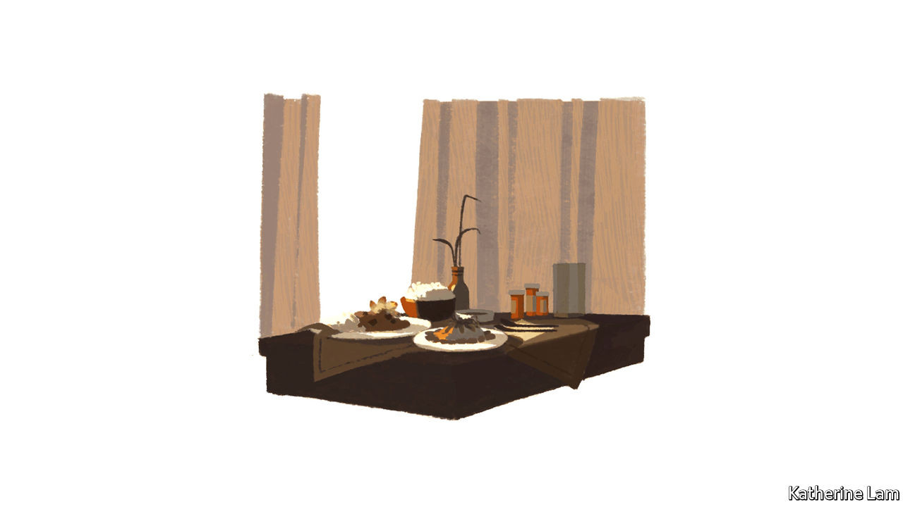

## Going abroad

# Might dementia tourism to lower-wage economies become a trend?

> It will remain a niche market; but shows how the best care needs a lot of carers

> Aug 27th 2020CHIANG MAI AND PHUKET

IN 2001, WHEN Martin Woodtli’s mother was diagnosed with Alzheimer’s, he was living in his native Switzerland. His father, who had a history of depression, had found himself living with a partner who no longer always knew who he was. He killed himself the next year. An only child, Mr Woodtli quit his job with a refugee-integration service, to become a full-time caregiver. He looked at care homes, but did not like them. His neighbours were sympathetic, but rather disapproving of a man in his 40s ditching his career to “waste his life” in this way. He thought of moving with his mother to Chiang Mai, a town of 127,000 in northern Thailand, where he had once worked on an AIDS project for Médecins Sans Frontières, an NGO.

He sought help from nurses through a local hospital, but then realised that his mother needed companions more than trained medical care, and for 24 hours a day. She was soon well looked after. He found a job, but it would have meant moving. He began to wonder if in fact he already had one: his experience with his mother might be the basis for a business.

It was. He found other clients, and a number of properties in a “village”—a Chiang Mai suburb. Now he runs a small but successful operation. Fourteen Europeans with dementia live there, mainly Swiss and Germans, all with access to 24-hour attention from one of the three carers dedicated to each of them, an unthinkable arrangement for all but the richest of the rich in Europe. In normal times (but not during the pandemic) they eat breakfast and lunch together in one of the houses and evening meals on their own. They have a swimming pool and a shop, used by the whole village. The Swiss wife of one resident lives nearby and describes the enormous improvement in her husband since their arrival. His bouts of physical aggression are over; he is taking less medication.

It is as close to a normal life as those with severe dementia are likely to find—except that it is far away from the homes and culture (and language) they knew. Their families, says Caleb Johnston of Newcastle University, who with Geraldine Pratt of the University of British Columbia in Vancouver, has researched the business, can be defensive. Yet guilt over having shipped their elderly to the other side of the world, where visiting is much harder, may be assuaged by the higher standards of care available at much lower cost.

Mr Woodtli is the unlikely founder of a mini-industry, in facilities marketing dementia care to foreigners, of which there are perhaps a dozen. Others, such as one run by two more Swiss expatriates, Carlo and Anita Somaini, on the island of Phuket, look more like luxury holiday resorts—but theirs has two emergency rooms for its 16 guests. The Somainis are branching into home care, offering home visits from trained dementia nurses.

Scaling up such operations is hard. Vivobene, a “long-stay resort with integrated care” 18km outside Chiang Mai, had some 50 residents, just over half with dementia. Carers outnumbered residents. It offered patient-centred care, based on the ideas of the late Thomas Kitwood, a British pioneer in dementia research, which call for a flexible approach based on individual needs, not a uniform set of daily targets (for walking, washing and eating). But a disagreement with the owners led the Swiss-directed medical and other staff to leave, taking most of the nursing residents with them to a new facility, to be known as “VivoCare”.

The number of dementia tourists in Thailand may be 150, mainly Americans, Britons, Germans and Italians. (Other countries such as Costa Rica, Mexico and the Philippines also have care homes for expatriates.) Mr Woodtli criticises some for merely adapting a failed model of large-scale care centres from the rich world. Rather, the method he devised for his mother shows what can be done to offer dementia patients the best individual care with a large number of skilled, dedicated, low-wage carers—and how far out of reach that is for most of the world.

## URL

https://www.economist.com/special-report/2020/08/27/might-dementia-tourism-to-lower-wage-economies-become-a-trend
