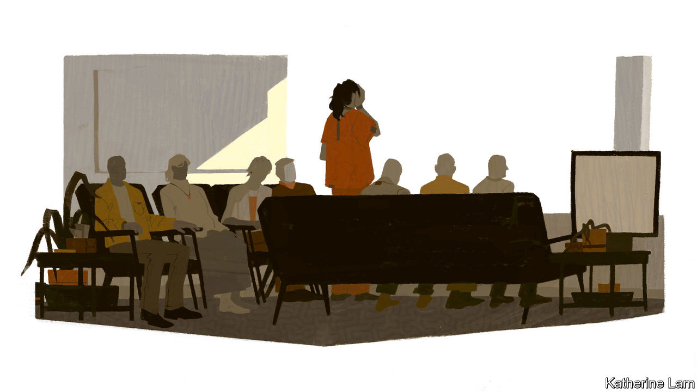
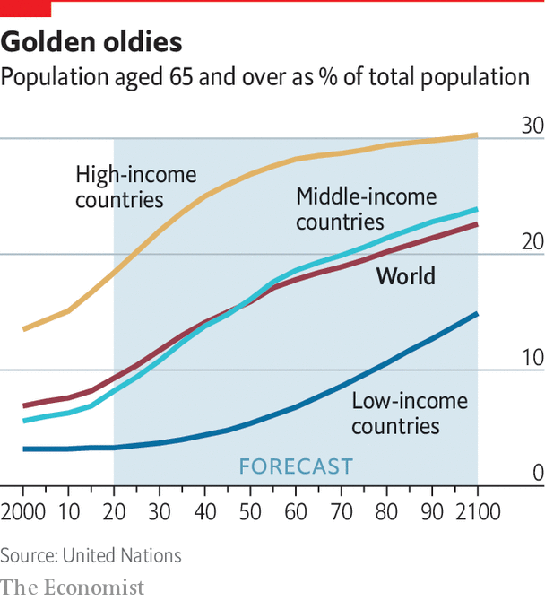

## Care

# The big question about dementia care is who is going to do it

> The best care is “people-centred”, ie, labour-intensive

> Aug 27th 2020

IN A TWO-STOREY building in a suburb of Tokyo, eight old people are sitting around tables in a spotless living room with a kitchenette attached. They are enjoying a quiz game, which entails shouting out the word that completes a well-known phrase or saying. One woman is first to all the answers, with nobody else getting a look-in. But, say staff at this care home, one of 280 run by Nichi Gakkan, a medical-services company, she forgets what happened ten minutes ago. The residents’ spartan rooms, with just a few keepsakes from home, have their photographs on the door, to make it easier to go to bed in the right one.

The house has 18 beds. All residents have dementia—mostly Alzheimer’s, but some cases of vascular dementia and one of the rarer fronto-temporal sort. The youngest is 69; half are over 90. They are encouraged to help with chores, such as folding their own laundry. Volunteers teach ikebana (flower arranging) and origami (paper folding). They watch, or sit through, a lot of television.

Most have families. But some never visit. To be honest, says one of the staff, it makes little difference. Residents often do not recognise loved ones. The best that can be hoped for is to offer a “safe and ordinary everyday life”. This is a top-of-the-range facility, with a lower ratio of residents to staff than in many other care homes: four people on duty in the day and two from 5pm to 8am. The cost is met by public insurance, residents’ pensions and savings, or by their families. Occasionally a resident has to leave for a cheaper home. Mostof them are here till they die.

Japan has the world’s oldest people, with 28% of the population aged 65 and over and 2.4m people over 90, including more than 70,000 centenarians. (In America, with a population two and a half times as big, 16% of the population are 65 or over, and there are 97,000 centenarians.) Japan also has the highest percentage of people with dementia of any country: about 4%, or 5m people. Since life expectancy at birth is high (81 for men, 87 for women), birth rates low (seven births per 1,000 people in 2019) and immigration tiny, this percentage is only going to grow.

Just behind Japan demographically are greying western European countries such as Italy and Portugal, and the Asian tigers: Hong Kong, Singapore, South Korea and Taiwan. These trends of longer lifespans and lower fertility rates will, barring disaster, be followed by the rest of the world. So how Japan copes with a problem that every country will have to confront is instructive.

It has advantages—notably prosperity, but also traditions of social cohesion and respect for the elderly, and sophisticated companies alert to the business opportunities in ageing. Nichi Gakkan, for example, was founded in 1968 to focus on medical administration and education. It moved into long-term care, which now accounts for 60% of its business, in 1996, ahead of a new insurance scheme that the government launched in 2000. Its home in Tokyo is a fine example of humane, dignified care for people with dementia, of whom it houses 130,000 across Japan. However, as the country’s demographic imbalance worsens, the shortage of places for the infirm elderly and those with dementia will become more acute. In 2018 Tokyo was reckoned to be short of 140,000 residential places for old people. Across Japan it is estimated that the number of care workers will need to increase sevenfold by 2030 from today’s 1.5m. On this basis, more than a tenth of the workforce will be working as carers.

This is a global phenomenon. Around the world, similar problems are sure to develop. In America in 2017, 1m sufferers from dementia (nearly one-fifth of the total) were in residential care. In Britain around 312,000 are in care homes, a number expected to rise to 417,000 by 2025 and 667,000 by 2040. So severe is the shortage of appropriate residential care that, before the covid-19 pandemic, a quarter of beds in National Health Service hospitals were said to be occupied by people with dementia.

Many care homes are gruesome places, in which sedated residents sit or lie vacantly while overworked staff struggle to fulfil routines for administering medicine, food and exercise, and a television blares in a crowded living room. Efforts are being made to improve such homes, with more emphasis placed on treating residents as individuals. “Reminiscence therapy”, in which people are helped to remember events, people and places through sight, touch, taste, smell or sound can have remarkable results. Music seems especially potent. After caring for her mother and writing her book on dementia, Sally Magnusson founded a charity called “Playlist for Life”, devoted to producing musical life-soundtracks for people. So dementia care need not be grim.

In a much-praised example in the Netherlands, Hogeweyk, a “dementia village” in Weesp near Amsterdam, earlier this year housed 169 people with advanced dementia in 27 separate houses in one compound. Residents choose between four “lifestyles”—traditional, urban, formal and cosmopolitan—with decor, cuisine and activities adapted accordingly. It has its own grocery shop and a restaurant that is open to the public. Eloy van Hal, a founder of the centre, describes it as a shift from a medical and institutional model to a “social-relational, non-institutional” one. It is on the site of a conventional care home, and no bigger. Operating costs are no higher and can be covered by the Dutch long-term-care insurance scheme. Mr van Hal says the aim is that nothing should identify it as a “care home”. But it still has a flag outside advertising itself as such, and residents cannot go out at will.

In the Netherlands and elsewhere, much is done to help people with dementia stay at home for as long as possible. This is what they and their families often prefer. It also usually costs less than residential care. The average stay in Hogeweyk is just over two years, partly thanks to the support available to people in their own homes until they suffer serious impairment. Yet care at home can still place strain on caregivers. According to the OECD, the prevalence of mental-health problems among carers is 20% higher than among non-carers. In Japan there has been alarm over a series of “nursing murders”, in which caregivers have killed their charges. The stresses of tending for an invalid at home are also cited as a factor in many suicides.

Some places in Japan are bolstering care at home not just with visits from professional carers but by making daily life more “dementia-friendly”. According to the government, 12m people across the country have been given rudimentary training as “dementia supporters”. In Matsudo, a suburb of Tokyo, the local government and volunteers organise “dementia cafés”, weekly get-togethers for those with relatively mild dementia, for whom day-care facilities are not yet suitable. A volunteer at one describes how some people have been coming for two years and show no obvious signs of mental deterioration. The municipality is also trying to make the world outside safer. “Orange Patrols”, groups of five or six mostly elderly volunteers in hi-vis jackets, keep a lookout for endangered schoolchildren and disoriented old people.

People with dementia are also encouraged to carry a QR code on them, perhaps stuck to a walking-stick or hat, or on a lanyard. If somebody finds them looking lost (and, thanks to a vigorous public-information campaign, knows what to do) a smartphone scan of the code will reveal details about them. Takeuchi Wataro, of Mapple, a map and guidebook firm that sells codes on stickers at ¥1,800 ($17) for ten, says he was inspired by coming across a confused old man walking blithely across a six-lane highway.

Looking after someone at home may not be possible for 24 hours a day. In Britain a surge in the number of dementia cases ending up in hospital seems linked to the closure of day-care centres, which offered both a social outlet that helps slow cognitive decline, and a much-needed respite for carers at home. Even better, some places offer overnight stays when needed.

Another way to keep people at home longer is through technology. In some public-housing blocks in Singapore, neighbours or family members of the vulnerable elderly will be alerted if, say, a tap in a washbasin has not been used for a while. Researchers at the UK Dementia Research Institute’s Care Research & Technology Centre, based at Imperial College London, are experimenting with taking this further. Infra-red and radar sensors installed in the homes of those with dementia, devices worn by them as watches, or hearing-aid type brain-scanners can all provide data giving early warning of signs of trouble. They might pick up indications of worsening dementia or a sickness. For example, blood-pressure and temperature measurements and frequent visits to the lavatory might indicate a urinary-tract infection (a common reason for people with dementia to end up in hospital, because they can be slow to respond to the symptoms).

There are also, inevitably, apps for dementia. “Refresh player” and “Refresh studio”, from a tech firm called “How do I?” offer “personalised memory support”, including videos on how to perform day-to-day tasks, such as run a bath or boil a kettle, which appear when a smartphone taps a code on a sticker on a once-familiar but now sometimes baffling object. They can also jog memories with videos or photos supplied by family and friends. Japan is pioneering the use of robotics in caring for the elderly. Toys such as Paro, a furry seal used as a “therapy animal”, and Pepper, a humanoid robot deployed in hundreds of care homes to play games, talk and demonstrate exercise moves, can help.

Nobody pretends that these can be a substitute for human care, especially for the bewildered. But they are at least a partial answer to the question that will determine the future of dementia care: who is going to do it? There are wonderful examples of “people-centred” care for dementia sufferers. But most are extremely labour-intensive (see [article](https://www.economist.com//node/21791110)). And as the number of cases rises inexorably, in most countries it will be hard to find enough people willing and able to take on the job.

This is partly a simple function of demography as society ages. But it is also partly because care workers often endure low status and low pay, a sad truth highlighted in the covid-19 pandemic as society leant on them more heavily than ever. In Britain, for example, under the new immigration policy the government is introducing for the post-Brexit world, most jobs in care will not pay high enough wages to allow employers to recruit overseas. Yet the industry relies on about 350,000 immigrant workers. A trade union has warned of a shortage of up to 500,000 workers in an industry that already has 8% of vacancies unfilled.

The ranking of such jobs as “unskilled” seems short-sighted. Camilla Cavendish, a journalist and policy wonk now again advising the government, led a review in 2013 of support workers in Britain’s health and social-care services. In a recent book (“Extra Time: Ten Lessons for an Ageing World”), she writes: “Care work is undervalued, underpaid, emotionally draining and physically exhausting. Yet it is, in my view, highly skilled. It requires enormous maturity and resilience; deep wells of kindness, too.”

Japan, in contrast, has been making it easier for foreign workers to come in for a few years. But cultural and language barriers are high, and the country starts from such a low base of immigration that this will not make much of a dent in its shortfall.

Adelina Comas-Herrera, a researcher at the London School of Economics, is leading a study into care in poorer countries (“Strengthening Responses to Dementia in Developing Countries” or STRiDE). She argues that what is needed, given the looming labour crunch, is a new model of collaborative care. This might involve using what institutional infrastructure exists for new purposes, especially in poor countries with few arrangements in place. In Vietnam, for example, the ruling Communist Party has a nationwide network of offices. Community centres might be transformed to offer a form of day care. Such adaptation may be better than building dementia-care services from scratch.■

## URL

https://www.economist.com/special-report/2020/08/27/the-big-question-about-dementia-care-is-who-is-going-to-do-it
