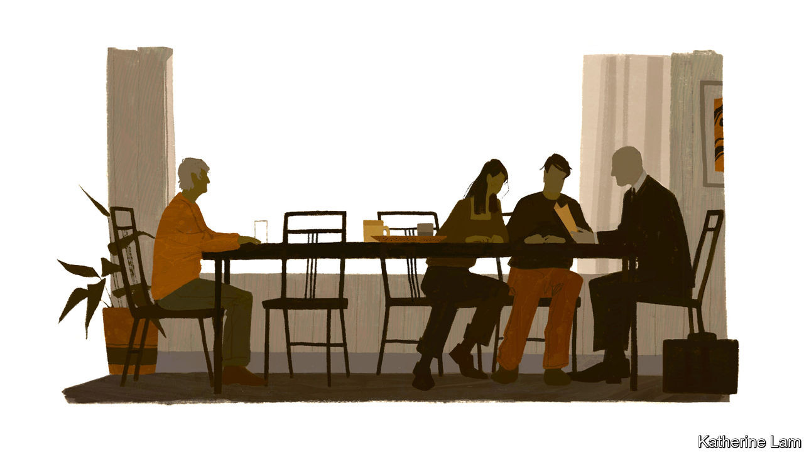

## Ethics

# Too often the basic rights of people with dementia are overlooked

> But trying to respect them can raise painful ethical dilemmas

> Aug 27th 2020

A FEW MONTHS before Vera mistook her grandson for a coconut, her son came by with someone she did not recognise. He was indeed a stranger, a local solicitor. He gave her a paper to sign, having first checked that she was fully aware of what she was doing, indeed, “as sharp as two tacks”. Thus did she sign away her money, property and decision-making rights to her son, this writer. The solicitor was right to think that he had only benevolent intentions. But this was a process, like many others, in which the rights of people with dementia can easily be forgotten.

The dilemmas start with diagnosis. With no cure on offer, and diagnostic tools crude and capable of getting it wrong, not everyone thinks people should be told they have early-stage dementia. Some may cope perfectly well with MCI and lose confidence only if given a diagnosis that sounds like a brain-death sentence. But most charities argue that early diagnosis is both their right, and helpful in making care arrangements—and indeed plans to hand over decision-making in good time.

In fact, relinquishment of legal rights is covered by strict laws, and is used more often to protect than to exploit. At some point, people with advanced dementia need help in making even basic decisions. But some countries now ensure greater protection for those signing away their rights. South Korea has amended its guardianship law from one with only the option to surrender all legal rights into one where “full” guardianship is a choice, with others allowing specific sorts of decisions to be delegated.

These decisions can be matters of life and death. Suppose somebody wants to live but refuses life-saving medicine. Or suppose they cannot bear the thought of becoming totally dependent, helpless and confused and sign an instruction that they do not want to be revived if seriously ill, but then change their mind. Susan Cahill, of Trinity College, Dublin, argues in her 2018 book, “Dementia and Human Rights”, that often “the ‘best guess’ of a trusted and chosen supporter, based on all the knowledge gathered about the person’s past and present wishes, hopes and aspirations for her life, values and beliefs, is the most that can be achieved.”

The problem is most acute in countries where euthanasia or assisted suicide is allowed. In 2017 in the Netherlands 6,585 people died in one of these ways, with 166 having early-stage dementia and three advanced dementia. That so few reached the advanced stage is not surprising. People often write “advance euthanasia directives” (AEDS) saying they want to die if they can no longer recognise members of their own family. But by then, they may not grasp that they are going to die and be unable to repeat their wish; or, such is the human capacity for adaptation, they may have reconciled themselves to impaired cognition and no longer want to die. The law permits euthanasia in cases of “unbearable suffering”. But for severe dementia, that may be impossible to prove.

The Dutch law was tested last year. Prosecutors brought charges to seek clarification, rather than punishment, for a doctor who was seen to have acted with the best intentions. The patient was a 74-year-old woman with severe Alzheimer’s, who four years earlier had written an AED requesting euthanasia rather than go into a care home. But she added that she wanted “to be able to decide [when to die] while still in my senses and when I think the time is right.” With the consent of her family, the doctor gave the woman a sedative before the final act. But she woke up and had to be restrained to receive the lethal injection.

Such choices are agonising, pitting the rights of a person with unimpaired faculties against those of the same person with advanced dementia. The consequence, as can be seen from the Dutch numbers, is that people have to choose a shorter life than they might otherwise have lived, to be sure of being able to decide when to end it. The only cure for dementia, after all, is death.

Ethical dilemmas such as these seem insoluble. But that they are being confronted is a sign that attitudes to dementia are changing. Whether the condition is seen as an inescapable part of the ageing process, or as a symptom of a common disease, there is a tendency to let it define a person. Of all the stigmas it carries, perhaps the worst is the prejudice that people with dementia are less than fully human. They are often talked about, in their presence, even by those who love them, as if they are not there.

So many covid-19 victims have had dementia that the pandemic might have prompted soul-searching about these attitudes. Yet it has not. Many families worry that, when patients are selected for access to scarce medical resources, those with dementia come last, based on questionable assumptions about their quality of life. If and when a covid-19 vaccine becomes available, the same issue will arise: will those with dementia be first to get it, as among the most at risk? Or will preference be given to other vulnerable groups? Nobody is going to argue that those with dementia matter less than others. So public debate on these issues is almost non-existent.

Before covid-19, campaigners had reason to believe that they were making progress with the argument that dementia is not an inevitable feature of ageing but a disability that should be treated as such. And it seemed that governments were accepting that dementia is a global emergency, arriving with the remorseless logic and unstoppable force of demography: longer lifespans and a shrinking share of the population of working age. Covid-19 may have made a difference in the cruellest of ways, by killing hundreds of thousands of people with dementia, and, more hopefully, by encouraging public-health campaigns to resist a return of the pandemic that will, incidentally, protect more against dementia. Yet the fundamental problems will remain: most important, not enough people to care for the tens of millions with dementia, but also not enough resources for understanding, ameliorating or curing the condition, or for looking after people who have to live with it.

Optimists may point to the covid-19 pandemic to argue that it shows how much can be achieved when the scale of an emergency is recognised and resources are thrown at it. Perhaps more realistically, it has given one more reason for policymakers to be more preoccupied by another looming emergency instead.■

## URL

https://www.economist.com/special-report/2020/08/27/too-often-the-basic-rights-of-people-with-dementia-are-overlooked
