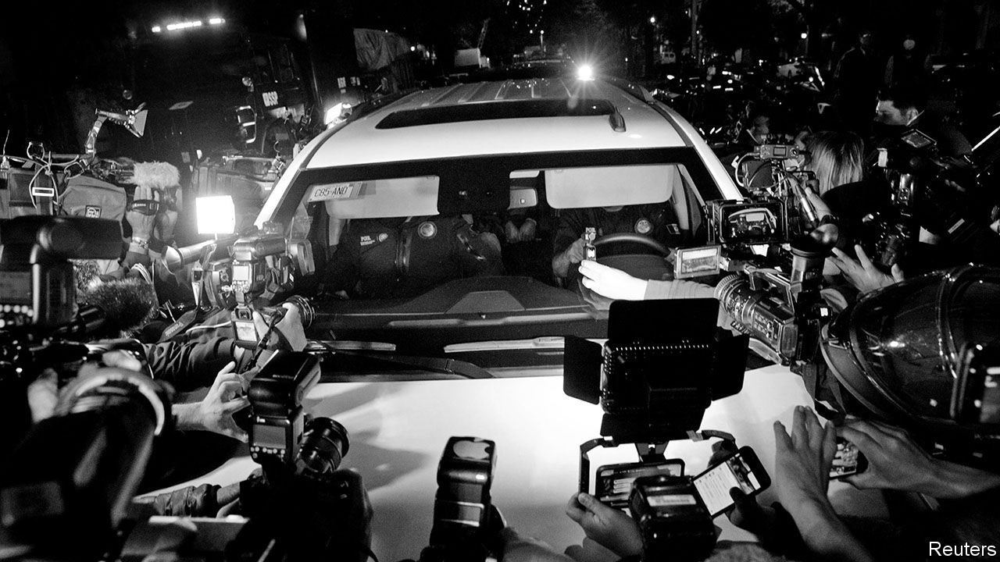

## Bombshells on board

# A former official fires a legal missile at Mexico’s political class

> Emilio Lozoya’s explosive allegations of corruption will test the country’s institutions, and its president

> Aug 29th 2020MEXICO CITY

ONE OF THE rituals of Mexican politics is for a president to begin his term by locking up a supposed miscreant from the previous administration. Four of the six presidents from 1982 to 2018 did that. They incarcerated two union leaders, a former president’s brother and the head of Pemex, the state oil company. They presented these as giant victories in the fight against corruption. But they were not. Two of the jailbirds were acquitted, one was pardoned and the sentence of the fourth was overturned. Corruption continued to be rampant, uninvestigated and unpunished.

Many Mexicans regard the administration of Enrique Peña Nieto, which governed until December 2018, as the most corrupt in history. Rosario Robles, a minister in his government, is suspected of helping to siphon off $400m of the government’s money through ghost companies and has spent the past year in preventive detention. A construction firm with government contracts helped Mr Peña’s wife acquire a house worth $7m.

Those scandals helped Andrés Manuel López Obrador, a left-wing populist, win the presidential election in 2018 in a landslide. Mr López Obrador, often called AMLO, portrays himself as incorruptible and promises to “eliminate, not reduce” graft. Like past presidents, he has sought out wrongdoers from earlier administrations.

Last year, at the request of the attorney-general, a judge issued an arrest warrant for Emilio Lozoya, who was international-affairs co-ordinator for Mr Peña’s campaign and the boss of Pemex from 2012 to 2016. He returned from Spain in July this year.

The idea that Mr Lozoya would be just another presidential scapegoat was demolished in dramatic fashion. On August 19th the press got hold of his deposition, in which he offers to provide evidence of a corrupt mega-scheme involving 17 prominent Mexicans, including Mr Peña and two other former presidents. Mr Lozoya is seeking protection from prosecution in return.

On paper, the scandal he has revealed is the biggest in Mexican history. Without a proper investigation, on paper it will stay. That is all too likely. In part, that is because Mexico’s judiciary is politicised and inexpert. AMLO seems to share past presidents’ preference for trying his opponents in the court of public opinion.

Mr Lozoya describes his role as Mr Peña’s point-man in two linked schemes. The first was a $4m bribe from Odebrecht, a Brazilian construction company that corrupted officials across Latin America (see [article](https://www.economist.com//node/21791238)). Mr Peña’s presidential campaign spent most of that money on foreign consultants. The second was 56m pesos ($4.3m) to induce senators from the opposition National Action Party (PAN) to vote to open the oil sector to private investment. The architects of this scheme, says Mr Lozoya, were Mr Peña and Luis Videgaray, his finance minister and confidant.

Mr Lozoya suggests that his reward for his part in this skulduggery was his appointment as boss of Pemex, in charge of a multi-billion dollar budget. There he discovered more corruption, he says. Under Felipe Calderón, Mexico’s president from 2006 to 2012, Pemex sold ethane to an ethylene plant owned by Braskem, in which Odebrecht has a controlling stake, at an “inexplicable discount” of 25%. Mr Lozoya alleges that José Antonio Meade, the presidential candidate in 2018 for Mr Peña’s Institutional Revolutionary Party, approved the ethane contract as a member of Pemex’s advisory council.

Mr Lozoya claims that in 2013 Mr Videgaray bullied him into approving the purchase by Pemex of a fertiliser plant for $275m, well above its true value. The seller, Altos Hornos de México, a steelmaker, allegedly gave Mr Lozoya’s wife a seaside villa worth $1.9m 12 days after the deal went through. Nearly all the people Mr Lozoya accused have denied wrongdoing and many have sued him.

The allegations, which taint nearly all of AMLO’s main rivals over the past 20 years, play into his hands. They are acutely embarrassing for the two main opposition parties. To many they make Mr Peña’s energy reforms, which ended Pemex’s 75-year monopoly of drilling in an oil-rich country, seem illegitimate. AMLO has always denounced them (and championed Pemex) and may now try to revoke them. The scandal distracts from his mishandling of the covid-19 pandemic. Mexico’s death toll, 62,076, is the world’s third-highest.

There are reasons to doubt Mr Lozoya. His testimony could well keep him out of jail and protect his wife and sister, in whose names he registered houses and offshore companies. “People can say anything in exchange for reductions in sentences,” he observed in 2017, after he was accused of corruption by Odebrecht employees who were co-operating with Brazilian investigators. Perhaps that includes Mr Lozoya, his critics say.

Ricardo Anaya, the PAN’s presidential candidate in 2018, denies Mr Lozoya’s claim that in August 2014 he received a bribe of $600,000 in the congressional car park. Mr Anaya had left the chamber of deputies five months earlier to become general secretary of the party. Some who believe Mr Lozoya’s allegations doubt that he witnessed everything he says he did.

The case comes at a pivotal moment. Activists have spent the past decade drawing up anti-corruption and criminal-justice reforms and cajoling politicians to implement them. Criminal trials have shifted from the “inquisitorial” system used, for example, in France, in which the court takes an active part in establishing facts, to an “adversarial” one similar to that in the United States. Now investigators must use forensic equipment and, in corruption cases, dig through financial records. The reform is young; judges and prosecutors have yet to master their new roles.

In response to scandals in his administration, Mr Peña agreed to set up an “anti-corruption system”, featuring a strong, independent attorney-general, a dedicated anti-corruption prosecutor and a monitoring role for citizens’ groups. These institutions should have been primed to investigate Mr Lozoya’s claims. But Mr Peña gummed up the anti-graft machinery. He failed to make the attorney-general’s office independent and nominated anti-corruption magistrates to the federal administrative court without proper vetting.

AMLO has been no keener to oil the gears. The attorney-general he appointed, Alejandro Gertz Manero, advised his campaign. The government appointed the anti-corruption prosecutor, María de la Luz Mijangos, without soliciting applications from other candidates. Although the law gives her responsibility for investigating the allegations made by Mr Lozoya, she is playing no visible role.

A dutiful slog through the evidence, conducted by independent investigators, is not what AMLO seems to have in mind. He has often proposed holding a public vote on whether former presidents should be prosecuted, most recently at his morning press conference on August 24th. He has mused about holding it on the same day as congressional elections, due in July 2021. That is impossible to square with the attorney-general’s independence.

The leak of Mr Lozoya’s testimony has made the investigators’ job more difficult by subverting the presumption of innocence and, perhaps, provoking suspects to destroy evidence. For AMLO it serves as a prop. He leafed through the deposition in a video entitled “The neoliberal period in Mexico was synonymous with corruption”. At a press conference he showed a video of senators’ aides handling bags of cash. It demonstrated “the filth of the corrupt regime”, the president declared.

AMLO is personally honest and ostentatiously frugal. And there are no reports of thievery in his government on the scale Mr Lozoya alleges. But his political movement may not be as clean as he claims. A day after Mr Lozoya’s deposition came to light, videos emerged of AMLO’s brother, Pío, receiving bundles of money in 2015 from an official of the Chiapas state government. AMLO explained that the money was given by “the people” to finance Morena, the political party he founded. But it seems to violate a ban on supporting parties with large cash payments, which is supposed to ensure that criminals do not finance elections. “We are not the same as corrupt governments of the past,” AMLO insisted. Nevertheless, he agreed that the matter should be investigated.

Surveys show that Mexicans believe AMLO’s claim to be an anti-corruption crusader. But small-scale graft may have increased during his government. More Mexicans reported paying bribes in 2019 than two years earlier. AMLO has slashed the salaries of senior public servants, which increases the incentive to demand kickbacks.

Mr Lozoya’s accusations have kept Mexicans’ attention on the past. They further discredit a demoralised opposition, and set up Morena to do well in next year’s mid-term elections. Justice for the alleged miscreants may not be what the president wants most. For his purposes, it is enough to see them squirm.■

## URL

https://www.economist.com/the-americas/2020/08/29/a-former-official-fires-a-legal-missile-at-mexicos-political-class
