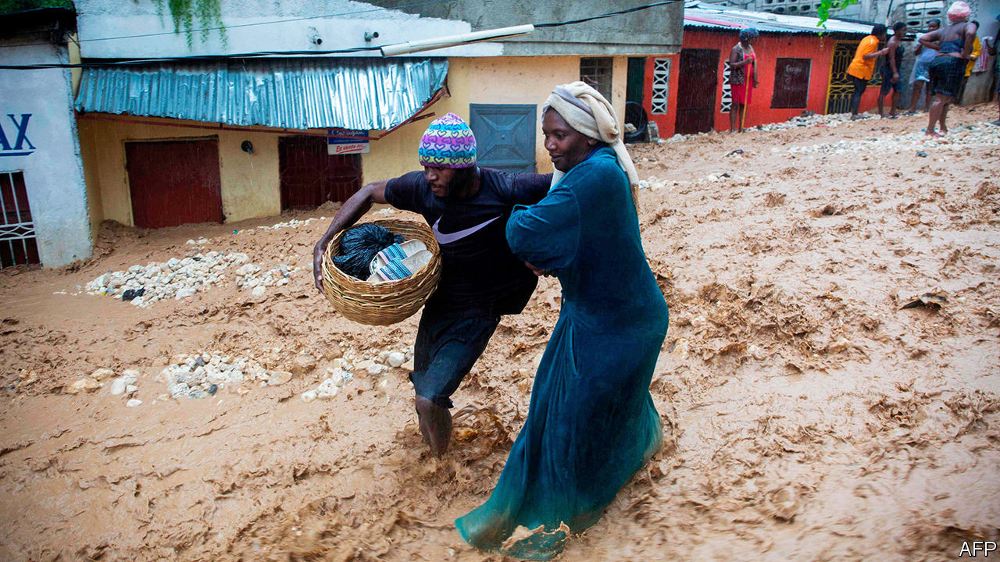

## Sibling storms

# Storms Marco and Laura strike the Caribbean

> Aug 29th 2020

TWO STORMS battered the Caribbean before heading towards the United States. Marco led, becoming a hurricane over the Gulf of Mexico, followed by Laura, which strengthened to a category-four hurricane. The 12th named Atlantic storm this year, Laura arrived earlier than any other with that place in the sequence. It struck Haiti (pictured), where at least 21 people died, and the Dominican Republic, where four died.

## URL

https://www.economist.com/the-americas/2020/08/29/storms-marco-and-laura-strike-the-caribbean
