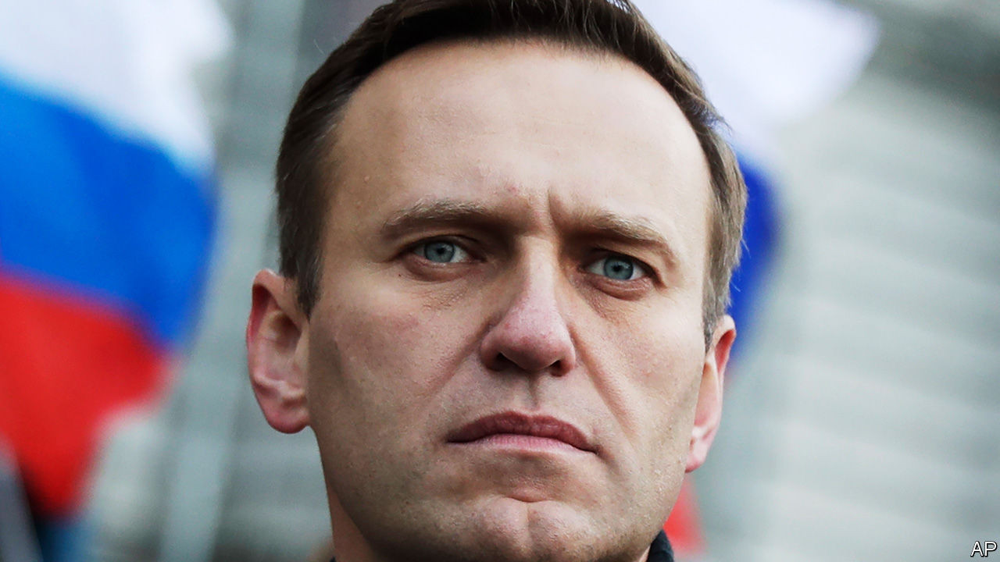
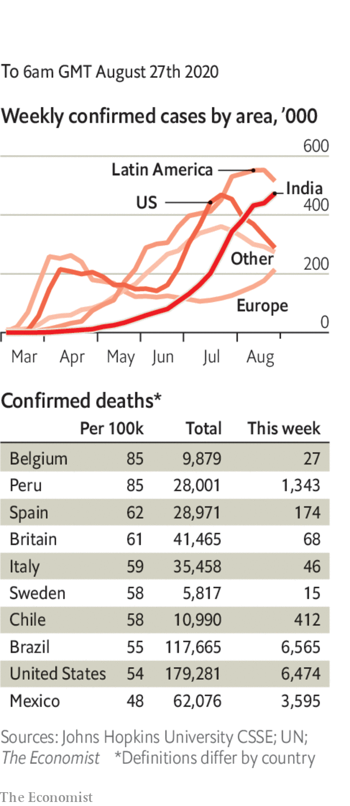

# Politics this week

> Aug 29th 2020

Alexei Navalny, Russia’s most prominent opposition leader and anti-corruption activist, fell into a coma after being poisoned. He was held for two days in a Russian hospital, before being released and flown to Germany, where doctors said they thought the poison included cholinesterase inhibitors, an ingredient in some Russian-made military toxins. Kremlin flacks said perhaps he was suffering from low blood sugar. Germany has offered him asylum. See [article](https://www.economist.com//leaders/2020/08/29/russians-and-belarusians-are-tired-of-backwards-looking-autocrats).

Hundreds of thousands of protesters continued to demand the resignation of Alexander Lukashenko, Belarus’s dictator, despite facing arrest and torture. Mr Lukashenko flew by helicopter to a secure location and brandished an AK-47 rifle. Western countries have not recognised a rigged election on August 9th that Mr Lukashenko “won”. See [article](https://www.economist.com//briefing/2020/08/29/the-uprising-in-belarus-and-the-poisoning-of-alexei-navalny).

Phil Hogan, the EU’s commissioner for trade, resigned after violating covid-19 social-distancing rules while on a trip to his home country of Ireland. See [article](https://www.economist.com//node/21791258).

Africa was declared free from wild polio, after decades of work by governments, volunteers and global health bodies. Nigeria was the last African country to be given the all-clear. The disease is now only found in Afghanistan and Pakistan. There is no cure, but there is a vaccine.

The UN Security Council blocked America’s effort to restore UN sanctions on Iran, which were lifted as part of a nuclear deal that America ditched in 2018. The rotating president of the council said many members disagreed with America’s position. Meanwhile, Iran agreed to grant inspectors from the International Atomic Energy Agency access to two nuclear sites after a months-long stand-off.

Israeli warplanes bombed targets in Gaza belonging to Hamas, the Islamist group that runs the territory. The strikes were a response to Palestinians launching incendiary balloons towards Israel. There were no reports of casualties.

Several pro-democracy activists were arrested in Thailand as student protests raged against the military-backed regime. Facebook obeyed an order to block access to a group with 1m members that the state claims is rude to the monarchy—a crime in Thailand.

In India Prashant Bhushan, a lawyer, was found guilty of contempt of court for a tweet chiding the chief justice for flouting social-distancing rules and another saying courts were abetting the erosion of democracy in India. The ruling on the two tweets was 108 pages long.

A white supremacist who massacred 51 people at two mosques in Christchurch was sentenced to life in prison without the possibility of parole. It was the first time such a sentence has been handed down in New Zealand. See [article](https://www.economist.com//asia/2020/08/29/the-murderer-of-51-muslims-in-new-zealand-last-year-is-sentenced).

Abu Sayyaf, an insurgent Islamist group in the Philippines, carried out two suicide-bombings in the city of Jolo, killing 14 people.

A deposition containing startling allegations of corruption against three former Mexican presidents and other politicians and officials was leaked to the press. The current president, Andrés Manuel López Obrador, proposed holding a referendum to decide whether to prosecute them. Critics noted that this would make a mockery of the rule of law. See [article](https://www.economist.com//leaders/2020/08/29/mexicos-president-shows-how-not-to-handle-a-scandal).

Canada’s Conservative Party, the main opposition to the Liberal government of Justin Trudeau, chose Erin O’Toole to be its new leader.

Prosecutors in Brazil charged Flordelis dos Santos de Souza, a gospel singer who is now a congresswoman, with conspiring to murder her husband, an evangelical pastor. They accused six of her 55 children (most of whom are adopted) of participating in the murder. Ms dos Santos claimed her husband, who was shot 30 times, was killed in a robbery. 

America’s Republicans held their convention, with most of the speechifying broadcast via video link. Donald Trump used the White House as a backdrop for parts of the jamboree. Mike Pompeo also flouted protocol by praising Mr Trump’s accomplishments. Secretaries of state normally keep a low profile at overtly political functions. See [article](https://www.economist.com//node/21791234).

Mr Pompeo broadcast his speech from Israel, where he had earlier called on other Arab states to follow the lead of the United Arab Emirates and normalise relations with the Jewish state.

Protests against the shooting of a black man by police in Kenosha, Wisconsin, that left him paralysed, descended into violence. A white teenager was charged with shooting dead two people. See [article](https://www.economist.com//united-states/2020/08/29/wisconsins-summer-of-fury).

Hurricane Laura battered Haiti and the Dominican Republic, killing dozens, before roaring across America’s Gulf coast, hitting Louisiana and east Texas. The National Hurricane Centre said that the expected storm surge was “unsurvivable”. See [article](https://www.economist.com//node/21791233). 

Steve Bannon, a former adviser to Mr Trump and inspiration to nationalists and populists globally, was charged with swindling donors to a charity that supports building a wall along the Mexican border. He was arrested on a yacht owned by Guo Wengui, a Chinese billionaire who lives in exile in New York. See [article](https://www.economist.com//united-states/2020/08/29/meet-guo-wengui-steve-bannons-chinese-exile-friend).

Researchers in Hong Kong reported the world’s first genetically verified case of someone who has been reinfected with covid-19, suggesting that immunity from the disease does not necessarily last long. The WHO called for more studies.

Mexico officially passed 62,000 deaths in total and 574,000 cases. Unofficially, the real numbers are thought to be perhaps three times higher. In the United States the number of new cases continued to fall.

Japan was reportedly set to lift its ban on foreign residents returning to the country.

Joe Biden said he would “listen to the scientists” and, if elected president, would be willing to shut the economy to stop another wave of infections.

The World Economic Forum postponed next year’s Davos summit from January until the middle of the year.

## URL

https://www.economist.com/the-world-this-week/2020/08/29/politics-this-week
