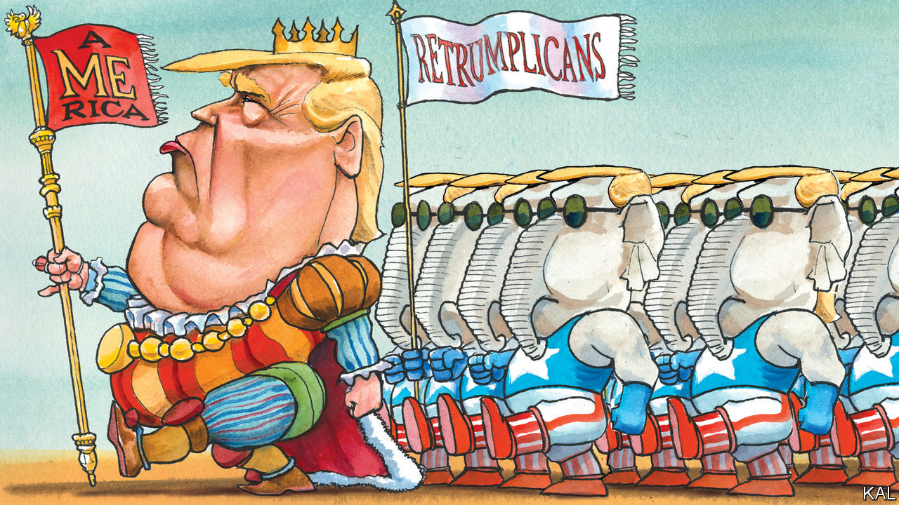

## Lexington

# Hail to the king

> Trump at the convention

> Aug 29th 2020

WHEN DONALD TRUMP appeared at the 2016 Republican National Convention in Cleveland, the party’s establishment was still shell-shocked by his nomination. Yet its politico, donor and lobbyist members consoled themselves with the thought that, given his probable loss to Hillary Clinton, they would soon have a chance to reunify their party in furious opposition, and reclaim it. While a few senior Republicans—including the governor of Ohio, John Kasich—condemned Mr Trump, most merely gave the convention a miss. Mr Trump’s main defeated rival, Senator Ted Cruz, addressed the gathering but did not endorse him. Seemingly by default, Mr Trump filled the vacuum with a cast of relatives, hyper-partisans and sycophantic opportunists.

Four years on, it turns out that that wasn’t by default. Half of this week’s RNC headliners were named Trump (including the president’s four adult children, wife and daughter-in-law). And though other members of the 2016 crew were unavailable, their replacements hit the same notes of hysterical fear and adulation. In place of Mike Flynn and Chris Collins, two prominent cheerleaders since convicted of crimes, Mr Trump employed attack-dogs such as Congressman Matt Gaetz, a Floridian mini-Trump—who warned viewers that Democrats “will disarm you, empty the prisons, lock you in your home and invite MS-13 to live next door.”

Deputising for Jerry Falwell junior, the president’s main evangelical fan in Cleveland, now mired in scandals (including an allegation that he enjoyed watching his wife have sex with a young boyfriend), Mr Trump had members of Billy Graham’s family laud him as a “fierce advocate” of faith. No opportunist has spoken for the president with more cynical zest than his eldest son’s girlfriend, Kimberly Guilfoyle, a Fox News presenter turned well-paid Trumpist megaphone, did this week. “The Best! Is Yet! To Come!” she yelled to an empty room. Mr Trump’s political showmanship is unchanged. Yet his standing within his party is transformed.

When he declared in Cleveland that America was half-destroyed and “I alone can fix it”, even many Republicans were nonplussed. Less than half had voted for him in their presidential primaries. Now almost all approve of him, many reverently, as the personality cult he launched in Ohio has subsumed the party.

Instead of unveiling a policy platform, as is customary, the Republican National Committee set independent thought aside this week and resolved to “support the president’s America First agenda”. Yet, halfway through the convention, it was harder than ever to fathom what that means. The only logic to the policies highlighted was tactical. To reassure the dwindling centre-right, one segment featured Mr Trump, the most anti-immigration (legal and illegal) president of modern times, praising hardworking immigrants at a naturalisation ceremony. Several speakers, while tumbling over each other to praise his achievements, also gave contradictory accounts of what they were. Senator Rand Paul lauded his opposition to “endless wars”; Mike Pompeo, the secretary of state, praised his sabre-rattling against Iran; Eric Trump claimed he had brought peace to the Middle East.

In contrast to Cleveland, a willingness to lacquer Mr Trump with praise was a condition for being allowed to speak—as demonstrated by former critics such as Nikki Haley, even though, when she was his ambassador to the UN, she observed the president being laughed at by world leaders. Yet the unfeigned reverence expressed for him by the many ordinary folk showcased in the convention was more unnerving. They included health-care workers who gave thanks for his management of a pandemic predicted to claim a quarter of a million American lives by the election.

Besides seeming profoundly un-American in its tone, such adulation represents the triumph of a four-year propaganda campaign that abandoned objective truth on day one and the normal limits of partisan self-promotion shortly afterwards. Its current iteration, to which the convention was largely dedicated, insists that Mr Trump inherited an economy on the brink of collapse, proceeded to build the “greatest economy our country has ever seen”, was unfairly assailed by the “China virus”, but is now in the process of making more American greatness, which Joe Biden would turn to ashes overnight. Fact-checkers identified more lies on the Republican convention’s first night than throughout last week’s Democratic one. In the midst of the worst plague in a century, worst social unrest in decades and one of the worst economic crises in the country’s history, three in four Republicans claim to believe America is in better shape now than it was four years ago.

As that should suggest, the Republican Party is not the only institution that has failed to check Mr Trump. The media have also succumbed. Conservative outlets have embraced his alternative facts. Left-leaning ones have uncovered them—yet their increasingly frenzied opposition to the president has fed the grievance culture that insulates his supporters from reality.

The law and constitution have similarly trimmed the president’s excesses at best. Defended by an unprincipled attorney-general, Bill Barr, and a supine party, Mr Trump has faced no censure for his many abuses, including his alleged obstruction of investigations into Russia’s hand in his election and efforts to wring political favours from foreign leaders. His impeachment trial, in long-ago January, was hardly mentioned in either convention. He will presumably face no sanction for his additional transgressions this week, in using the White House and other government offices as campaign props, which the law forbids.

The big question, of course, is whether a majority of American voters will hold the line against Mr Trump. He currently trails Mr Biden by a decent margin. Yet in the context of the dishonesty, narcissism, contempt for office and incuriosity about the miseries facing millions he displayed this week, it is not wide enough.■

Dig deeper:Read the [best of our 2020 campaign coverage](https://www.economist.com//us-election-2020) and our [presidential-election forecast](https://www.economist.com/https://projects.economist.com/us-2020-forecast/president), then sign up for Checks and Balance, our [weekly newsletter](https://www.economist.com//checksandbalance/) and [podcast](https://www.economist.com//podcasts/2020/08/21/checks-and-balance-our-weekly-podcast-on-american-politics) on American politics.

## URL

https://www.economist.com/united-states/2020/08/29/hail-to-the-king
