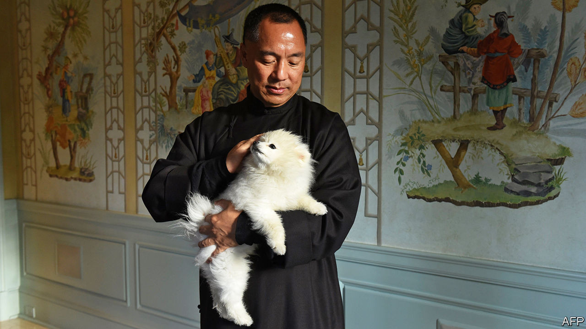

## Guo Wengui and Steve Bannon

# Meet Guo Wengui, Steve Bannon's Chinese-exile friend

> Cognitive dissidents

> Aug 29th 2020NEW YORK

ON AUGUST 20TH, shortly after Steve Bannon was arrested aboard a yacht in Long Island Sound in connection with an alleged charity fraud, the owner of the yacht, a property developer named Guo Wengui, posted a video online intimating that the Chinese Communist Party (CCP) had orchestrated the downfall of the former White House adviser. Mr Guo, who fled China in 2014, has established a formidable online persona as an outspoken dissident who, in his telling, will bring down the CCP.

From his 152-foot yacht and his $67.5m penthouse overlooking Central Park, he spins tales of Chinese elite corruption and purges, styling himself a “CCP terminator”. (Mr Bannon is given the same nickname.) On June 4th, the anniversary of the Tiananmen Square massacre in 1989, Messrs Guo and Bannon announced, aboard the yacht in New York harbour, the founding of “The New Federal State of China”, meant to supplant the People’s Republic.

Mr Guo’s penchant for grandiosity has made it difficult to sort truth from fiction in his claims. Even his personal details are hard to pin down. He is about 50 and also goes by the name Miles Kwok, or Miles Guo, though he is also possibly known as Guo Wugui or Guo Haoyun, and he holds as many passports as he has names. (According to the New York Times Magazine, he also claims never to wear the same underwear twice.) In China he amassed a fortune of $1.1bn, according to a Forbes estimate in 2015. It is not clear how much he still has; both his yacht and his Manhattan apartment are for sale.

On his way up Mr Guo befriended Ma Jian, vice-minister of state security from 2006. He also played a part in bringing down a deputy mayor of Beijing, reportedly with the help of a sex tape of the official with a mistress. He became an object of fascination to American diplomats in Beijing, who pumped him for political gossip. But Mr Guo fled to America during President Xi Jinping’s anti-corruption campaign, which would soon sweep up his friend, Mr Ma.

Chinese authorities have accused him of multiple crimes, from bribery to sexual assault. He denies any wrongdoing. The Wall Street Journal has reported several efforts by Chinese authorities in 2017 to repatriate Mr Guo; he has applied for asylum in America. Chinese state media have attacked him. But some dissidents and sceptics, wary of his past ties to Chinese state security, do not trust him, wondering if he works both sides (he has dismissed such insinuations). American intelligence is said to listen to his insights—but also to keep him at arm’s length.

That may be wise. The day before Mr Bannon’s arrest the Journal had reported that a company he and Mr Guo are involved in, GTV Media Group, was the subject of a federal investigation into its fundraising. Mr Guo called the report a fabrication, part of the CCP’s plot to take Mr Bannon down. But his antics have worn thin on his hosts. “There would be a lot of groans when his name came up,” says a former Trump administration official. In both Beijing and Washington, it seems. ■

## URL

https://www.economist.com/united-states/2020/08/29/meet-guo-wengui-steve-bannons-chinese-exile-friend
