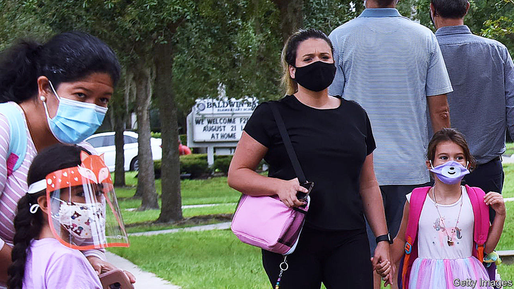

## Covid-19 in schools

# Other countries show that schools need not be pandemic hotspots

> Learning from the world

> Aug 29th 2020

HOW MUCH of a risk is opening schools during the pandemic? Experience from a number of countries is starting to shed some light.

For the children themselves, covid-19 is not a big threat. They usually have mild symptoms or none at all. Among children with symptoms, only 0.1% of those younger than ten and 0.3% of those aged between ten and 19 end up in hospital, a study from Britain shows. For school-aged children, a covid-19 infection is less deadly than most flu infections.

The big worry is that children may spread the virus through school. Studies in households where someone introduced the infection usually find that younger children are much less likely to catch the virus than adults. The evidence for older children is mixed, with some studies concluding that they are as susceptible to infection as adults.

But even if children are infected less easily at home, when they mingle a lot chances are that many of them will pick up the virus. In an overnight summer camp in the state of Georgia in June at least half of the 346 children attending were infected.

Whether the sort of mingling that happens at school is also a recipe for disaster is best judged by looking at countries where schools have reopened. Data from England published on August 23rd are encouraging. Its schools reopened in June for some school years before closing for the summer a month later. In that period only 0.01% of preschools and primary schools had covid-19 outbreaks, affecting 70 children and 128 staff—out of 25,470 infections recorded in England as a whole. Of the 30 school outbreaks involved, the probable source in 20 was a staff member. Students were the source in eight cases, and in two cases the source was unclear.

That teaching is not exceptionally risky is also the conclusion from Sweden. Staff at its nurseries and primary schools, which never closed, were no more likely to become infected than those in other jobs.

Less clear is the role of secondary schools in infections. They have stayed shut almost everywhere. Outbreaks in France and Israel suggest that the virus could spread more easily in them than in primary schools. Older students may be easier to keep apart in classrooms, but good luck trying to stop them congregating afterwards.

America would struggle to contain school outbreaks as much of Europe has done, because infection rates in many states are too high and health officials are overwhelmed. Tough choices may be necessary. Britain’s prime minister, Boris Johnson, has warned that pubs might have to close (to keep infections down) so that children can go to school. In America, where any constraint on freedom goes against the grain, such trade-offs may be an even tougher sell.

Editor’s note: Some of our covid-19 coverage is free for readers of The Economist Today, our daily [newsletter](https://www.economist.com/https://my.economist.com/user#newsletter). For more stories and our pandemic tracker, see our [hub](https://www.economist.com//news/2020/03/11/the-economists-coverage-of-the-coronavirus)

## URL

https://www.economist.com/united-states/2020/08/29/other-countries-show-that-schools-need-not-be-pandemic-hotspots
