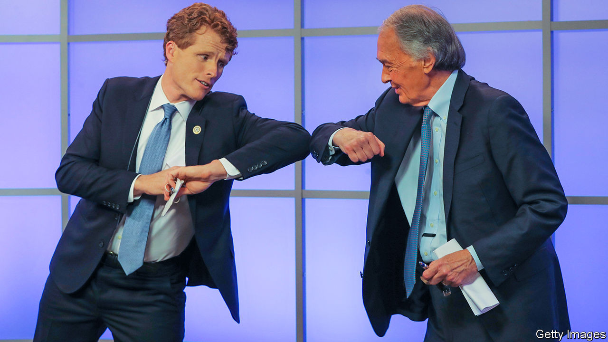

## Kennedy v Markey

# The Kennedy name no longer assures victory, even in Massachusetts

> Sparring for the Senate

> Aug 29th 2020

“JOE KENNEDY knows how a legacy is earned,” begins a new campaign ad for Joe Kennedy, a 39-year-old congressman who is running for the US Senate in Massachusetts. The ad weaves footage of Mr Kennedy helping his constituents with images of his famous family. His great-great-grandfather was a Boston mayor, his dad was a congressman, his great-uncle was president, another served as senator and his grandfather was attorney-general, a senator and a presidential candidate. A Kennedy running for the Senate in Massachusetts should be a shoo-in, especially one with an abundance of red hair. But the Kennedy name may no longer carry the same resonance it once did.

A University of Massachusetts Amherst poll indicates that young people are more attracted to his Democratic-primary opponent and incumbent, Ed Markey. Mr Markey is a Washington veteran. He served as a congressman for nearly four decades before becoming a senator in 2013. He has proved resilient, and his digital strategy has cleverly targeted younger voters. One clip of him shooting hoops while wearing khakis and old trainers has gone viral. Others star Alexandria Ocasio-Cortez, the progressive New York congresswoman widely known as AOC, who introduced the Green New Deal with Mr Markey. For the first time in his long career this rather cerebral politician has taken on a rock-star quality.

As well as AOC’s backing, Mr Markey has received that of Elizabeth Warren, the state’s senior senator. Mr Kennedy, meanwhile, has won the endorsement of Nancy Pelosi, the House speaker. That angered Ms Ocasio-Cortez, who implied the Democratic Congressional Campaign Committee (DCCC) was hypocritical in “cherry-picking” whom to support. Last year the DCCC said it would blacklist firms that help challengers to Democratic incumbents.

Despite arguments over who is more progressive, there is little to distinguish the two likeable politicians beyond their age (Mr Markey, at 74, is nearly twice as old as Mr Kennedy) and that famous last name. Perhaps that is why the campaign has taken on a nasty tone as the primary on September 1st draws near. In one ad, which has had 3m views, Mr Markey says: “With all due respect, it’s time to start asking what your country can do for you,” a play on John Kennedy’s inaugural speech in 1961. In a debate, Mr Markey accused Mr Kennedy’s father and brother of funding negative ads. Mr Kennedy has had to beef up security because of death threats, which his campaign blames on the “dangerous” atmosphere created by some of Mr Markey’s supporters.

Polls have pointed to a tight race, but recently Mr Markey has pulled ahead. Some people may decide not to vote because either candidate would be fine. Both have high approval ratings in their respective jobs. Mr Kennedy had at first been careful not to play on his family’s legacy because it might have turned off younger, progressive voters, some of whom see him as the embodiment of entitlement and privilege. As primary day approaches, however, he has started to lean into the legacy in an effort to persuade older supporters to vote. A Kennedy has not lost an election in Massachusetts since John Kennedy became a congressman in 1946. Mr Kennedy does not want to be the first. ■

Dig deeper:Read the [best of our 2020 campaign coverage](https://www.economist.com//us-election-2020) and our [presidential-election forecast](https://www.economist.com/https://projects.economist.com/us-2020-forecast/president), then sign up for Checks and Balance, our [weekly newsletter](https://www.economist.com//checksandbalance/) and [podcast](https://www.economist.com//podcasts/2020/08/21/checks-and-balance-our-weekly-podcast-on-american-politics) on American politics.

## URL

https://www.economist.com/united-states/2020/08/29/the-kennedy-name-no-longer-assures-victory-even-in-massachusetts
