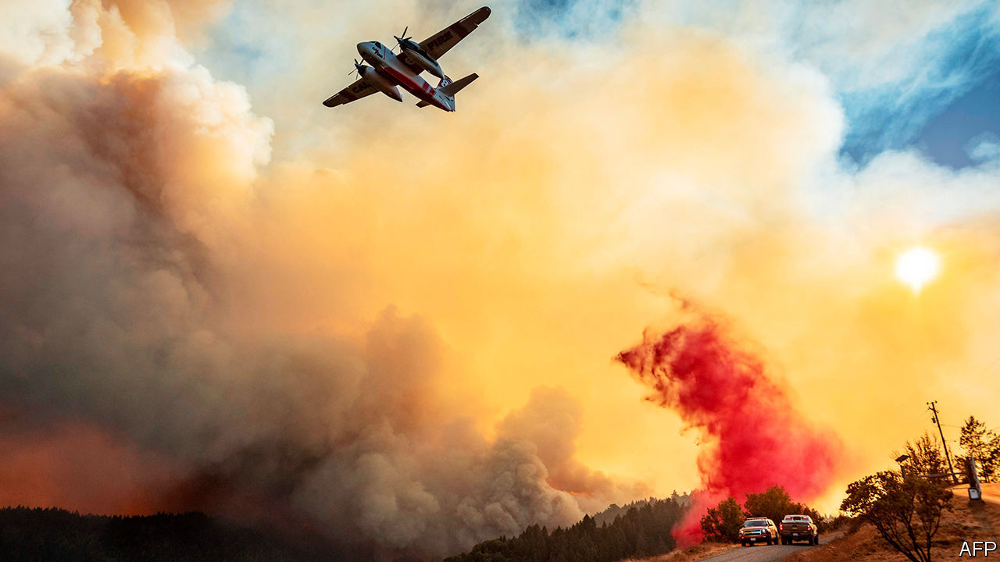

## Natural disasters

# Why California is experiencing its worst fires on record

> Plague, fire and water

> Aug 26th 2020

THE WEBCAM above her nest shows Iniko, a four-month-old California condor, high in the trees of the Ventana wilderness area, looking out as flames advance towards her. She is part of a 20-year breeding programme to reintroduce the giant birds, which were extinct in the wild, to California’s central coast. She is alone—her parents have fled the danger—and cannot yet fly. At 10:40pm on August 20th the webcam shows a flash of wing feathers, then the live stream goes dark, as the flames, presumably, engulf the nest.

Had the fire been in a previous year, Iniko would probably have been old enough to fly: the worst of the fire season takes place in September or October. But the season of 2020 has started early and with astonishing force. The California Department of Forestry and Fire Protection (CAL FIRE) said that there had been over 700 wildfires between August 15th and 26th, burning 1.3m acres (500,000 hectares). That is two-thirds as much, in just 12 days, as burned as in the whole of 2018, the worst year to date, and the season has not yet reached its peak. The two biggest conflagrations, one east of San Jose, the other north of San Francisco, are the state’s second- and third-largest on record. Gavin Newsom, the governor, was not exaggerating when he said: “We simply haven’t seen anything like this in many, many years.”

Some previous fires have been man-made. One started when a car tyre blew and the wheel’s metal rim scraped the pavement. This year’s fires are the latest and starkest example of a different man-made influence: climate change.

On August 16th a monitoring station in Death Valley measured a temperature of 54.4°C (130°F). If confirmed, that would be the highest reliably recorded anywhere on Earth. It may reflect a broader trend of global warming hitting Californians harder than most places. According to the National Oceanic and Atmospheric Administration, temperatures in many parts of the state, including Santa Clara County, which is being scorched by the largest of the fires, rose by 2°C between 1895 and 2018, roughly twice the global average.

The state is drier as well as hotter. California has experienced droughts throughout history, but the one between 2011 and 2019 was the longest and driest recorded. According to a study in Nature Geosciences in 2019, that drought killed almost 150m trees, leading to a state of emergency in 2019 intended to help reduce the huge build-up of flammable dead wood. Too late. Drought returned this year, when the state had its driest February on record (matters improved a bit later). A recent study in Environmental Research Letters by Michael Goss of Stanford University and others found that climate change had doubled the number of days of extreme risk for wildfires in the state during autumn.

There is some evidence that climate change is also increasing the danger of lightning strikes, which (rather than burst tyres) lit the inferno this season. Northern California’s fires began after a massive electrical storm passed over the Bay Area in mid-August, producing, said CAL FIRE, 11,000 strikes in three days. According to a study published in 2014 in Science by David Romps of the University of California, Berkeley, climate models suggest the number of lightning strikes across the continental United States could rise by about 12% for every degree of global warming (though another study, in Nature, questions the link with climate change).

Such change has not worked its destruction unaided. Mistaken policies have made the forests more vulnerable, especially the decades-long suppression of wildfires. Fires thin out the dense, flammable undergrowth. Preventing them—as a study in Science pointed out as long ago as 2006—increases what is called fuel loading and turns forests into tinder boxes. Frank Lake of the US Forest Service talks of a tipping-point: “There is too much fuel loading; it is too warm and the probability of ignition is greater.” That summarises what has happened this season.

Considering the vastness of the fires and their position—on the edge of the Bay Area, home to more than 7m people—the cost in human life could have been far greater. Seven people had died by August 25th. Californians have learned the lessons of previous fires, such as the one in 2018 which destroyed the town of Paradise and killed 85 people: evacuate early. Southerners fleeing Laura, a mighty hurricane that hit the Gulf coast on August 27th, will follow the same guidance.

So far, the responses of state and federal governments have held up fairly well in California, despite ritual hazing by the Democratic governor and Republican president. Donald Trump declared a major disaster, speeding federal funds to those who had lost their homes. And this week firefighters seemed to be making progress.

Still, California’s many crises—covid-19, fires and rolling blackouts—are overlapping, which hampers a long-term response. Early this year, the governor proposed spending $100m to make existing houses more fire-resistant (replacing wooden shingles with tiles, for example). He had to suspend the programme because of a state budget crisis caused by covid-19.

In 2008 another condor chick was caught in a fire and miraculously survived. She was, inevitably, renamed Phoenix. Iniko, alas, need not be renamed. Her name means “born in troubled times”. ■

## URL

https://www.economist.com/united-states/2020/08/26/why-california-is-experiencing-its-worst-fires-on-record
