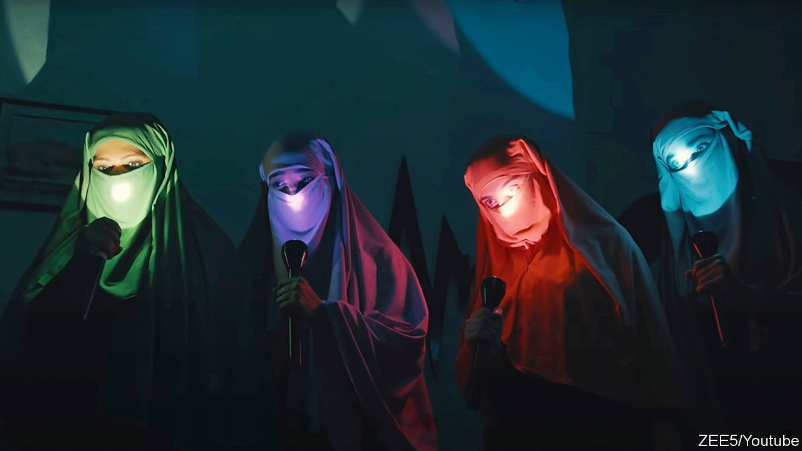

## No shrinking violets

# A TV series about female vigilantes breaks taboos in Pakistan

> Shows on streaming services can tackle topics that television channels avoid

> Sep 3rd 2020ISLAMABAD

“NOT ALL heroes wear capes,” declares the trailer for a new Pakistani television series. Some wear burkas. The stars of “Churails”—which means “Witches” in Urdu—are a gang of female avengers who wield fists and hockey sticks in anger. They dispense rough justice to abusive and philandering men.

Sara is a lawyer who gives up her career for her husband before discovering that the rotter has sent explicit messages to scores of women. Jugnu plans weddings for rich couples, and happens to be an alcoholic. Batool served 20 years in prison for murdering her husband, who was a paedophile. Zubaida has long suffered under a domineering and violent father.

Thrown together by chance, the quartet run a secret agency that aims to help wronged women exact revenge. They use a clothes shop in Karachi as a front for their activities. The heroines drink, swear and take drugs. There are lesbian characters and a trans one.

Female characters in Pakistan’s television dramas are often depicted as helpless damsels. Their conflicts are usually with children, mothers-in-law or rivals in romance. Lately TV producers have sought to introduce more challenging themes, such as rape and child abuse, but advertisers and channel bosses are not keen. “The most refreshing thing about ‘Churails’ was that it was completely uncensored,” says Aamna Haider Isani, a journalist who covers entertainment for The News, a Pakistani daily. One enthusiastic reviewer called it a “feminist masterpiece”. Another hailed “a monumental moment for representation”.

Asim Abbasi, the show’s creator and director, who lives in Britain, explains that he “wanted to tell a story that was authentic to women I know and to the society I know”. He is able to do so because “Churails” is airing over a web-streaming service, instead of a television channel. It was created for the Urdu-language unit of Zee5, an Indian video-on-demand service. Going digital “allows us to take risks”, says Mr Abbasi.

Pakistan has no domestic streaming services, but Zee5, Netflix and Amazon are all gaining users. Lockdowns imposed to fend off covid-19 have helped to boost subscriptions. Ms Isani says her children no longer watch conventional television channels. “They say, ‘Why are you watching the same woman cry day after day?’” That TV-streaming youngsters are now watching completely different things to channel-hopping elders may explain why “Churails” has not provoked more of a backlash. Many conservative Pakistanis have yet to discover it.

## URL

https://www.economist.com/asia/2020/09/03/a-tv-series-about-female-vigilantes-breaks-taboos-in-pakistan
