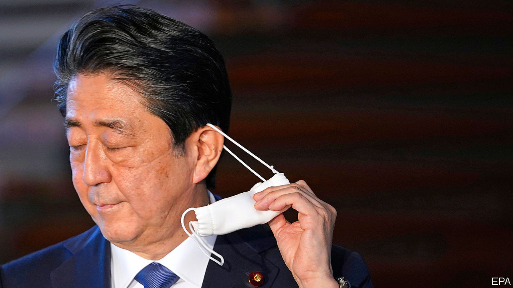
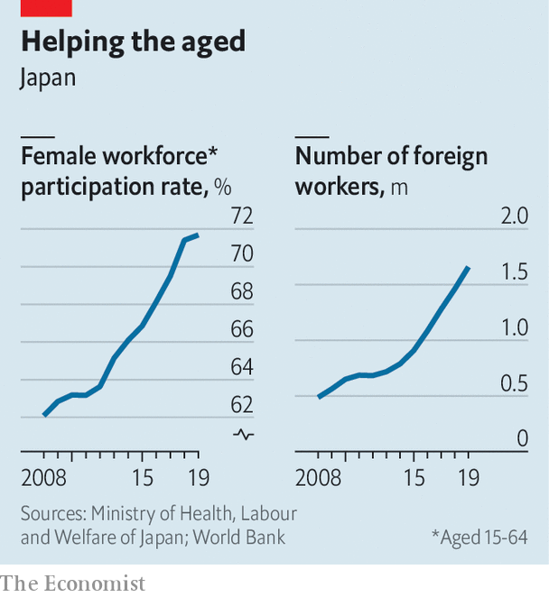

## A new story at last

# Abe Shinzo has left an impressive legacy

> But his successor has a mountain to climb

> Sep 3rd 2020TOKYO

WHEN HE WAS a boy, Abe Shinzo aspired to make films. His family history—he is the grandson of a prime minister and the son of a foreign minister—set him on a different path (see Books & arts section). Yet as a politician, he strived to change the stories that Japan tells about itself. “If the Japanese need one thing now, that thing is confidence—the ability to turn our faces to the sun, like the sunflower does when it blooms at the height of summer,” Mr Abe said after becoming prime minister for the second time, in 2012.

His departure did not follow the script. Mr Abe announced his resignation on August 28th, citing a bout of ulcerative colitis, a chronic intestinal disease. Instead of leaving in the afterglow of the Olympic Games, he is departing amid a pandemic. His successor will inherit the fight against the virus, along with other challenges: an economy battered by covid-19, a shrinking population, the growing assertiveness of China and an unpredictable ally in America. Yet Mr Abe will be remembered as transformative, not least because, after the doldrums of the “lost decades”, when the economy stagnated, he fostered hope that Japan’s problems could be solved. “Abe changed the narrative,” says Mireya Solís of the Brookings Institution, a think-tank. Although his government’s approval rating had been dire, in a poll after he resigned 74% of Japanese gave it their approval.

Mr Abe’s first stint as prime minister, starting in 2006, lasted little more than a year and was also ended by ill health. In the next five years Japan cycled through five prime ministers. Mr Abe’s Liberal Democratic Party (LDP) fell out of power for only the second time since his grandfather helped found it in 1955. By the time Mr Abe returned to power, he had concluded that he must have a convincing economic agenda to provide the popular support he needed to pursue his foreign- and security-policy priorities.

Mr Abe moved first to centralise the machinery of the state. He created a personnel bureau that gave politicians power to appoint bureaucrats, and set up a national security council. He increased the size of the cabinet secretariat that directly supports the prime minister by more than half. Japan had 16 prime ministers between 1989 and 2012, with an average tenure of 538 days; Mr Abe’s second term stretched for more than 2,800 days. His ability to balance factions in his party and command the civil service gave him a longevity that bred credibility at home and abroad.

The trust Mr Abe earned from foreign leaders enabled Japan to play a bigger role in the world, while upholding the post-war liberal order that has bolstered Japan’s prosperity. He faced down the powerful farm lobby and joined the Trans-Pacific Partnership, a big regional trade pact, promoting it even after America pulled out. He inked an Economic Partnership Agreement with the European Union and a bilateral deal with America. That, along with lots of golf and flattery, kept him in Donald Trump’s good books. “If not for Abe, we’d be treated like Moon Jae-in or Merkel,” says a former adviser.

Mr Abe also dealt deftly with China (see [article](https://www.economist.com//business/2020/09/03/can-japan-inc-navigate-the-rift-between-china-and-america)). When he took office, the two countries were close to conflict over disputed islands. Mr Abe had hoped Xi Jinping would visit Japan this year, before covid-19 intervened. But he also encouraged neighbours to stand up to China. Under the banner of a “Free and Open Indo-Pacific”, Japan has tried to uphold freedom of navigation in Asian waters and liberal principles in Asian markets. He built security ties with Australia, India and countries in South-East Asia. He created a strategy to link Japan’s piecemeal aid projects, quietly promoting “quality infrastructure” as an alternative to China’s Belt and Road Initiative. “No other [Japanese] politician has such a sixth sense in foreign policy,” says Miyake Kunihiko, a former diplomat.

Mr Abe failed in his efforts to revise the pacifist constitution that America imposed on Japan after the war. But he strengthened the armed forces, reinterpreting the constitution and passing national-security and secrecy laws that, in practice, make it possible for Japan’s “self-defence forces” to deploy abroad. Were it to attack Taiwan, China would have to “assume it would face a common US-Japan front”, notes Michael Green, a former director for Asia on America’s National Security Council.

Such changes were controversial, but Abenomics kept voters happy. Mr Abe installed a new governor at the Bank of Japan, Kuroda Haruhiko, who unleashed a “bazooka” of monetary easing (see [Free exchange](https://www.economist.com//node/21791407)). That helped reverse years of deflation, even if a 2% inflation target was never hit. Unemployment fell to its lowest rate in decades. Reduced corporate taxes and a weaker yen boosted firms’ profits. The Nikkei stockmarket index has reattained levels last seen in the early 1990s.

Mr Abe’s government introduced corporate-governance codes that led to more outside directors on boards. Nicholas Benes, who helped draft them, calls the changes “unstoppable”. Japan’s state pension fund, the world’s largest, shifted towards investing in stocks rather than government bonds. A new index, the JPX400, focused on good governance and high returns on equity, helped spur corporate reform. “The bluest of blue-chip companies were vehemently opposed,” says Kathy Matsui of Goldman Sachs, an investment bank. But investors swooned. In a research note, Morgan Stanley, another investment bank, compared Mr Abe’s legacy to those of Ronald Reagan and Margaret Thatcher.

Mr Abe sought to lessen the damage caused by Japan’s swiftly ageing population. His government expanded parental leave and child-care services. Female labour-force participation grew from 63% to 71%, higher than in America. “Abe mainstreamed the whole concept of gender diversity,” shifting the context from human rights to economic growth, says Ms Matsui. Mr Abe also allowed in more immigrants. The number of foreign workers in Japan more than doubled during his tenure.

Critics see plenty of shortcomings in Mr Abe’s economic policies. Until covid-19, his time in office was largely free from external shocks. The biggest injuries were self-inflicted: two ill-timed increases in the consumption tax, in the name of fiscal probity, both of which pushed the economy into recession. As a result, his government mustered only meagre economic growth of 1.1% a year on average during his eight years in office, less than the 2% he promised. Companies saw their profits rise, but many sat on them. Women got more jobs, but not enough promotions. Average wages fell after accounting for inflation.

Despite the increases in the consumption tax, Mr Abe also leaves behind a massive public debt, currently 238% of GDP. Markets seem unworried: the yield on many government bonds is negative. But the debt mountain may nonetheless burden future generations. “People assume this is free money but it’s not: it will have to come back in terms of higher taxes or smaller services,” says a former official at the Bank of Japan.

Although Japan has suffered a relatively small number of deaths from covid-19, especially relative to its population, the public is unhappy with Mr Abe’s handling of the pandemic. The national government was slow to adopt measures to curb its spread, leaving local leaders such as the governor of Tokyo, Koike Yuriko, to lead. A string of corruption scandals also dented his standing. Shortly before his resignation the approval rating of Mr Abe’s government was 34%, the lowest since he returned to office. In his resignation speech, Mr Abe lamented that he was unable to amend the constitution or solve a territorial dispute with Russia. Many Japanese feel he put more energy into his ambition to reverse these legacies of the second world war than he did into tending to the economy.

His successor will presumably have less interest in fighting these old battles. Managing the effects of covid-19 will come first: the economy shrank by a record 7.8% in the second quarter of this year. That makes it no bigger than when Mr Abe became prime minister in 2012. The government has propped up companies and given cash to consumers; bankruptcies are down this year. But as the slump persists, a painful restructuring will have to take place, says Hoshi Takeo of the University of Tokyo.

Japan needs a “productivity revolution”, says Ms Matsui. The tax code and the labour market stifle startups and innovation. The government uses archaic computer systems. No one in Japan was surprised to find fax machines being used to tally covid-19 test results. “We have to erase all of the inefficiencies and redundancies,” says a member of a government economic advisory council.

The next prime minister cannot, however, ignore foreign affairs. China is expanding its presence at sea. Japan is at odds with South Korea; Mr Abe could never muster the patience with Moon Jae-in, its president, that he showed with Mr Trump. Japan’s pro-coal stance and the closure of its nuclear reactors after a disaster in 2011 have made it a climate laggard.

The LDP will choose its next president on September 14th, in a vote of its members of the Diet and some regional representatives. In the interests of continuity most of the main factions have endorsed Suga Yoshihide, the chief secretary of the cabinet. If he wins, he would serve out the remainder of Mr Abe’s term, which was due to end in September next year. Then a party-wide election will be held, which should attract a broader crop of candidates.

The son of a farmer from rural Akita Prefecture in the north of Japan, Mr Suga has a reputation for diligence (in a country known for overwork) and as a master of the bureaucracy. His instincts appear less nationalist than Mr Abe’s. He has advocated more immigration and freer trade. He urged Mr Abe to focus on the economy instead of visiting the Yasukuni Shrine, a controversial war memorial, in 2013.

Mr Suga has little experience on the world stage. He is not especially popular among either the LDP’s broader membership or among Japanese at large. He will have many rivals in the party. “A lot of people are chomping at the bit,” says Sheila Smith of the Council on Foreign Relations. Ominously, long-serving prime ministers have typically been followed by strings of short-lived, unpopular governments.■

## URL

https://www.economist.com/asia/2020/09/03/abe-shinzo-has-left-an-impressive-legacy
