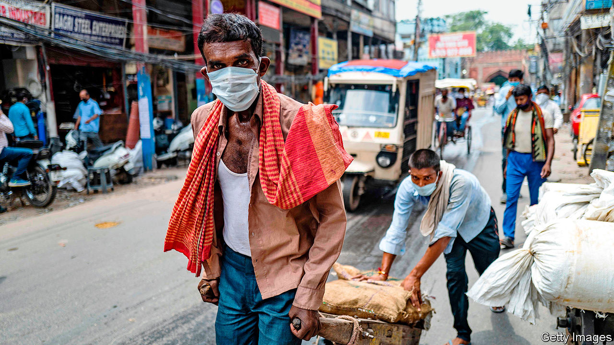
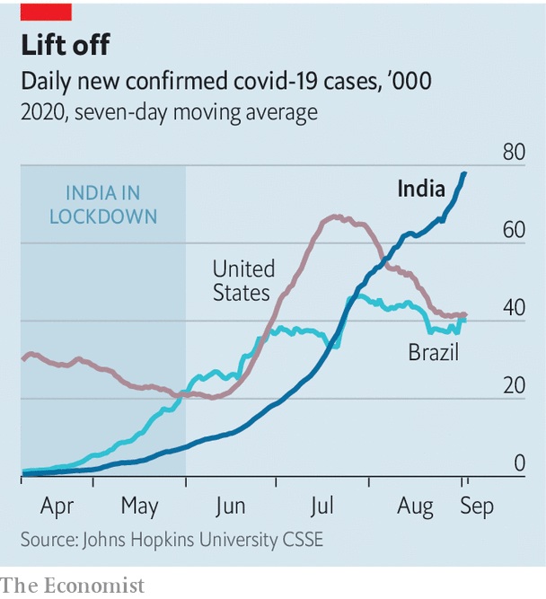

## Breaking the wrong sort of record

# India’s economy shrinks by a quarter as covid-19 gathers pace

> The record-breaking contraction comes at the same time as record numbers of new infections

> Sep 3rd 2020DELHI

THE STATISTICS landed like fists in a one-two punch. First came the news that India had counted 78,000 new cases of covid-19 on August 30th alone—more than any other country has tallied in a single day since the pandemic began. The next day came the bill for the two-month lockdown that the government imposed in late March at only four hours’ notice. The National Statistical Office said that India’s output between April and June was 23.9% lower than in the same period the year before.

India had never recorded a quarter of negative growth since it began issuing such data publicly in 1996. No other big economy has shrunk so much during the pandemic. In the same period America’s GDP fell by 9.1%. India’s economy had been stumbling before covid-19. But what had seemed a dismally low rate of growth in 2019 is now the stuff of fond memory.

In hindsight, India’s government may have locked down too soon. The country had detected barely 600 cases of covid-19 by March. The ban on commercial activity and movement outside of the home was nearly total for two months. Test-and-trace programmes worked in some areas, notably the southern state of Kerala, but nationwide they have fallen far short of the standards set by some East Asian countries. Hospitals rushed to get ventilators and free up beds in intensive care, but they were starting from a woefully low level. India had 0.7 hospital beds per 1,000 people; South Korea had more than 16 times as many. Lacking health care, people resorted to makeshift remedies. Around 140m people were thrown out of work. Millions trudged on foot to ancestral villages.

The pain was so great that hardly anyone can stomach the thought of reimposing strict controls, even though infections are rising more swiftly than ever. Public transport is resuming this month. Public gatherings are to be subject to looser rules. Eventually schools will reopen. An edict declares that state and municipal governments may no longer impose stricter rules than the central government. Kerala, once a model for the rest of the country, has been unable to stop travellers from other Indian states bringing the virus with them. It is now counting over 1,000 new cases a day.

The number of Indians dying of the virus appears to be lower than might be expected, given the number of infections. The country’s 3.8m detected cases have led to just 67,000 known deaths. That is a low rate by global standards, although many covid-related deaths are thought to be going unrecorded around the world, making comparisons unreliable. A paper by Minu Philip, Debraj Ray and S. Subramanian of the National Bureau of Economic Research suggests that few Indians are dying because its covid-19 sufferers are younger than those elsewhere. After taking patients’ ages into account, the difference all but disappears.

More startling are the results of surveys that analyse blood serum. They suggest that a fairly high proportion of urbanites may have already had covid-19. The relevant antibodies were detected in 41% of samples collected in Mumbai in July and in nearly 57% of samples from its slums. They were also found in 23% of tests in Delhi in June and in more than 28% in August. In Pune, a prosperous city of 7.4m in Mumbai’s hilly hinterland, the proportion of those with antibodies was more than half.

Many in India are growing stoical about the virus’s spread. The national media are once again full of celebrity tittle-tattle. When Pranab Mukherjee, a former president, died on August 31st, the government declared a seven-day period of mourning. That he had been on a ventilator suffering from covid-19 for the last three weeks of his life was barely mentioned.■

Editor’s note: Some of our covid-19 coverage is free for readers of The Economist Today, our daily [newsletter](https://www.economist.com/https://my.economist.com/user#newsletter). For more stories and our pandemic tracker, see our [hub](https://www.economist.com//news/2020/03/11/the-economists-coverage-of-the-coronavirus)

## URL

https://www.economist.com/asia/2020/09/03/indias-economy-shrinks-by-a-quarter-as-covid-19-gathers-pace
