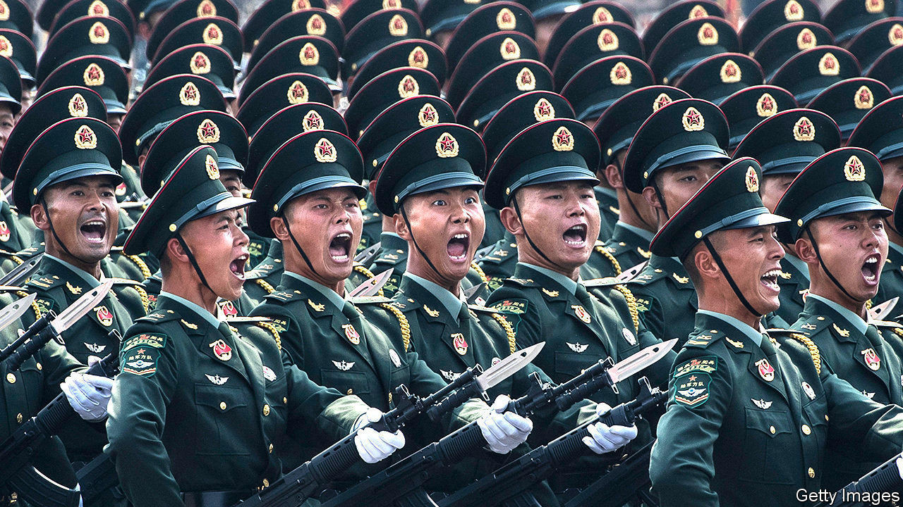

## When unambiguity is ambiguous

# To China’s alarm, America modestly upgrades ties with Taiwan

> But the island still cannot be sure of American help if China resorts to force

> Sep 3rd 2020

CHINA HAS never renounced what it says is its right to “reunify” Taiwan by force if peaceful means are thwarted. So armies on both sides have to prepare for war, however remote it may seem. Of late the number of naval exercises China has conducted has caused alarm—all the more so at a time of worsening relations between China and America on a number of fronts, including American policy towards Taiwan. The delicate status quo, in which China insists Taiwan is part of its territory but the island functions as an independent country, is fraying. As the Global Times, a tub-thumping official Chinese tabloid, puts it: “The possibility of peaceful reunification is decreasing sharply.” Mercifully, that does not mean war is imminent.

A big reason for that is America’s support for Taiwan. Yet it has no formal alliance or clear-cut commitment to defend the island. A law passed in 1979 obliges it only to provide Taiwan with “arms of a defensive character”, and to take seriously any effort to determine the island’s future other than by peaceful means. This vagueness has been dignified with a clever-sounding euphemism, “strategic ambiguity”. Critics of the policy worry that ambiguity increases the risks of a disastrous strategic miscalculation. Its supporters argue that, for the four decades since America switched diplomatic relations from Taiwan to China, it has worked. It has provided enough reassurance to Taiwan that America would not let China invade unpunished, but not so much as to embolden those who favour a formal declaration of independence—something China has always warned would mean war.

On August 31st America’s position became a touch less ambiguous. It made public classified cables from 1982 in which its government gave Taiwan six supposedly secret but widely known “assurances”. These included not to repeal the 1979 law, and not to set a date for ending arms sales. The declassification went a tiny way to meeting recent calls from some American politicians and former officials to clear up the ambiguity. Ted Yoho, a Republican representative from Florida, for example, is promoting a “Taiwan Invasion Prevention Act”, to authorise military intervention.

The issue has seemed more urgent following a recent series of menacing Chinese military drills, including “realistic” exercises in the Taiwan Strait, at both the north and south ends of the island. No doubt carrying the same message, on August 10th Chinese fighter jets crossed the median line in the strait, the unofficial air border.

The drills serve as a reminder of just how seriously China treats its “sacred mission” of bringing Taiwan back under its sovereignty. They also serve to flaunt China’s fast-improving military capability. It is hard not to see this as part of a more assertive approach to the region. That has been evident in the South China Sea, where China has been steadily building up a military presence in contested waters, although its claims have been rejected both by an international tribunal in 2016 and, just last month, by America. To the north, off China’s east coast, Japan has accused China in recent months of a “relentless” campaign to seize control of the tiny, uninhabited, Japanese-administered Senkaku islands (known in China as Diaoyu). And on August 29th Chinese and Indian soldiers became embroiled in the latest of several stand-offs in a remote part of their long border in the western Himalayas, where India accuses Chinese troops of trying to move the de facto border.

Meanwhile, China’s ruthless approach to Hong Kong has also held a message for Taiwan. The imposition at the end of June of a national-security law in effect ended the autonomy promised under the “one country, two systems” arrangement that was supposed to pertain in Hong Kong until 2047. That deal was a modified version of one on offer to Taiwan. For a time, it seemed China hoped Hong Kong might serve as an advertisement to Taiwan of the benefits of “peaceful reunification”. These days Hong Kong is less an advertisement than a grim warning. That is one reason to worry that China might conclude that its patient approach to Taiwan has failed.

Another reason is China’s concern about America’s upgrading of its ties with Taiwan, which China insists can only be “unofficial”. Those fears have been especially acute under the presidency of Donald Trump, who raised hackles in Beijing by accepting a congratulatory call from Tsai Ing-wen, Taiwan’s president, after his election in 2016. In recent weeks Alex Azar, America’s health secretary, visited Taiwan and met Ms Tsai (apparently provoking the big war-game and the fighter-jet incursion). America has also announced new high-level economic talks with Taiwan.

All of this will annoy China, which will complain loudly. But it is probably relieved that the steps are so modest, and confident that if the ambiguity is resolved under Mr Trump, it will be in its favour. In a memoir published this year, John Bolton, one of Mr Trump’s discarded national security advisers, speculates that Taiwan may well be the next American ally to be jettisoned by his former boss. As a Global Times commentator put it this month: “Taiwan for the US is only a tradable chess piece.” After all, Mr Trump has always put “America first”. Trade concessions have always seemed to matter more to him than alliances, or even the abstractions Taiwan so proudly embodies, of freedom and democracy.■

## URL

https://www.economist.com/asia/2020/09/03/to-chinas-alarm-america-modestly-upgrades-ties-with-taiwan
