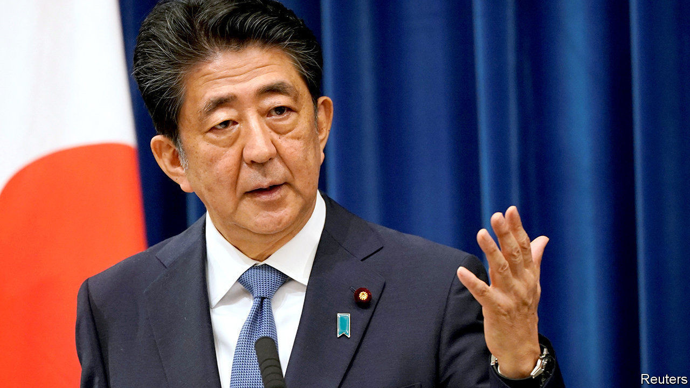

## Family man

# A timely, comprehensive biography of Abe Shinzo

> “The Iconoclast” situates the outgoing prime minister’s ideas in the broader context of Japanese history

> Sep 3rd 2020

The Iconoclast. By Tobias Harris. Hurst; 392 pages; $29.95 and £25

ABE SHINZO was just five years old in 1960 when protesters surrounded his grandfather’s house in Tokyo. Kishi Nobusuke, then Japan’s prime minister, was in the midst of a pitched battle over Japan’s security treaty with America. Kishi would get his treaty that year, though it led to him losing power. For a young Mr Abe, the episode would be “the touchstone of his political identity”, argues Tobias Harris in “The Iconoclast”, a new biography of Japan’s longest-serving prime minister.

Mr Abe’s status as the grandson of a former prime minister and the son of a former foreign minister, Abe Shintaro, is well-known. Mr Harris, a longtime observer of Japanese politics, astutely explains how Mr Abe’s family influenced his thinking, and situates that thinking in the broader context of Japanese history stretching back to the Meiji restoration of 1868. This comprehensive and engaging tome may become the definitive English-language portrait of Mr Abe, made all the more relevant by his recent resignation (see [article](https://www.economist.com//node/21791382)).

As Mr Harris shows, Mr Abe is the progeny of Kishi, but a product of the American occupation and the many strange compromises it engendered. His grandfather’s fate is one of the most striking. Kishi made his name orchestrating forced labour for the Japanese war machine as a minister in Japanese-occupied Manchuria in the 1930s. He served loyally in Japan’s wartime cabinet and was arrested as a war criminal in 1945. As the cold war ramped up, Kishi was one of several ex-leaders the Americans let off in order to help rebuild Japan as a bulwark against Soviet communism. Kishi climbed to the pinnacle of power in Japan by helping to found the Liberal Democratic Party (LDP) with a bit of help from the CIA.

Re-establishing Japan’s sovereignty and seeking greater equality in the partnership with America became Kishi’s mission. But in the battle of post-war ideas, his vision lost out to the “Yoshida Doctrine” (so named after Japan’s first significant post-war prime minister, Yoshida Shigeru), wherein Japan would rely upon America for security while focusing on its own economic development. Mr Abe made it his cause to revise that consensus, embodied in the American-imposed post-war constitution that bars Japan from having armed forces (though it does, with American support, maintain mighty armed forces for the purpose of self-defence).

Mr Abe may have drawn on his grandfather’s ideas but he learned his trade at his father’s side. Shintaro visited 81 countries in the 1980s; the younger Mr Abe served as his secretary. “His father’s globe-trotting personal diplomacy impressed upon his son the importance of building trust with foreign leaders,” Mr Harris writes. That has been one of Mr Abe’s main achievements (see [Leader](https://www.economist.com//node/21791372)). He also inherited his father’s unfinished business: Shintaro died of cancer while trying to settle a territorial dispute with the Soviet Union in 1991.

After Mr Abe followed his father into the Diet, Mr Harris shows how he came to be a leader of a “new conservative” movement. He argued for a more equal alliance with America in which Japan could bear a greater burden, and latched on to the cause of Japanese citizens abducted by North Korea to prove his bona fides as a defender of his country. He also engaged in some appalling whitewashing of Japan’s wartime atrocities. Mr Abe’s allegiance to the new conservative ideas helped doom his first short-lived term as prime minister in 2006-07, which became bogged down in ideological battles over the past.

Belonging to a political dynasty gave Mr Abe a big head start. He rose fast despite having been an average student who whizzed around in a red Alfa Romeo and played a lot of mahjong. Yet it has also been a heavy burden. The reader cannot help but quake alongside Mr Abe when his mother tells him, “The LDP of the present was made by my father Kishi Nobusuke, and you must never forget those great footprints.” His mother is an enduring presence: they live in the same apartment building, and even as prime minister, he and his wife, Abe Akie, ate breakfast with her.

That, in part, explains why changing Japan’s constitution was so important to Mr Abe. He cited his failure to do so as one of his biggest regrets when he announced his resignation on August 28th. Yet history will remember Mr Abe more fondly for his readiness to subsume his ideology in favour of a pragmatic approach to national interests during his second stint in office. (Such as with his conciliatory statement on the 70th anniversary of the end of the second world war.) Even what Mr Harris dubs an “Abe Doctrine”—building up Japan’s defence capabilities and ties with other regional powers—is less a break with the Yoshida Doctrine than an offshoot.

As Mr Harris notes, Mr Abe was a keen reader of the German sociologist Max Weber. “With regard to what one should do as a politician, my grandfather consistently acted according to ‘responsibility for consequences’,” he wrote in 1996. “That is, Max Weber’s ‘ethic of responsibility’.” Mr Abe was too kind to his grandfather. The description fits him better. ■

## URL

https://www.economist.com/books-and-arts/2020/09/03/a-timely-comprehensive-biography-of-abe-shinzo
