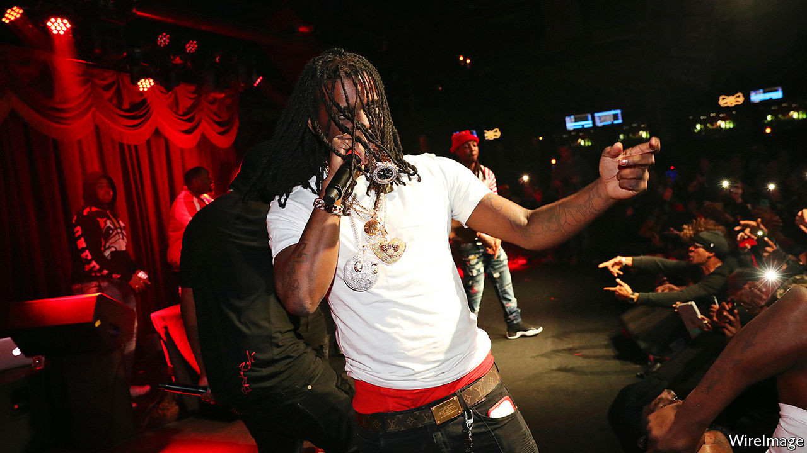

## Hip-hop music

# An ethnographer’s study of drill music and gang violence in Chicago

> Forrest Stuart embedded with rappers on the city’s South Side for over 18 months

> Sep 5th 2020

Ballad of the Bullet: Gangs, Drill Music and the Power of Online Infamy. By Forrest Stuart.Princeton University Press; 288 pages; $27.95 and £22.

TWO CARS, one silver and one black, pulled up in a busy shopping street in the Gold Coast, Chicago’s glitziest neighbourhood, one afternoon last month. Four passengers, weapons drawn, stepped between shoppers and fired off a hail of bullets. Their target was a chubby man in a blue tracksuit who stood outside a luxury-goods boutique. The 26-year-old slumped to the ground as shop windows shattered behind; his two companions were wounded. Passers-by filmed the aftermath of the shooting, posting footage online as he lay dying in the road.

The murder was unusual. Gun deaths have surged of late: by the end of August 500 killings had been counted in Chicago, as many this year already as in all of 2019. Overwhelmingly these occur when gang members intrude on each other’s turf in troubled districts on the South or West sides. Bullets rarely fly in Gold Coast. For participants in gang conflict, excursions to such wealthy, central places had previously seemed relatively safe.

Nor was the victim run-of-the-mill. Carlton Weekly was a minor celebrity who performed drill, a form of rap music that arose in Chicago a decade ago and became popular in London, New York and beyond. Performing under the moniker FBG Duck, his tracks were ominous, repetitive and catchy; his last music video, “Dead Bitches”, released in July, has 11m views on YouTube. As with many drill videos, the star posed in a shadowy room, flanked by gun-toting friends, smoking joints while waving wads of cash.

Some speculate FBG Duck was killed for the music, as that last song was a “diss track”. His lyrics crudely celebrated the murders of several members of an infamous Chicago gang, the Black Disciples. Insulting other rappers—and the gangs they associate with—is not new, nor unique to drill. It is a means to digital notoriety, though it may invite a bloody response. Such musical clashes online are amplified by bloggers who relish details of these verbal conflicts because they mirror real-world gang confrontations. FBG Duck had abused others in song for years, beginning with insults of Chief Keef (pictured), an early star of the drill scene.

Social media probably helped cause FBG Duck’s death. Chicago’s mayor, Lori Lightfoot, suggested his enemies monitored his posts on Facebook as he carelessly bragged to fans about his shopping sprees. Rivals routinely “lurk on” others—studying their social-media feeds and hoping, in the words of gangster rappers, to “catch opps lacking”. That means getting a chance to shoot or humiliate a rival, for example by forcing him, on camera, to diss his own gang or fellow rappers.

For years police in Chicago have said this online sparring, often expressed through music, spurs deadly violence. Confirming that is hard. How could anyone prove FBG Duck’s songs directly led to his death, asks Forrest Stuart, an ethnographer at Stanford University who embedded with drill rappers on Chicago’s South Side for over 18 months. The musician had ties with the Tooka gang, an outfit linked to the Gangster Disciples, which has long vied with the Black Disciples. His elder brother, another drill rapper who worked as FBG Brick, and a cousin were shot dead on the same day in 2017. As a rapper he was a tempting target, but he would have been one anyway, even without uttering a word.

Mr Stuart’s recent book, “Ballad of the Bullet”, is an often gripping account of what he learned from his association with teenage members of an up-and-coming drill group—he dubs them the Corner Boys—desperate to win fame, status and money from rapping. He shows how their musical and lyrical talent is only a minor part of what determines success. As important are attempts to win a reputation online as authentic gangsters, despite their sometimes feeble efforts to acquire weapons, cash or other props essential for building credibility.

Aspiring stars must at least pretend they are heavily involved in conflict. “It is a hyper-violent context,” says Mr Stuart; even conducting research was risky at times. A young rapper mishandling a gun nearly shot him. He describes learning how the Corner Boys lurked on the social-media feed of a rival driller, here called Smoky-P, fond of posting selfies. They identified a shop where he regularly bought alcohol, drove by and fired at him several times, apparently as he prepared to take a photograph of himself.

The author is reluctant to simply blame his subjects for such appalling acts. For many characters he uses pseudonyms to avoid stirring more conflict, or inviting attention from police. Most such young men, he notes, are traumatised by street shootings they have experienced from early childhood. Broken families produce ill-educated men who go on to choose between menial service jobs or drug dealing. Youngsters have few role models to follow.

In slums, favelas and shantytowns elsewhere, ambitious people dream of getting out by playing football. In Chicago drill, despite its gang ties, serves that end. For a few rappers who earn enough online notoriety, such as Chief Keef, record contracts and wealth follow. More interesting is the fate of larger numbers of smaller fry like the Corner Boys. Their relatively modest musical success delivers paltry financial rewards, which mostly go to pay technicians. But the artists earn in other ways: higher status on the street, the attention of women, respect from other would-be rappers and adoration from some online fans.

Who then is responsible for the violence? Not one actor alone. But one conclusion is that consumers of drill—mostly more affluent folk far from the South Side—encourage it through the digital economy. They reward (by sharing and clicking) videos of artists who are the most authentically antagonistic and boastful about their violent crimes. “I want to implicate all of us,” says Mr Stuart. “Too often we leave ourselves, as consumers, out of the equation.” Rappers respond to consumer demand. If their content “is not egregiously violent, then they are irrelevant”. ■

## URL

https://www.economist.com/books-and-arts/2020/09/05/an-ethnographers-study-of-drill-music-and-gang-violence-in-chicago
