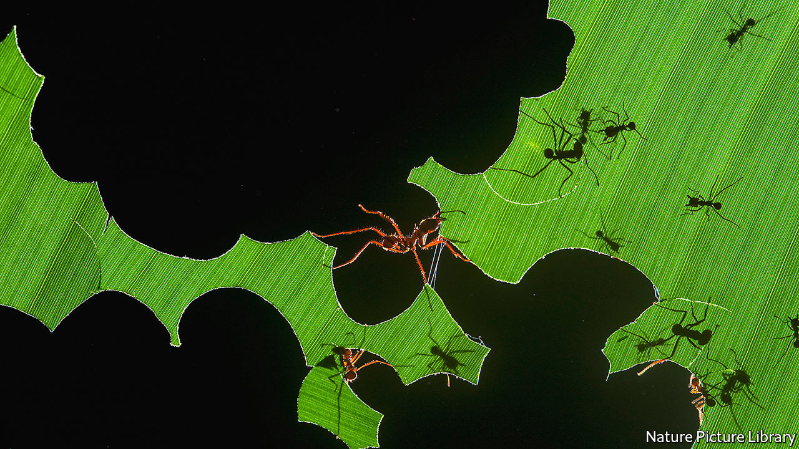

## A bug’s life

# Ants and humans have shaped each other’s destinies

> Edward Wilson complements scientific observation with personal anecdotes

> Sep 5th 2020

Tales from the Ant World. By Edward Wilson. Liveright; 240 pages; $26.95 and £17.99.

ANTS AND people have much in common, Edward Wilson explains. Both are social animals, organised into complex societies with elaborate forms of communication. Ant societies, much like the human kind, are often highly stratified, with specialised jobs and a well-defined caste system. Some ants are warriors, some slavers, and some, more benignly, gardeners.

But Mr Wilson cautions against carrying the analogy too far. Though ants are creatures of instinct, “human beings are torn by the competing needs of self, family and tribe. We use culture to banish instinct or at least tame it.” There is nothing in the ruthless lives of ants “that we can or should emulate for our own moral betterment”.

Mr Wilson has built a distinguished career by deploying insights from the biology and behaviour of ants to present larger lessons about evolution, ecology and the extent to which human psychology can be explained by natural selection. As its title suggests, “Tales from the Ant World” is a short, loose-jointed and conversational book. It lacks the ambition of works such as Mr Wilson’s “Sociobiology: The New Synthesis” (published in 1975) or the panoramic sweep of “The Diversity of Life” (1992), but it is filled with delightful accounts of a naturalist in action and enough hard science to keep readers on their toes.

Ants and humans not only share a sociable nature; they have shaped each other’s destinies throughout their shared time on Earth, sometimes as competitors, at other times companionably. For instance, ants have exploited the human talent for long-distance travel to extend their own reach. On their own, ants are “poor oceanic travellers”, but they hitched rides with mariners across the Polynesian archipelago during the age of European exploration, and roamed beyond their natural habitats aboard modern commercial vessels. Often the arrival of these aliens disturbs the ecological balance. When a crop-destroying fire ant native to Argentina and Uruguay arrived in the port of Mobile, Alabama, on cargo boats, it soon spread devastation across the American South and beyond.

In Mr Wilson’s hands even ant-sized anecdotes carry the seeds of larger ideas. He celebrates ingenuity even when it is manifested on the smallest scales. As may be expected from someone who has spent much of his career crawling on hands and knees among the rotting leaves of a forest floor, or chasing insects across desert sands, the author is not squeamish. He finds beauty in the clever ways a parasitic fungus drives its host insect to its death, or in the resourcefulness of the Matabele ants, which attack and destroy termite mounds the size of buses. “Every corpse is an ecosystem,” he phlegmatically observes.

Revolting as all this may seem, Mr Wilson soon brings the reader around. “Each fallen bird, landed fish, beached whale, decomposing log, plucked flower”, he writes, “is destined to change from a conglomerate of giant molecules, the most complex system in the universe known, into clouds and drifts of much smaller organic molecules.” Zooming out from the microscopic to the panoramic and back again, “Tales from the Ant World” finds wonder in nature’s endless variety. ■

## URL

https://www.economist.com/books-and-arts/2020/09/05/ants-and-humans-have-shaped-each-others-destinies
