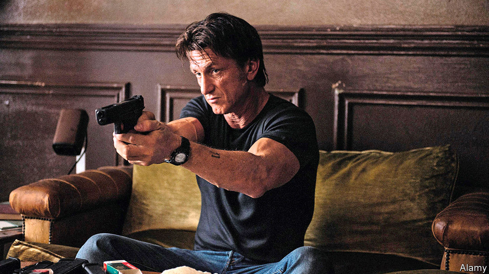

## Home Entertainment

# Discover the taut political thrillers of Jean-Patrick Manchette

> Unlike today’s noir fiction, his books waste no time on psychology

> Sep 5th 2020

“IN THE WEST the economy was not working well, mental illness was rife, and social classes were still locked in struggle.” This familiar diagnosis comes from “Three to Kill”, a French noir novel by Jean-Patrick Manchette, published in 1976. As he wrote, far-left terrorists in Europe were bombing and kidnapping their way towards revolution. He turned this unrest into a series of politically engaged pulp fictions as smooth as a well-oiled revolver.

In his youth Manchette, who died in 1995, had been a left-wing activist. Inspired by this milieu, he created a cast of assassins, anarchists and ideologues. Martin Terrier, the hit-man at the heart of “The Prone Gunman” (published in 1981 and adapted into a film starring Sean Penn in 2015), is trying to go clean after a decade of profitable murder, only to be pursued by old enemies. Georges Gerfaut, the militant turned middle-manager in “Three to Kill”, stumbles into a bitter vendetta involving an old fascist from the Dominican Republic. Manchette’s tightly wound plots move inexorably towards bloody denouements. Along the way he portrays a society riven by a class war that has devolved into a grisly procession of tit-for-tat murders.

Manchette wastes no time on psychology. His books are all action, unfolding with a laconic efficiency that would make his killers proud. One minute Gerfaut is enjoying a dip in the sea, the next a killer in swimming trunks is punching him “matter-of-factly in the solar plexus”. Manchette dispatches his victims with grim specificity: a woman’s chest becomes “a glob of crushed bone, pulped flesh, fragments of bronchial tubes”. His characters’ interests are narrow but deep—in particular, what bullets do to bodies and the weapons that fire them.

Flashes of lyricism illuminate the murk. Manchette describes a burning house collapsing “just as matter collapses, or so they say, in the hearts of distant stars”. There are touches of black comedy. As Carlo and Bastien, a pair of bickering assassins, trail a target to the south of France, Bastien plans a holiday excursion: “We can stop at Le Lude,” he says. “It’s charming, Le Lude. It has a delightful castle.” When Bastien dies in a shoot-out, Carlo’s eulogy is a passage from “Spider-Man”.

The blend of action, ideology and humour comes together best in “Nada” (1973). The most overtly political of Manchette’s novels, it tells of a ragtag group of left-wing terrorists planning to kidnap the American ambassador to France. Manchette skewers its members—only one is a true believer; the rest are there for the kicks—as well as the quarrelsome vanity of left-wing factions. Needless to say, the group’s plan goes awry in a stupendously violent way. Just when you think all the corpses have dropped, another head explodes. ■

## URL

https://www.economist.com/books-and-arts/2020/09/05/discover-the-taut-political-thrillers-of-jean-patrick-manchette
