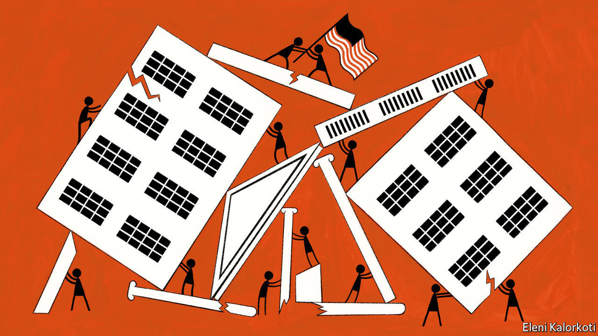
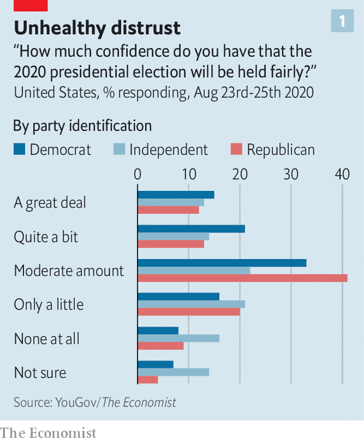
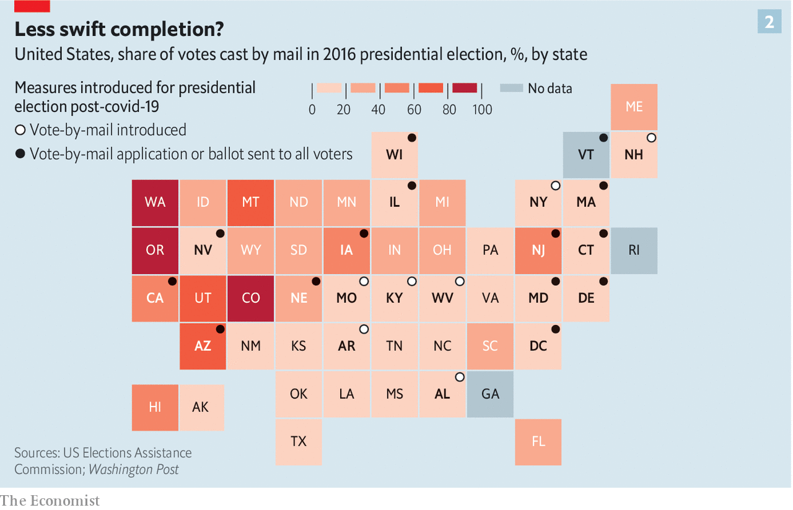
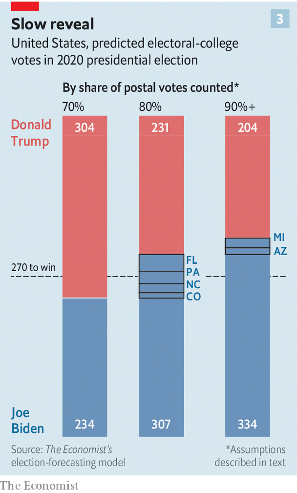
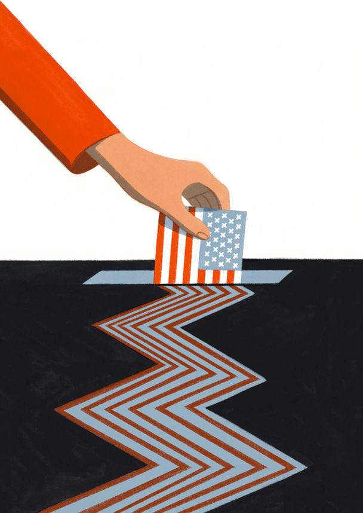

## A covid-struck, confused and polarised poll

# Donald Trump is very likely to challenge the results of the US election

> If he does so it will be bad, quite possibly very bad indeed

> Sep 3rd 2020WASHINGTON, DC

IN HIS FINAL debate with Hillary Clinton in 2016, Donald Trump refused to commit himself to accepting the results of the coming election. The following day he made his position clearer. “I will totally accept the results of this great and historic presidential election,” he said in mock solemnity—before adding, with finger-wagging emphasis: “If I win.” The stubby finger levelled itself at the crowd, which erupted into cheers; the not-yet-president grinned.

President Trump went on to win with 304 Electoral College votes to Mrs Clinton’s 227, and so how he would in fact have reacted had things gone the other way remains a matter of speculation. This year there appears to be a strong chance that he will not win; The Economist’s election-forecasting model currently puts his chances at one in seven. Mr Trump, though, denies any possibility that he could lose a fair contest: “The only way we’re going to lose this election is if the election is rigged,” he told his followers in August. There can be no real doubt that, should he indeed lose, he would claim that the election was stolen.

That, come November 4th, such a theft will actually have taken place is remarkably unlikely. Admittedly William Evanina, who directs the National Counterintelligence and Security Centre, says that China and Iran have joined Russia in seeking to influence this election through covert means, presumably emboldened by Russia having paid little price for having done so last time. This is a shocking development. But even if they were all pushing in the same direction—which is unlikely—there is no reason to think that they could decisively tip the result. America’s electoral system is sufficiently decentralised for attempts to rig the vote on a large scale to be incredibly hard. And though voter fraud occasionally takes place, both in-person and by means of absentee ballots, it is harshly punished and very rare; various studies have found the rate to be well below one in a million votes cast.

But this does not mean that Mr Trump’s protestations will be of no account. America is deeply polarised, and in a few places armed partisans have taken to the streets. Both parties have portrayed this year’s contest as existentially important to America’s future, warning that the country will be forever altered for the worse if the other candidate wins. The new round of foreign interference, like the lies and fearmongering from the president himself, add both to the stock of disinformation and the pervasive sense that things are not to be trusted. As a result a significant number of Americans of all political stripes doubt that the election will be held fairly (see chart). On top of it all, the election is being held during an epidemic that will, by election day, have killed over 200,000.

In June a bipartisan group of campaign veterans, elected officials, journalists and academics convened by the Transition Integrity Project, a group founded last year, set about war-gaming four different possible election results: a commanding victory for Joe Biden, a narrow victory for Mr Biden, a narrow victory for Mr Trump achieved, as his previous one was, without a majority of the popular vote, and a result in which, because of contested outcomes in battleground states, the identity of the victor was unclear. In all four scenarios the role playing produced levels of gamesmanship and tumult beyond anything seen in recent American elections. In the narrow-Biden-victory scenario the Secret Service escorted Mr Trump from the White House on inauguration day. It is hard to overestimate what such a sight would mean to Americans—and to the rest of the world.

In principle, an election is a fairly simple thing. Identify the people entitled to vote; provide them with the means to vote; accurately count their votes; after that, just abide by the results in the way the constitution requires.

As far as the first step goes, America’s constitution says that only citizens can vote, and that those over the age of 18 cannot be barred from doing so on the basis of their race or their sex. The Voting Rights Act of 1965 took aim at the legal requirements, such as literacy tests and poll taxes, by which Democrats in southern states had contrived to maintain race-based disenfranchisement. Those changes saw conservative whites in the south switch their allegiance from Democratic to Republican.

In the decades since, conservative whites have become increasingly central to Republican fortunes and an increasingly smaller share of the American electorate. The party has thus developed an interest in limiting electoral participation, rather than increasing it. As Mr Trump put it earlier this year, discussing a proposal greatly to expand postal ballots, “They had things, levels of voting that if you’d ever agreed to it, you’d never have a Republican elected in this country again.”

Erecting barriers to voting has grown easier to do since the Supreme Court in 2013 struck down a provision of the Voting Rights Act that required jurisdictions with a history of racial discrimination to “preclear” any electoral changes with the Justice Department. In 2016 a federal court struck down a voter-ID law in North Carolina because it “target[ed] African-Americans with almost surgical precision”. The fact that courts have ruled in this way is heartening; the fact that they have to is not.

America’s electorate is becoming ever more diverse regardless. This year non-whites comprise one-third of eligible voters, an all-time high, with Hispanics outnumbering African-Americans for the first time. The electorate is also younger than in recent times—another factor that favours Democrats. Most analysts predict a high turnout in November. As much as 70% of the 240m-strong electorate is expected to vote, compared with 60% in the 2016 election and 50% in the 2018 midterms.

They will not all find it easy. The Leadership Conference on Civil and Human Rights, an umbrella group, has found that nearly 1,700 polling places were closed between 2012 and 2018 in states formerly covered by the pre-clearance rule. The largest numbers have been in Texas, Arizona and Georgia—three battleground states this year. Many of the closures are in areas where the population is disproportionately black or Hispanic.

Polling-place closures can be expected to lead to queues elsewhere, and queues are already a problem. The Bipartisan Policy Centre, a think-tank, found that in 2016 over 560,000 voters failed to cast a ballot because of polling-place management problems, including queues. Predictably, a study of the 2018 midterms from the Brennan Centre for Justice, another think-tank, found that black and Latino voters were markedly more likely than white voters to find themselves waiting more than 30 minutes to vote. Such delays can be expected to discourage voting at the best of times.

And this is not the best of times. Covid-19 makes standing in a long November queue particularly unappealing. It may also make the queues, and the time taken to vote, longer. The epidemic meant that Wisconsin had trouble recruiting enough poll workers for its primary election in April; as a result, the state’s biggest city, Milwaukee, had just five polling places, down from 180 in 2016. There has been more time for planning since then, which will doubtless improve things, but America remains grievously short of poll workers. With local governments already cash-strapped, private enterprise has begun to step in: the National Basketball Association, for instance, says it will convert many of its arenas into polling places.

Coronaviruses are not the only invisible threat such places need to take account of. Computer viruses, ransomware and other hacks and attacks are also a worry. The Senate Intelligence Committee, which is chaired by a Republican, Marco Rubio, concluded in 2019 that Russian hackers probed all 50 states’ electoral systems in 2016, looking for vulnerabilities. Congress’s ability to look into what is happening this time, though, may be circumscribed. John Ratcliffe, a three-term congressman with no previous intelligence experience who was recently installed as the administration’s Director of National Intelligence, has stopped providing personal briefings to the Democratic-led House Intelligence Committee. He argues that written briefings will somehow reduce the chance of leaks; they will also eliminate committee members’ opportunity to question him. According to Mr Rubio, Mr Ratcliffe will continue in-person briefings for the Senate committee.

At the state level, according to Marian Schneider, president of Verified Voting, a non-partisan group focused on election technology, “There have been significant improvements” since 2016. Many states have got rid of voting machines that do not produce paper trails for validation, thus inviting fraud. But Ms Schneider sees much more to be done: “America has woefully underfunded election infrastructure forever.” And new support does not always get to where it can do the most good. According to Mac Warner, who as secretary of state is West Virginia’s chief election official, “The most vulnerable piece is the county. They may not have [an] information officer, and even if they knew the problem, they might not have the money to fix it.”

There is little risk of any hackers, even those with the support of nation states, changing a meaningful number of votes on the national scale. But hacking into a crucial county in a swing state is a much less onerous task, as is taking a state election system down for a few hours on election day, thereby increasing voter wait times and sapping public confidence. That Americans are even having such conversations is, in a sense, a victory for bad actors. As Ms Schneider explains, “The destructive narrative that our elections are rigged and someone is going to hack into them is almost as bad as actually doing it.”

It is hardly the only such destructive narrative around. Mr Trump is doing his best to undermine trust in one of the key responses on which states and individuals are relying in order to ease elections at a time of contagion: voting by mail.

In 34 states any voter may now request an absentee ballot for any reason. Nearly every swing state falls into this category, and fear of covid may see more voters than ever take up the opportunity. In a number of states the opportunity to vote by mail has been, or is being, widened specifically to respond to covid (see chart 2). It allows voters to feel more secure and reduces the pressures on polling places. Four states, along with Washington, DC, will swell the ranks of those states which, like Colorado, mail ballots to every registered voter.

Mr Trump has been fulminating against these changes since early summer: “MILLIONS OF MAIL-IN BALLOTS WILL BE PRINTED BY FOREIGN COUNTRIES AND OTHERS. IT WILL BE THE SCANDAL OF OUR TIMES!”; voting by mail is “a corrupt disaster” that “will lead to the most CORRUPT ELECTION in our Nation’s History”; and so on. His animus is not restricted to Twitter; expansions of mail-in voting are among a huge number of changes to voting rules related to the covid-19 epidemic currently being challenged in the courts. As of August 31st, according to Justin Levitt, a professor at Loyola Law School, courts in 43 states, Puerto Rico and the District of Columbia were looking at at least 228 such cases. When rules change quickly in response to an emergency, a certain amount of legal scrutiny is a good thing. Still, it is notable that most cases involve Democrats pressing for broader ballot access and/or Republicans doing the opposite.

Take Pennsylvania, a swing state that Mr Trump barely won in 2016 and where polls currently show him trailing Mr Biden. Last year it expanded its provisions for voting in absentia; Mr Trump’s campaign is challenging some of that expansion. The campaign has also sued Nevada over a law that sends an absentee ballot to every registered voter—something which several other western states do—increases the number of polling places, and allows non-relatives to deliver the ballots of elderly or disabled voters. All those things, Mr Trump’s legal term argues without evidence, raise the risk of fraud.

Some cases have already risen as far as the Supreme Court, where the conservative majority has shown little interest in expanding voter participation, to the infuriation of the liberal minority. When the majority overturned a decision by a Wisconsin court to allow a period of grace for late ballots in the state’s primary elections, Justice Ruth Bader Ginsburg wrote that “It boggles the mind” that the court would risk “massive disenfranchisement” by treating voting during a pandemic as no different from “an ordinary election”.

In July Justice Sonia Sotomayor excoriated the majority for allowing Florida to bar around 800,000 released felons from the polls. In 2018 Florida’s voters passed a constitutional amendment allowing all felons except murderers and sex offenders to vote as soon as they had completed their sentence. In response the Republican-controlled legislature defined the completion of a sentence to include the payment of all fines, fees and penalties. The Supreme Court was not persuaded by arguments suggesting that this amounted to a poll tax. By ratifying a “pay-to-vote scheme” under which ex-offenders must pay all fines before punching a ballot, Justice Sotomayor wrote, the Supreme Court “continues a trend of condoning disfranchisement”.

Because of the limited time available, many of these election questions are making their way to the court as emergency applications; in such cases the justices hand down verdicts with little or no explanation after only partial briefing, no live hearing and quick deliberation, and reveal their votes only if they so choose. Dale Ho, the director of the voting-rights project at the American Civil Liberties Union, argues that the justices “need to explain their reasoning more” in cases about electoral law, so as to provide a guide for lower courts and the next round of litigants. Rick Pildes, a law professor at New York University, says the justices should strive for “significant consensus” in issuing decisions on voting rules if the election results are to be “broadly accepted as legitimate”.

While the courts deal with questions raised by the states’ responses to covid-19, election officials have to make them work on the ground. Dealing with new counting systems that comply with social-distancing requirements while also handling absentee and mail-in ballots in unprecedented quantities will be challenging. In New York’s primary, on June 23rd, the volume of mailed ballots returned in New York City was ten times higher than usual. Thousands of people did not receive the ballots they requested; winners in some congressional contests were not announced until well over a month later.

To be counted at all, ballots need to get where they are meant to be going by a certain date, no matter when they were sent or postmarked. This is why the tenure of Louis DeJoy, a generous Republican donor, as postmaster general has been a subject of great scrutiny. After being appointed in May, Mr DeJoy set about implementing various operational changes at the United States Postal Service (USPS), an institution where he had never previously worked. These included restrictions on overtime and limits on the number of trips mail carriers can make back to the post office to pick up more mail.

The USPS has also removed hundreds of mail-sorting machines from processing facilities, which makes delivery slower. In Michigan—a crucial swing state which, like Pennsylvania, Mr Trump narrowly won in 2016 and where he is on track to lose this year—postal-union officials say the removal of machines has slowed sorting capacity by 270,000 pieces of mail per hour. For a ballot to count in Michigan, it must arrive at a county board of elections by election day, no matter when it was postmarked; delayed mail could easily disenfranchise voters.

Mr DeJoy has said this is all essential cost-saving. Others see his changes, implemented so soon before an election heavily dependent on mailed ballots, as deliberate sabotage. At least 20 states have sued the USPS over his changes or announced plans to do so. Mr DeJoy reassured Congress in August that the USPS could handle the upcoming election. And under public pressure he has vowed no further operational changes. But he has not committed to reversing the changes already made.

These new burdens on changed systems make it quite possible that America will not see the sort of clean result it has come to expect on election night. This was one of the main conclusions drawn by the Transition Integrity Project through its war-gaming. A number of swing states forbid election officials from even sorting mailed ballots before election day, which all but assures several days spent counting. Officials will also need to verify provisional ballots cast by voters whose eligibility is for some reason—such as a forgotten ID card, changed address or mistake on the voter rolls—in doubt. Such verification can take a while in person; it may take even longer for mailed ballots.

Jocelyn Benson, a Democrat who is Michigan’s secretary of state, says that the gap between when polls close and when results are announced “is when we anticipate individuals...may drum up uncertainty and plant doubts about the sanctity of the process...By constantly providing information and being transparent we hope to mitigate [those] efforts.”

The gap is particularly concerning because of the likelihood that the ballots counted early may tell a different story from those counted late. After the 2012 elections Edward Foley, a professor of law at Ohio State University, noticed a tendency for later-counted votes to favour Democrats. He called this phenomenon the “blue shift”. In Pennsylvania, for example, late-counted ballots have added around 20,000 more votes to the Democratic tally than the Republican one in the past four presidential elections. In 2016 Mr Trump’s lead in the state whittled down from 67,951 on election night to just 44,292 in the end.

There are various factors at play in the blue shift, and their relative importance is a matter of some debate. Part of the story is the urban/rural split. Rural counts are by and large faster; rural areas are by and large more Republican. Young and urban voters, being more transient as well as more likely to vote Democratic, may be more likely to vote with provisional ballots.

This year mail-in ballots may exacerbate the shift in places where they are not counted until late in the process, or where their sheer number clogs up the system. Mail-in ballots are not normally expected to show a pattern of support different from that seen in the election as a whole. But this year Mr Biden’s supporters tend to be more worried about covid-19 than Mr Trump’s, while Mr Trump’s are likely to share his professed views as to the nefariousness of the whole idea. A recent YouGov poll found that half of Mr Biden’s supporters planned to vote by mail, compared with just a fifth of Mr Trump’s.

An enhanced blue shift raises the possibility of a “red mirage”: a situation in which Mr Trump appears to be leading around the time when people are used to having the television networks call the result, but falls behind when the counting continues. Calculations based on our election-forecast model provide a sense of how that might look (see chart 3).

Though there is obviously a significant margin for error, the model currently predicts that Mr Biden will, when all the votes are counted, win 334 Electoral College votes. Now imagine that every state sees a doubling of mail-in and other late ballots, which is hardly a sure thing but seems reasonable, and that the proportion of Biden votes in those mail-in ballots is 75%, which would square with what likely voters for the two candidates are telling YouGov about their intentions when it comes to voting by mail or in person. At a stage when only 70% of the strongly pro-Biden mail-in votes have been counted, the election will look like a clear win for Mr Trump. Only after 90% are counted will the true outcomes for each state become clear.

In reality there will be no such evenly spread national mirage. But the conditions necessary for late swings will be present in many states. Michigan expects that its share of absentee votes may nearly triple from its levels in 2018. In the swing states of Wisconsin and North Carolina, where in 2016, 5% and 4%, respectively, of votes were cast by mail, the odds of a precipitous rise look strong. And if Mr Trump seizes on what looks like a mirage in a single battleground state—if, for example, he sees a small lead in Pennsylvania narrow by the customary 20,000 votes and then keep on narrowing—the effect on the narrative of the election, if not its underlying process, will immediately become national.

Nils Gilman of the Berggruen Institute, a think-tank, one of the founders of the Transition Integrity Project, says one of the lessons he took away from June’s war games was that “the aggression of the first mover had a really decisive effect on how the game played out”. If instead of just tweeting that counts should be stopped, as he did when he saw the blue shift in action in 2018, Mr Trump gave consequential orders to that end, they might be followed. Nearly 80 left-leaning groups have joined what they call the Protect the Results coalition, which aims to push state election officials to keep counting whatever the president says or does.

If Mr Trump refuses to concede, Sean Eldridge, who founded Protect the Results, vows “an unprecedented presence on the streets.” This year, when the presence of politics on the streets in the form of justified peaceful protest has been used a pretext for rioting and looting, and when a Trump supporter has been arrested for murder after going to Kenosha, Wisconsin as an armed vigilante, “unprecedented” has a disturbing ring to it.

Mr Gilman’s other conclusion from the war-game was “just how few boundaries there are on a sitting president who is unbounded by democratic norms and unrestrained by his own political party”. It is in the fact that there is a sitting president, and one who meets that description, that one sees the most important difference between this year’s prospects and the previous contested election result. In 2000 George W. Bush and Al Gore were challengers on an equal footing. When the Supreme Court decided, in a five to four decision along ideological lines, that moves to recount Florida’s votes should be ended, giving victory to Mr Bush, Mr Gore stepped aside. In the eloquent and graceful concession speech he gave on December 13th, 36 days after the election, he called on all Americans to “unite behind our next president”, and asked God to bless Mr Bush’s stewardship. He also expressed a hope that “the very closeness [of the contest] can serve to remind us that we are one people with a shared history and a shared destiny.” Today those words sound like a dispatch from another country.■

Dig deeper:Read the [best of our 2020 campaign coverage](https://www.economist.com//us-election-2020) and our [presidential-election forecast](https://www.economist.com/https://projects.economist.com/us-2020-forecast/president), then sign up for Checks and Balance, our [weekly newsletter](https://www.economist.com//checksandbalance/) and [podcast](https://www.economist.com//podcasts/2020/08/28/checks-and-balance-our-weekly-podcast-on-american-politics) on American politics.

## URL

https://www.economist.com/briefing/2020/09/03/donald-trump-is-very-likely-to-challenge-the-results-of-the-us-election
