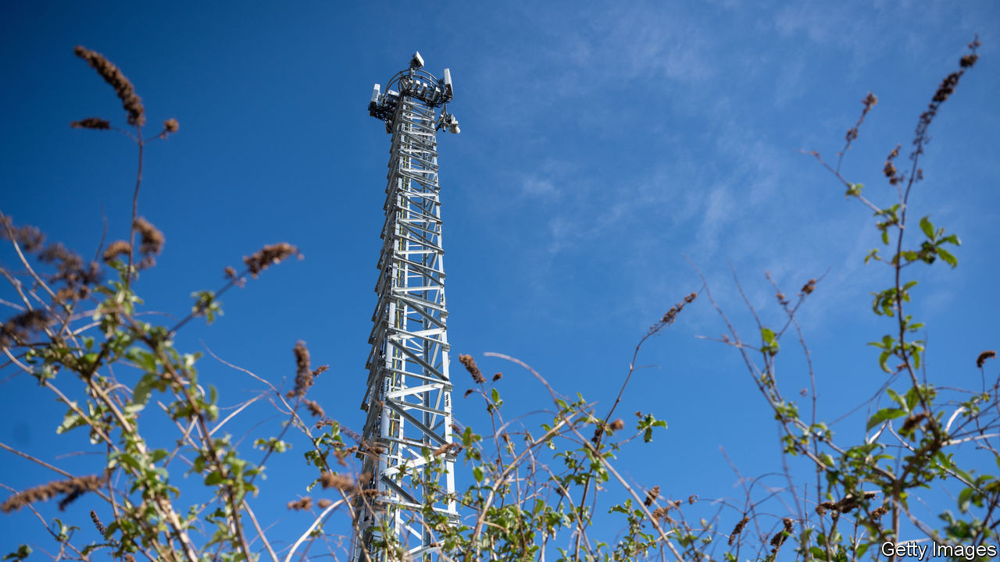
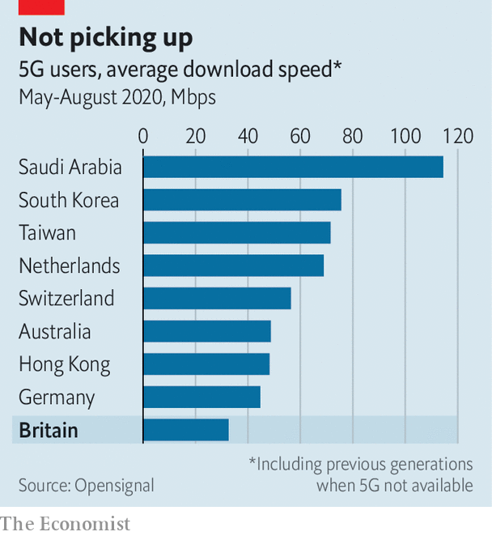

## So-so networks

# Britain’s 5G rollout faces myriad obstacles

> Geography, policy and economics all play a role

> Sep 3rd 2020

BRITONS HAVE long complained about their mobile networks. A report from the National Infrastructure Commission in 2016 compared Britain’s 4G coverage, unfavourably, to Albania’s. At that time, a much-hyped new technology was on the cards: 5G, or the fifth generation of networks, would offer superfast speeds and lots more capacity. The network went live last year, making Britain one of the first countries to offer it to consumers.

A new report from Opensignal, a network-analytics firm, compares the experience of using 5G in a dozen countries where it is available. Britons have little reason to cheer. British 5G users spend less than 5% of their time on the new network, compared with nearly 20% for Americans; 5G download speeds are in the bottom third; overall average download speeds are the lowest in the set (see chart).

One culprit is geography. The countries on Opensignal’s list that perform best are either small, such as Taiwan, or very big but with most people concentrated in a few urban areas, such as Saudi Arabia and Australia. Britain, like Germany, has some dense areas but also many sparsely populated rural areas where building lots of cell-towers is expensive, and returns slim. The lay of the land matters too. Hills and trees interfere with mobile signals. A second reason is planning. Other European countries have more liberal planning laws, says Karen Egan, a telecoms analyst with Enders Analysis, a research firm. Councils present one obstacle. The farmers on whose land towers need to go present another.

The way in which spectrum is allocated also affects the quality of the service. Just as more water flows through a broader pipe, the more spectrum an operator has, the better the service it can provide. Many countries have just three networks. Britain has four. That means more competition and lower prices, but also less spectrum for each. Moreover, only half of the 5G spectrum has so far been auctioned. When the next chunk is bought up, networks may find themselves with fragmented bits of spectrum. Ms Egan describes the operators’ spectrum as “barcode-like: rather slim slivers of it, rather than large bands”.

That might be fixable. Ofcom, the telecoms regulator, is open to facilitating swaps between networks, says Greig Paul, a networks expert at the University of Strathclyde. But new problems have arisen, such as the government’s decision to ban equipment manufactured by Huawei, a Chinese company, from 5G networks. That will slow its roll-out and increase its cost. Conspiracy theories linking 5G to covid-19 and other ailments do not help either.

This matters—not just for consumers but also for industrial and agricultural uses. The real promise of 5G is in vastly increased capacity. The new network can handle up to 1m connections per square kilometre, compared with some 2,000 for 4G. That is why much of the hype surrounding 5G has been about filling factories full of sensors or connecting cows to the internet. But uncertain rules slow progress and raise costs. As Mr Paul puts it, “you cannot possibly charge £10 per cow” per month. Operators will have to find a way to spend on infrastructure, control prices and greatly increase the number of connections all at the same time if they are to milk 5G.■

## URL

https://www.economist.com/britain/2020/09/03/britains-5g-rollout-faces-myriad-obstacles
