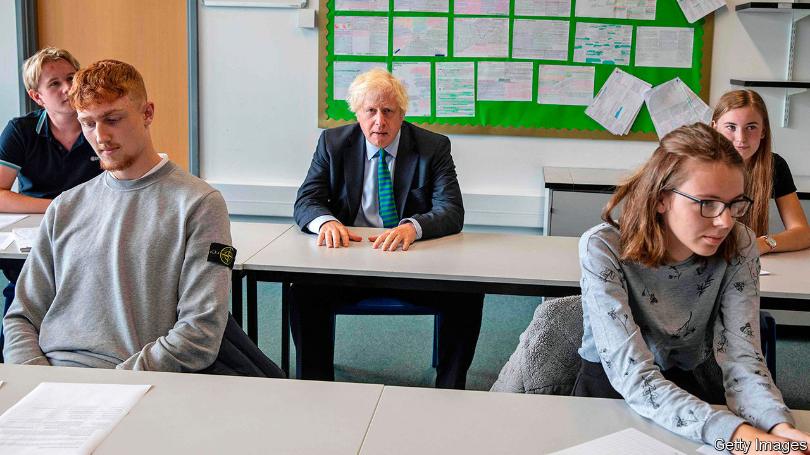
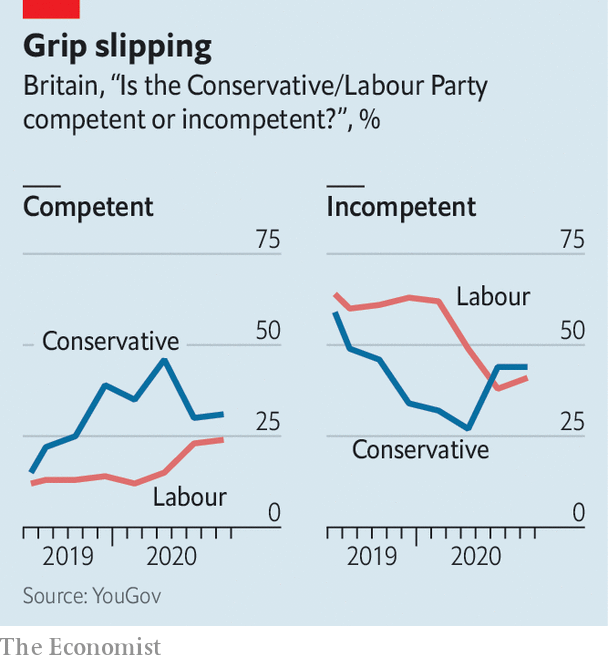

## Boris Johnson

# Competence matters, and Johnson hasn’t got it

> Support for the government remains strong, but it has gained a dangerous reputation for incompetence

> Sep 5th 2020BARNARD CASTLE

“I THOUGHT BORIS had a bit more authority about him,” says Rob Westley, a teacher. Mr Westley voted Conservative for the first time in the election last December but now he’s unsure who he would go for. The prime minister, he reckons, was too slow to respond to the coronavirus pandemic, and the exam-results mess created misery for his students. “He fluffed it,” he says. Leanne Rooney, a waitress, also voted Conservative for the first time last year, and is also having second thoughts. “I did like Boris’s ideas, but now I question his leadership,” she says. “He has been so flippant, and you can’t have that in a pandemic.”

Barnard Castle, in northern England, does not yet feature much in the great histories of the Conservative Party, but it will be prominent in the chronicles of the Johnson administration. It contributed to Mr Johnson’s greatest victory last December, as the constituency of Bishop Auckland elected 26-year-old Dehenna Davison as its first Conservative MP in a wave that unseated Labour from former mining and mill towns. It was also the scene of an infamous blunder, when his chief aide Dominic Cummings made a day trip to the town with his family during the long coronavirus lockdown.

Poor management of the pandemic followed by series of U-turns has damaged the government. It had insisted the algorithmically-set exam results were robust and dependable, but scrapped them after an outcry. It has changed its mind on whether face masks should be worn in shops and schools, months after they became commonplace elsewhere. The government has switched policy on providing free children’s meals during the school holidays, whether foreign NHS employees should pay a health-care levy, and when a moratorium on evictions should be lifted. The test-and-trace system to control the virus took months to work. “We’ve had more unforced errors this summer than I’ve seen in 30 years,” says an exasperated Tory.

Conservative MPs, who returned from their summer breaks on September 1st, blame an over-centralised Downing Street, an over-reliance on focus groups and a weak cabinet which lacks the confidence or foresight to predict problems. “We’ve got to stop talking about ‘world beating’,” says Charles Walker, a Tory MP, who likens Mr Johnson to a star football striker let down by a poor team. “What we need is ‘effective’—just workmanlike success.”

The Tory unease was fuelled by a poll on August 29th which found the Conservatives and Labour on 40% each, the first time the Conservatives had not been in front since July 2019. That was a fall from a peak of 55% in April. Yet this figure reflected a “rally round the flag” effect often found in democracies at times of crisis, which invariably subsides.

A better benchmark is the Tory result of 44% secured in the election in 2019. Excluding those like Mr Westley who are undecided, polls conducted in August found the Tories averaging 42% to Labour’s 37%. “The Tories have been in power for a decade, and for the opposition to still be behind at that point is extraordinary,” says Ben Page, chief executive of Ipsos MORI, a pollster. Voters—including Labour supporters—approve of the package of interventions to support workers and businesses designed by the chancellor of the exchequer, Rishi Sunak. A programme of weekday subsidies for restaurants “was a fantastic idea”, says Ms Rooney.

Tory MPs think their vote is holding up largely because Mr Johnson is aligned with the values of his base, much as “Teflon” Tony Blair could brush off scandal as long New Labour was attuned to the public mood. Folk in Barnard Castle credit Mr Johnson with pushing on with Brexit. When in trouble, he has tickled the country’s cultural divisions, claiming that Winston Churchill’s statue and the patriotic songs sung at the Proms are under threat from censorious forces.

But competence matters, and acts as a leading indicator of support. In “The Politics of Competence”, a 2017 study, Jane Green and Will Jennings show that new governments invariably enjoy a honeymoon, before errors accumulate, dragging a party’s polling lower like a yacht taking on water. Once gained, a reputation for incompetence is hard to shift.

Reversals are particularly harmful to Mr Johnson, who cast himself as the barnstorming antidote to Theresa May’s caution and paralysis. Johnsonism promised to “Get Brexit Done”—and other things, too, through large cheques, vim and can-do spirit. The attention to detail and patience that good governance demands are not part of the narrative.

All this works well for Sir Keir Starmer, Labour’s leader. Unlike his ideologically driven predecessor, Jeremy Corbyn, Sir Keir wants every government policy to be a test of competence. It suits his lawyerly, professional image and distracts from the splits in Labour’s electorate: to ask whether the Dover customs checks will be ready is to sidestep whether leaving the European Union is a good idea at all.

The strategy is paying off (see chart). Some polls show Sir Keir ahead of Mr Johnson as “best prime minister”. Mr Johnson stirs much more animosity in Labour voters than mild-mannered Sir Keir provokes in Tories. (“He has his head screwed on,” says Andrew Alderson, a Tory-voting retired firefighter in Barnard Castle, of Sir Keir). Overall, voters disapprove of the government’s handling of the pandemic and do not trust its ability to get a grip in the future. Most voters, including more than quarter of Tories, say Britain is “going in the wrong direction”.

Although the virus is now being effectively suppressed and GDP will bounce back strongly after the shutdown, winter will be hard. Mr Sunak is determined to end the furlough scheme next month. That will drive unemployment sharply upwards and may erode the goodwill his largesse to date has garnered. Mr Johnson is determined to help the economy recover by getting people back into their offices, but in other European countries increased mobility has pushed infection rates up. Whether or not Mr Johnson secures a Brexit trade agreement, leaving the EU’s single market and customs union on New Year’s Day will disrupt trade. His party is quarrelsome: he faces a rebellion over plans to build more houses in wealthy constituencies, and the prospect of tax rises to repair the public finances have alarmed his MPs. Mr Johnson’s marks in his first year have been poor, and he has more tough tests to sit.■

## URL

https://www.economist.com/britain/2020/09/05/competence-matters-and-johnson-hasnt-got-it
