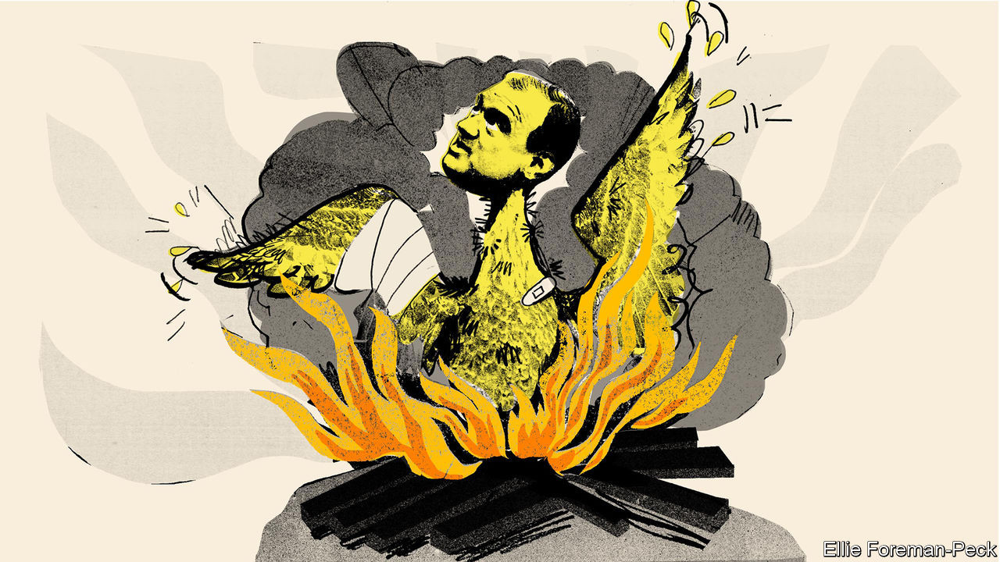

## Bagehot

# Could Ed Davey lead a Lib Dem revival?

> There’s life in the corpse

> Sep 5th 2020

THE MOOD in Westminster, as MPs return from their long break, is one of general frustration. Conservatives are frustrated with Boris Johnson’s inept leadership. Labour MPs are frustrated by their failure to translate that ineptitude into a clear lead. And Scottish Nationalists are frustrated that the one thing that they want, another independence referendum, is in the gift of a man who has no reason to give it. Still, when it comes to frustration nobody can compete with the Liberal Democrats.

The Lib Dems went into the last election hoping for a realignment that would boost their numbers and turn them into powerbrokers. They ended up with their seats reduced from 21 to 11 and their dream of remaining in the EU shattered. The party now has a new leader, Sir Ed Davey, who has tried to rouse them with the battle cry “wake up and smell the coffee”. This is hardly the stuff of Lloyd George, the last Liberal prime minister, whom John Maynard Keynes called a “goat-footed bard” on account of his eloquence. But Sir Ed is at least right that his party is sleeping rather than dead.

One of the Lib Dems’ greatest strengths is that, third-placed in a first-past-the-post system, they are masters of disappointment. Humiliation is part of their brand, as is the hope of a revival just around the corner. Peter Sloman, of Churchill College, Cambridge, points to a historical parallel with 1970-74. They went into the 1970 election with high hopes and ended up with just six seats. But then they picked themselves up, winning a succession of by-elections and taking almost 20% of the vote in February 1974, thus helping eject Edward Heath from office. There are reasons to think that they can repeat the trick.

The party’s new leader inherits some significant institutional strengths. The Lib Dems came second in 91 constituencies in 2019, compared with 38 in 2017 and 66 in 2015. They have more members than they have had for decades—120,000 compared with the Tory Party’s 150,000. There are about 90 Lib Dem peers, many of them with long experience in either central or local government or both, who can act as an ermine-clad think-tank. Sir Ed can also profit from a couple of long-term trends.

The first is the Labour Party’s move to the centre under Sir Keir Starmer. A centrist Labour Party sounds like bad news for the Lib Dems, but historically the opposite has been true. The Lib Dems do best when Labour has “safe” leaders, such as Tony Blair, because otherwise they are vulnerable to the charge that “a Lib Dem vote lets in Labour”. Paddy Ashdown, a former party leader, maintained there is a Labour-acceptability threshold below which wavering Tories will not vote Lib Dem. In 2019, thus, they would have had a better chance of taking Dominic Raab’s Esher and Walton seat and Sir John Redwood’s Wokingham seat had disillusioned Tories not been terrified of putting Jeremy Corbyn into Downing Street.

Sir Ed’s second advantage is the decontamination of the Lib Dem brand. The party managed to do as badly as it did in 2019 by pulling off a remarkable trick: despite not having run the country since 1922, it persuaded voters it was the party of the establishment because it gave its blessing to austerity as part of the coalition government in 2010-15 and sided with the “hidden state” in determination to overturn Brexit. Correcting this impression will not be easy given its leader’s knighthood and its legion of lords. But time will dull the memory of the coalition, and failure might revive the party’s image as a scrappy underdog.

The Lib Dems’ biggest problem in recent decades has been their lack of what politicos call a “core vote strategy”. Their voters have come from two incompatible groups: on the one hand, cosmopolitan liberals in suburbs and university towns who support the “double liberalism” of free markets and progressive values; on the other, provincial liberals, particularly in the Celtic fringe, who are motivated by local issues and dislike one or both parts of the liberal formula. Twenty-six of the 57 constituencies which elected Lib Dem MPs in 2010 voted leave in 2016.

A recent shift in voting patterns has solved this problem by accident: the party has strengthened its support in knowledge-intensive areas (particularly London and the south-east) while losing its old heartlands. This should make it much easier to produce a coherent programme. The current leadership will no doubt bang the drum on green issues (which Sir Ed is keen on) and civil rights (which Sir Keir is reluctant to embrace). And it has even more to gain from the problem of over-centralisation. The Lib Dems’ traditional enthusiasm for local government sits well with the rising concern that Britain is a dangerously unbalanced country.

Who cares? Even the Lib Dems’ strategists don’t expect more than 30 seats at the next election. Yet the possibility of a Lib Dem revival matters, for the party is likely to take votes from the Tories. The Lib Dems have always been at their happiest when engaged in ground wars with the Conservatives. Their new profile pits them even more directly against their old enemy. They have captured several Tory seats in a “yellow halo” around London such as Twickenham, St Albans and Richmond Park. Tim Bale, of Queen Mary College, London, calculates that, in 23 of the 29 seats that they are well positioned to win, they are the main challenger to the Conservatives, with every other party a distant third.

Sir Keir and Sir Ed have a lot in common other than their rather embarrassing knighthoods: both recognise that they have a mountain to climb and both are keen on the politics of competence rather than culture wars. They also have much to gain from working together, at least informally. Labour needs the Lib Dems more than ever because, having lost its base in Scotland, it is unlikely to form a government on its own. The Lib Dems see their future in detaching the educated bourgeoisie from the Conservatives. Old-fashioned liberals have been dreaming of a Lib-Lab rapprochement for decades. That vision—or mirage—is taking shape once more. ■

## URL

https://www.economist.com/britain/2020/09/05/could-ed-davey-lead-a-lib-dem-revival
