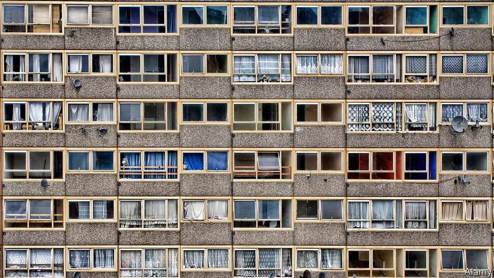
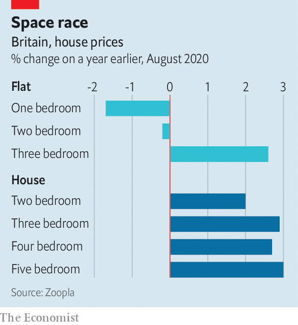

## The housing market

# Demand for apartments is flatlining in Britain

> People want more space, so houses are in

> Sep 3rd 2020

SHUT DOWN between March and May, the housing market has roared back to life. Nationwide, a lender, reckons prices hit a record high in August. Pent-up demand and a temporary cut in stamp duty have helped propel interest, but a bigger factor, according to estate agents, is that people are reassessing their housing needs. Spending weeks trapped indoors gave them a chance to think hard about their living quarters, while the rise in working from home is already having an impact. Richard Donnell, the research director of Zoopla, a property website, thinks that Britain has undergone a “once in a lifetime re-evaluation of housing requirements”.

People want more space. Price rises are positively correlated to size (see chart) and the value of one-bed flats has slipped since the market reopened. According to Zoopla, the time taken between the listing of a home and its receiving an accepted offer has fallen across the board but the larger the property, the bigger the fall. Five-bedroom houses, which in 2019 took an average of 48 days to attract an offer, are now being snapped up in 32 days, faster than one-bedroom flats. Three-bedroom houses, the category most in demand, are going in just 24 days. Renters as well as buyers are becoming less keen on flats. Apartments have fallen out of the top five categories searched for by potential tenants on Rightmove, another property website, in favour of smaller houses. Access to a garden or a nearby park are much more highly prized than a year ago.

Rightmove is advising estate agents who advertise on its website to emphasise different factors these days. Whereas in the past proximity to a train or tube station was much in demand, that “isn’t going to be such an important selling point for those buyers expecting to work from home more”, according to Miles Shipside of Rightmove. It is now, he explains, “all about showcasing a spare room in the best way”. He advises sellers to buy some cheap office furniture and put it in smaller bedrooms to demonstrate their potential as home offices.

The decline in the appeal of flats is a challenge for London. While flats represent only around a fifth of Britain’s housing stock, they make up just over half of London’s. According to Rightmove, after the lockdown, 54% of property searches by London residents have been for areas outside the capital, compared to 45% a year ago—the biggest fall in interest in any city. But the turn away from flats is a problem elsewhere, too. Flats make up about two-fifths of new properties built over the past decade, and housebuilders worry that the stereotypical block of converted flats in a former warehouse in London’s East End, Manchester’s Northern Quarter or Newcastle’s Quayside will see a permanent fall in value. “If you’re a prosperous two-earner couple in your late 20s you might now decide to skip the two-bed flat that used to be the first rung on the ladder and go straight to the three-bed semi in the suburbs,” says a housing boss.

The foreigners aren’t helping. They mostly buy newly built flats and, except in Hong Kong, where a change in the status of British Overseas National Passport holders is resulting in some interest, international demand for flats in Britain is slack, as investors wait to see where rental yields settle. But the big question is domestic: is homeworking for ever, not just for covid?■

## URL

https://www.economist.com/britain/2020/09/03/demand-for-apartments-is-flatlining-in-britain
