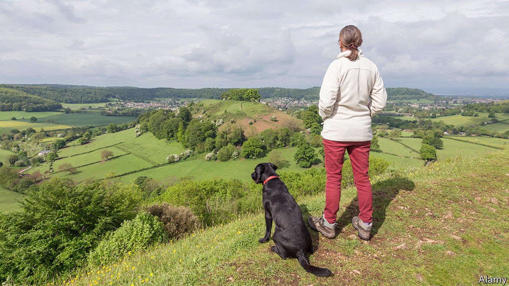

## Dog-walking

# Why Britons walk their dogs so much

> Parading the pooch

> Sep 3rd 2020

“WHEN I THINK of England, I think of the queen taking her dogs for a walk in the countryside,” says Carsten Haferkamp, a dog-owning German architect working in London. There may be something in the stereotype. Data from Tractive, a firm that provides GPS tracking for pets, show that Britons walk their dogs more than their European neighbours do.

British dogs get 177 minutes of activity a day, compared with 160 minutes for slack German pooches and 170 minutes for the average French mutt. That could be why they are slimmer than their European cousins: the average British labrador weighs in at 28kg, compared with 29kg and 31kg for its German and French counterparts. And it’s not just Europeans that British dog-owners outpace. Research by Carri Westgarth of Liverpool University has established that they are beating the footpaths more than Americans or Australians as well.

That continental European pooches are on the porky side has not gone unnoticed on the mainland. “Obesity among dogs is acknowledged as a problem,” says Fleur-Marie Missant of France’s Société Centrale Canine. James Serpell, professor of animal ethics and welfare at the University of Pennsylvania, suspects that excessive pampering, as well as under-walking, may contribute to the problem. “The French are super-indulgent with their dogs. They tolerate them in restaurants. I’ve been nudged by strange dogs under the table in France.” The German government is determined to get the country’s dogs—and dog-owners—off their sofas. Last month the agriculture minister announced plans to require dog-owners to walk their dogs twice a day.

The British devotion to dog-walking may have more to do with the walking than the dogs. Britons are big walkers—they came fifth in the world in a study in 2017, the highest in Europe. Dogs provide walkers with company and a purpose, so it may be that walking encourages dog-ownership, rather than vice versa.

But Julien Dugnoille, an anthropologist at Exeter University, suspects dog-walking has a deeper significance. Dogs, he suggests, are a useful aid to a socially awkward nation. “British people…tend to see dog-walking as a rare opportunity to socialise with strangers, to have a chat and exchange a few jokes and comments about the weather without putting themselves in danger (ie, without being too committed in their interaction).” The French, a nation of flâneurs, have no need of canine props.

A tradition among the British aristocracy of owning and training dogs also leads Dr Dugnoille to speculate that dog-walking retains some of its ancient kudos. When people in the park say “Max is very well-behaved,” says Dr Dugnoille, “that is a way to demonstrate mastery in the art of taming, an elevation above those dog owners who are ‘not in control of their own dog’, which is the ultimate faux-pas in public spaces.” But it’s not just about showing off, in his view. A Belgian who has lived in both Britain and France, he reckons the British are closer to their dogs than the French. Walking with one’s best friend “creates a time and space where dogs and humans meet as species and connect as individuals”.

Still, the British should not congratulate themselves too much on their behaviour towards their canine companions, for they are guilty of a universal hypocrisy. According to Dr Westgarth, “people say that a dog needs a walk every day, but they will find reasons why their dog doesn’t need a walk. They’ll say: he’s got company indoors, he’s nervous or he doesn’t like the rain.” Paw show. ■

## URL

https://www.economist.com/britain/2020/09/03/why-britons-walk-their-dogs-so-much
