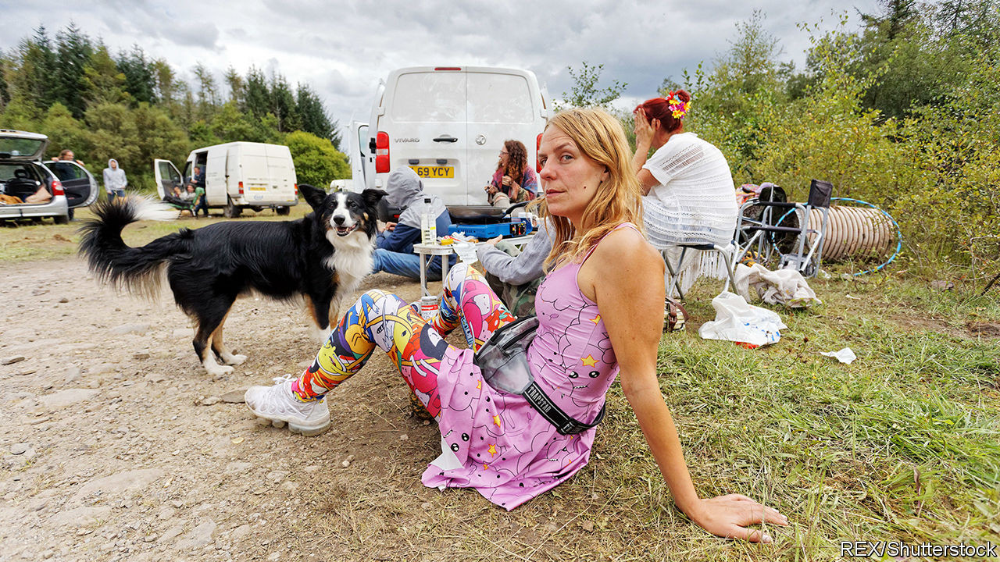

## Nightlife

# Why raves are enjoying a revival

> Britons are partying like it’s 1988

> Sep 3rd 2020

IT’S GROUNDHOG DECADE in Banwen, a small village in Wales. When the makers of the film “Pride” needed a location for an embattled Welsh mining community in the 1980s, they chose the tiny village on the edge of the Brecon Beacons. When 3,000 ravers arrived last weekend, that dubious decade seemed to be making a comeback.

Headlines about illegal raves recall the “second summer of love” in 1988, fuelled by the rise of dance music and party drugs such as ecstasy. The closure of clubs has revived that spirit this year, despite coronavirus restrictions banning gatherings of more than 30 people outdoors. The Metropolitan Police has recorded more than 1,000 raves (which it defines as unlicensed music events with more than 20 people) in London since the end of June. Between 2015 and 2018, the most raves reported to the Met in a single year was 133.

Even before the pandemic, raves were making a comeback. A combination of expensive rents in big cities and precarious operating licences has changed Britain’s nightlife. Big venues have passed their costs on to clubbers—entry to Printworks, a factory-turned-club in south-east London, can cost £40 ($54)—and drugs are less tolerated. In 2016 authorities revoked the licence of Fabric, a famous club in London, after two drug-related deaths. It reopened five months later, but with stricter rules, including ID-scanning and lifetime bans for anyone caught asking for drugs.

Smaller venues have taken advantage of big venues’ problems, and so have rave organisers. “You’ve got block parties, hippies in the woods, and London ones with middle-class people, thrown in a professional manner,” says James Morsh, who runs PillReport, a group that encourages people to rave responsibly. In May Mr Morsh organised the first socially distanced legal rave, with permission from Nottingham council. He had over 750 requests to attend, but could only allow 40 people to take part. He admits that it’s “not really what partying should be like”, although the arrival of 12 police officers gave the event an authentic feel. Once the police were satisfied that the revellers were not breaking any rules, they let them carry on.

Tougher punishments were introduced last month to deter people from partying. Eight organisers of the rave in Banwen were given fines of up to £10,000 each under the new regulations. But stopping determined ravers is hard, when locations are kept secret until the last minute and details shared through WhatsApp and Instagram. Mr Morsh thinks that the new penalties will have little effect: “The people throwing parties are going to keep throwing parties.”

The consequences for Banwen were not as grim as some feared. “When that many people turn up it’s a bit like ‘Oh shit, what have they come to do? Have they come to ruin the village?’,” says Alun, who lives nearby. But on checking it out, he found a fairly civilised event. Some attendees were even using hand sanitiser.

## URL

https://www.economist.com/britain/2020/09/03/why-raves-are-enjoying-a-revival
