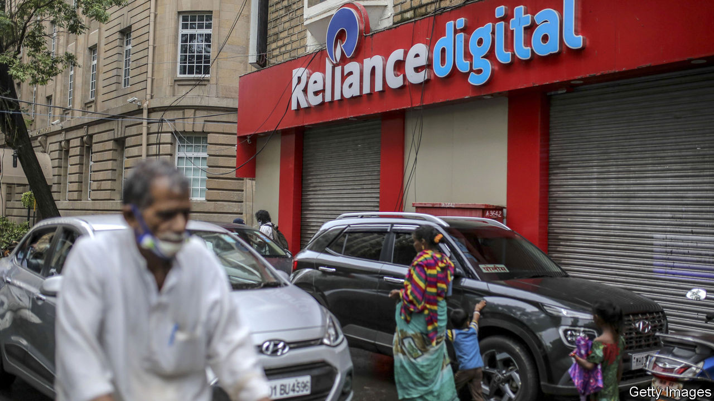
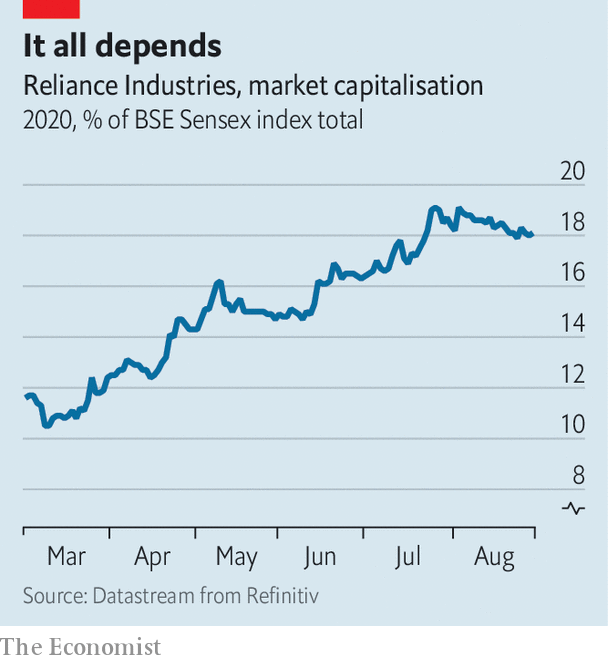

## Over-Reliance

# Can India’s biggest company keep getting bigger?

> Reliance Industries buys Future Group, its closest competitor in bricks-and-mortar retail

> Sep 3rd 2020

A FEW YEARS ago Future Group was seen as, well, the future of Indian retail. From humble beginnings making trousers in the 1980s, Kishore Biyani, its founder, built 2,000 shops in 400 cities across India, selling all manner of consumer goods. That is second only to the 3,700 retail outlets run by Reliance Industries, India’s largest conglomerate, which peddles everything from motor fuel to mobile phones. Future’s Big Bazaar supermarkets or Foodhall, a posh grocer, are enviably large and modern, as is its logistics network.

So enviable, in fact, that on August 29th Reliance said it would pay $3.4bn for most of the company. The combined group would account for one in three formal shops in India. “This transaction takes into account the interest of all stakeholders including lenders, shareholders, creditors,” said Mr Biyani in a statement.

Amazon might beg to differ. Last year the American e-empire struck a complex deal to provide Future, whose expansion had left it deeply indebted, with cash in exchange for an option to buy it later—law permitting. Despite fiddly visits from India’s regulators and trustbusters, Amazon’s hope was that the deal would go ahead. No such luck. On the contrary, India’s government has been making it harder for foreigners to own Indian warehouses and delivery fleets. It has tightened restrictions further amid the covid-19 pandemic.

As an Indian firm, Reliance faces no such obstacles. In the past year it has emerged as India Inc’s undisputed champion. It now accounts for 18% of the market value of India’s 30 biggest firms (see chart) and has secured $20bn in foreign investments in Jio, its mobile-network-turned-digital-platform. Investors including Facebook, a social-media giant, and KKR, a private-equity one, appear to have concluded that the best way to get a piece of India’s future is through a piece of its biggest player.

Mr Biyani may have had no choice but to find a buyer for his group. In a securities filing in March he said Future Group was investigating “baseless and false” rumours about the finances of subsidiaries that were undermining their share price. On August 31st a subsidiary defaulted on some bonds held by mutual funds run by Franklin Templeton, a big American asset manager. The debt is supposed to be repaid from the proceeds of the sale to Reliance, Franklin Templeton said. Still, being part of Mr Ambani’s empire may not have been the sort of future Mr Biyani had in mind.■

## URL

https://www.economist.com/business/2020/09/03/can-indias-biggest-company-keep-getting-bigger
