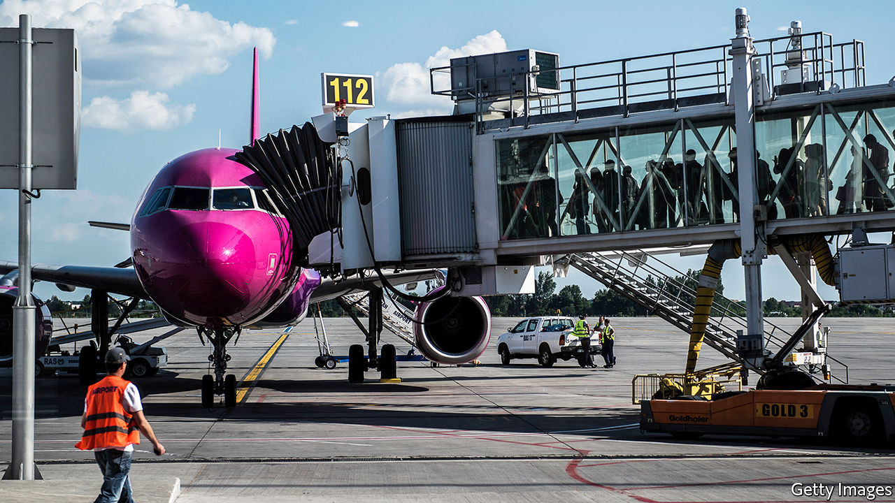
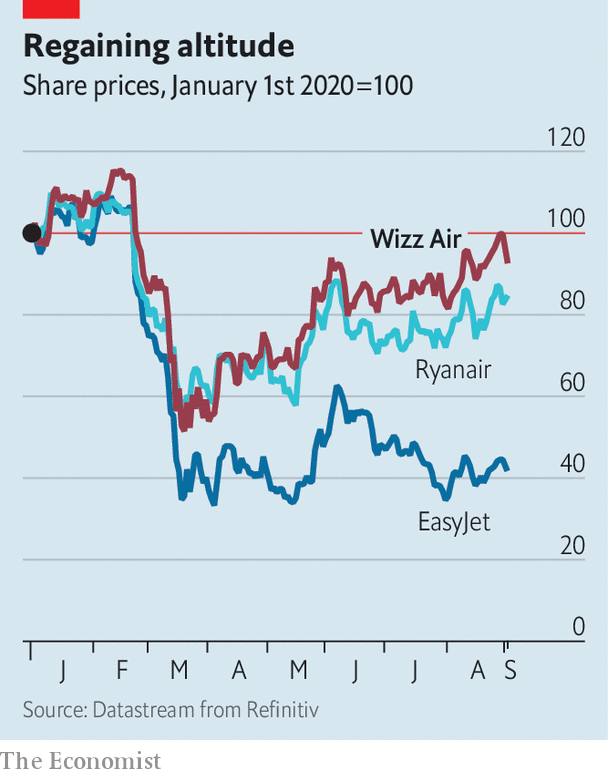

## Rising in the east

# Can Wizz Air soar amid the pandemic?

> The Hungarian low-cost carrier looks better placed than rivals to thrive

> Sep 3rd 2020

THE MOOD among airline bosses can seem uniformly bleak. For good reason: air travel may not return to pre-pandemic levels until 2024. Not a week goes by without an airline sacking thousands of workers. Against this gloom, Jozsef Varadi, who runs Wizz Air, cuts an audacious figure. While other airlines cancel and defer orders for new planes and put expansion plans on ice, he wants to increase his fleet from 127 planes to 160 by 2022 and double passenger numbers to 80m by 2025. He believes the Hungarian low-cost carrier, founded 17 years ago and now Europe’s third-biggest behind Ryanair and EasyJet, will not only survive covid-19 but thrive.

Can the plan fly? “The odds are it will,” says Keith McMullan of Aviation Strategy, a consultancy. Wizz Air managed to report a 19% rise in revenues in the 12 months to March, to €2.8bn ($3.1bn). Net profits doubled year on year, to €281m. Despite unavoidable losses this year, it has sustained less covid-19 damage than rivals.

Luck played a role. Wizz Air’s customers are on average 32 years old—younger than those of rivals and less fearful of the virus. It caters to many central and eastern Europeans working in the west, who are keen to fly home frequently. Wizz Air’s smaller fleet, less than a third the size of Ryanair’s and half of EasyJet’s, meant it could keep a bigger share of its aircraft in the air.

Wizz Air’s resilience is not all down to good fortune. Mr Varadi’s focus on costs helped, too. He claims Wizz Air’s are the lowest in the business, thanks mainly to the industry’s largest fleet of super-efficient Airbus A321s (though he got lucky here, too, by not picking Boeing’s rival 737 MAX jets, the grounding of which after two fatal crashes has delayed deliveries to big buyers like Ryanair). Using the biggest version of the single-aisle workhorse has helped to spread expenses among more passengers. One estimate put Wizz Air’s unit costs at half those of EasyJet, an airline that increasingly resembles the legacy carriers it once sought to subvert. And Mr Varadi has pulled this off without irritating passengers or gaining a Ryanair-like reputation for stinginess.

Now, thanks to mass lay-offs of pilots, cabin crew and other staff, labour costs are tumbling. Empty airports are wooing carriers with cheap landing slots and discounts on other charges. That has allowed Wizz Air to set up ten new bases in the past three months, including at London’s Gatwick airport, as well as in Germany, Albania and Russia. Plans to serve the Persian Gulf in a joint venture with Abu Dhabi’s sovereign-wealth fund remain on track.

Things could still go wrong. On September 1st, as European countries reimposed travel restrictions, Wizz Air tempered its plans to return to 80% capacity next quarter. It is now aiming for 60%, still better than 45% or so for most European rivals. Its share price is below its peak in mid-February, but back where it was at the start of the year (see chart). Mr Varadi says Wizz Air’s €1.5bn in cash would last 20 months even if all its planes stop flying. He relishes the chance to “sort winners from losers”. No points for guessing which group he thinks his firm belongs to.■

Editor’s note: Some of our covid-19 coverage is free for readers of The Economist Today, our daily [newsletter](https://www.economist.com/https://my.economist.com/user#newsletter). For more stories and our pandemic tracker, see our [hub](https://www.economist.com//news/2020/03/11/the-economists-coverage-of-the-coronavirus)

## URL

https://www.economist.com/business/2020/09/03/can-wizz-air-soar-amid-the-pandemic
