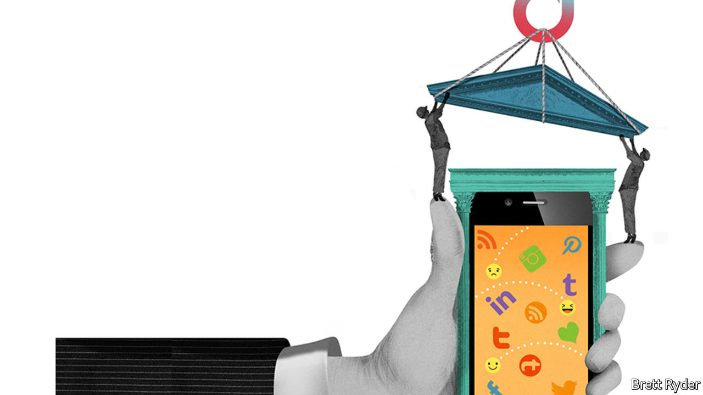

## Schumpeter

# Could you build a better TikTok?

> The short-video app offers its putative American buyers a chance to rethink social-media business and governance models

> Sep 5th 2020

“A MAINSTREAM GIANT goes countercultural.” That is how the technology press described the decision in the early 2000s by IBM, then a paragon of corporate IT, to back Linux, an obscure operating system written by a ragtag collection of activist coders. In the event, the unnatural combination wound up being a match made in computing heaven. It turned Linux into a serious rival to Microsoft’s Windows, then the dominant operating system, and justified the decentralised way that Linux had been developed. This benefited IBM and fuelled the rise of cloud computing, which is mostly powered by Linux and similar “open source” software.

The tech industry may soon witness a similarly curious pairing. Microsoft and Oracle, a big software firm, are—along with other, less serious suitors—fighting over TikTok, a Chinese-owned short-video app. Its sale is far from assured (see [article](https://www.economist.com//node/21791418)). But if a deal were struck it too could prove momentous, this time as a chance to redefine how big online platforms are run. TikTok could become the Linux of social media—and a model for others.

The current debate over platform governance centres on two options, neither of them appealing. Governments tell firms what to do (in part already the case in Germany). Or firms can regulate themselves (as happens in most other places, including America). In a recent paper Dipayan Ghosh and Josh Simons of Harvard University propose a third way, more fitting for what the authors call “algorithmic infrastructure”—utilities for the digital public square. Governments should set a broad framework and let platforms experiment within it, the authors suggest.

TikTok could become just such an experiment. It is a young service unburdened by an ingrained business model or governance structure. ByteDance, its Chinese owner, has barely begun building these for the American market. None of TikTok’s wooers, including Oracle and Microsoft, has much experience running a social-media platform. So each could try something new as TikTok takes on social media’s incumbents, notably Facebook and Google.

Start with the business model. Social-media firms make almost all their money from advertising. This pushes them to collect as much user data as possible, the better to target ads. Critics call this “surveillance capitalism”. It also gives them every reason to make their services as addictive as possible, so users watch more ads.

The new owner is unlikely to do away with advertising in favour of subscriptions; teenagers are notoriously unwilling to pay for online content. But the new TikTok could offer an ad-free version for those who prefer to pay with cash rather than attention. It could also consider other revenue sources, for example taking a cut from enabling seamless sales of something users see in a clip or charging professional influencers once they have reached a certain prominence (1m followers should be worth at least $100 a month to TikTok stars). As for ads, TikTok could target only broad categories of users instead of individuals, much as firms once bought ads in newspapers. Advertisers, who love microtargeting, need not necessarily object, so long as TikTok remains popular with its coveted young demographic group.

Respectful management of data offers another business opportunity. TikTok could give users more control, telling them how much their data are worth and managing information on their behalf, as a data trust of sorts. Other firms could tap your TikTok “data account” if you agree and they pay—a model pioneered by startups like digi.me and CitizenMe, which pocket a share of the proceeds from the data deals.

Perhaps most important, the new owner could turn TikTok from a social-media service to a digital commonwealth, governed by a set of rules akin to a constitution with its own checks and balances. User councils (a legislature, if you will) could have a say in writing guidelines for content moderation. Management (the executive branch) would be obliged to follow due process. And people who felt their posts had been wrongfully taken down could appeal to an independent arbiter (the judiciary). Facebook has toyed with platform constitutionalism: it once let users vote on privacy changes (mostly as a PR stunt) and now has an “oversight board” to hear user appeals (a more serious effort). But the social network introduced these only in response to mounting criticisms. Drafting rules at the outset might make them more credible.

Why would any company limit itself this way? For one thing, it is what some firms say they want. Microsoft in particular claims to be a responsible tech giant. In January its chief executive, Satya Nadella, told fellow plutocrats in Davos about the need for “data dignity”—ie, granting users more control over their data and a bigger share of the value these data create. Brad Smith, Microsoft’s president, last year wrote a book in which he argued that technology firms “must accept greater responsibility for the future”.

Governments increasingly concur. In its Digital Services Act, to be unveiled later this year, the European Union is likely to demand transparency and due process from social-media platforms. In America, ideas for making them more accountable appear on both sides of the partisan divide. “Citizens who are using these platforms every day should have a say in what content is acceptable,” says Johnnie Moore, an evangelical leader who has the ear of President Donald Trump. Andrew Yang, a former Democratic presidential candidate, has launched a campaign to get online firms to pay users a “digital dividend”. Getting ahead of such ideas makes more sense than re-engineering platforms later to comply.

Today’s social-media titans will resist change. But they may reconsider, as Microsoft did with Linux. Mr Nadella’s predecessor, Steve Ballmer, once called open-source software “a cancer”. Today, Microsoft is one of the biggest users of and contributors to such projects. Surreal as it sounds, 20 years from now Facebook and Google may have reconstituted themselves for the better, too.■

## URL

https://www.economist.com/business/2020/09/05/could-you-build-a-better-tiktok
