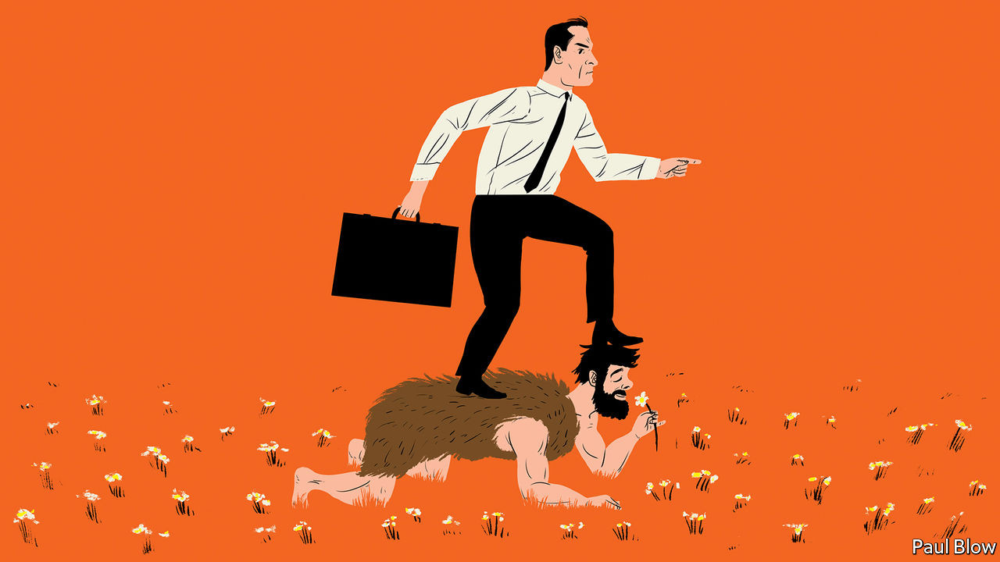

## Bartleby

# How has humans’ relationship with work changed over millennia?

> An anthropologist examines the world of work

> Sep 3rd 2020

THE STUDY of working life tends to be dominated by economists, management consultants and business-school professors. So it is nice to get a new perspective. James Suzman, an anthropologist, provides that fresh appraisal in an ambitious new book called “Work: A History of How We Spend Our Time”.

Mr Suzman’s interpretation has a quasi-Biblical feel in which hunter-gatherers, like the Ju/’hoansi tribesmen of southern Africa whom he has studied, lived in the garden of Eden. They worked only 15 hours a week and shared their provisions equally. Then came “the fall” and the arrival of agriculture, which brought with it hierarchical societies, inequality, harder work and poorer diets. Farming’s only, but crucial, advantage was that the pastoralists were able to outbreed the hunter-gatherers and eventually displace them from the land.

Farming also brought a change of mentality. Hunter-gatherers may occasionally go short of food but they are rarely short of time. Agriculture is more driven by the calendar: a time to plant and a time to harvest. It also requires regular maintenance: weeding of plants, milking of cows and mending of fences. Human life became more regimented.

The seasonal nature of agriculture also had implications. Grain needed to be stored and those who controlled the stores became the elite. This led to the development of writing, as the surplus was traded and rations allocated. As well as grain silos, some agricultural societies built monumental edifices like the pyramids. That, too, required new professions like stonemasons and carpenters. In time, humans gathered in towns and cities, which also created specialist occupations like shopkeepers.

Perhaps the development of sophisticated societies was inevitable. As Mr Suzman notes, humans’ complex brains expend a lot of energy processing information. When you are awake you constantly seek out stimulation and engagement, and when you are deprived of information you suffer from boredom.

This analysis helps explain modern habits. The efficiency of agriculture and the exploitation of energy sources such as coal and oil has allowed people in the developed world to meet their basic needs of food and warmth. But human brains need to be kept active. People created tasks for themselves. First there was the Industrial Revolution, which sent workers into factories. Automation subsequently made manufacturing more efficient, at the cost of many jobs.

The rise of the service sector, Mr Suzman suggests, is a way for people to keep themselves busy, even though many individuals are dissatisfied with work they feel is meaningless. Another sign of the human need for activity is that people now undertake what was once considered work (fishing, gardening, baking) as hobbies.

The result of this process, he argues, is an unsatisfactory relationship between humans and their jobs. “The work we do also defines who we are; determines our future prospects, dictates where and with whom we spend most of our time; mediates our sense of self-worth; moulds many of our values and orients our political loyalties,” he writes.

Humans have come to view idleness as a sin and industriousness as a virtue, and teach children that hard work will pay off. In today’s developed economies, though, there is little correspondence between time worked and monetary reward. Indeed, Mr Suzman questions “why we are content to let our markets reward those in often pointless or parasitic roles so much more than those we recognise as essential”.

This familiar criticism may strike a chord with many readers. However, Mr Suzman’s view of modern society gives little credit to economic growth. Thanks to prosperity, fewer mothers die in childbirth or infants in their early years. People in general are taller and live longer; they have a higher level of education and more choices than before.

Economic growth also brings innovation. Bartleby’s mother was particularly grateful for the invention of the washing machine, which saved her a day a week of scrubbing and wringing wet clothes through the mangle.

If humankind had stuck to hunting and gathering, there would be a lot fewer humans. Even if Mr Suzman had been alive in such a world, he would have been unable to study anthropology or write books. Modern work can indeed be boring—and so, as the pandemic has shown, can sitting at home. Not many people would want to live their lives back in the year 1020, or even 102000 BC.

## URL

https://www.economist.com/business/2020/09/03/how-has-humans-relationship-with-work-changed-over-millennia
