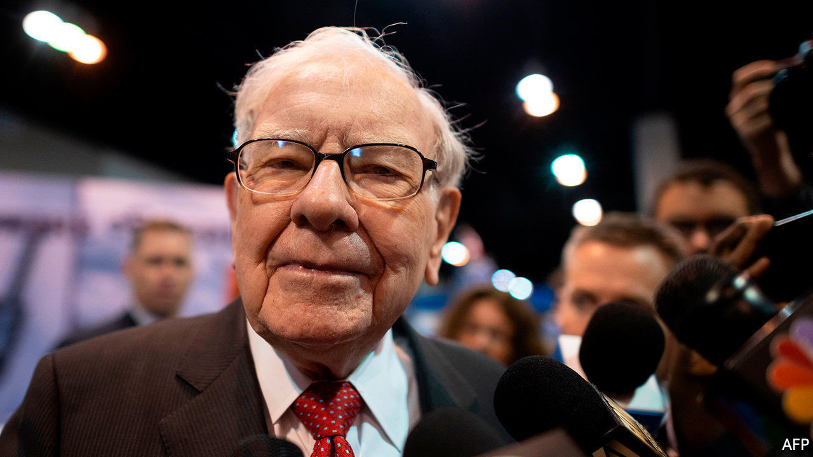
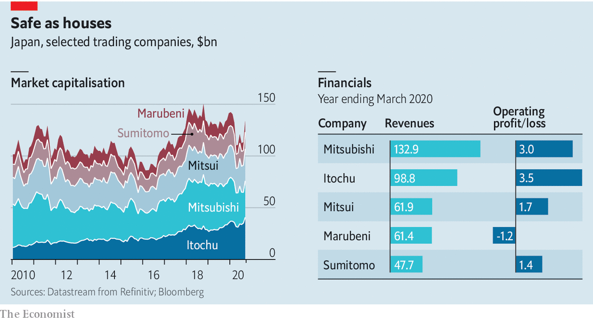

## Safe as houses

# What does Warren Buffett want with Japanese trading houses?

> Berkshire Hathaway gambles on five businesses that look a lot like his own

> Sep 3rd 2020

WARREN BUFFETT famously likes his businesses simple to understand and transparent. Why, then, has his conglomerate, Berkshire Hathaway, poured $6bn into 5% stakes in Japan’s five biggest trading houses? Mitsubishi, Itochu, Mitsui, Marubeni and Sumitomo do not appear to meet either criterion. They run a bewildering array of subsidiaries in most sectors of the economy. In that they bear a passing resemblance to Berkshire itself. Perhaps more important, though, they satisfied two other Buffett must-haves: their shares, dented by covid-19, looked cheap, and they pay reliable dividends.■

## URL

https://www.economist.com/business/2020/09/03/what-does-warren-buffett-want-with-japanese-trading-houses
