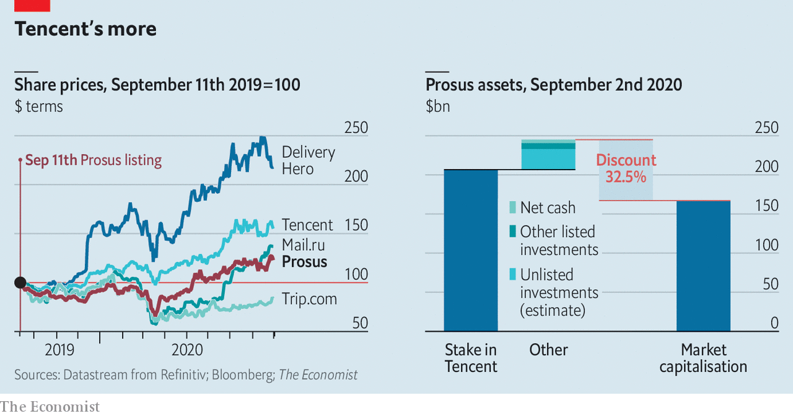

## Winner’s curse

# What is Prosus, Europe’s consumer-internet star, for?

> Investors question the purpose of the old continent’s fourth-biggest company

> Sep 3rd 2020PARIS

FEW FIRMS struggle with too much success. One is Naspers, a South African media group founded in 1915. In a prescient bid to diversify away from newspapers in 2001 it paid $32m for a large stake in a piddly Chinese startup. Tencent, the startup in question, has since morphed into a gaming and messaging behemoth worth over $670bn. Dealing with the windfall presents unique management headaches.

The unexpected upshot of a South African investment in China is a European consumer-internet giant. A year ago Naspers listed Prosus, a vehicle for its online bets, in Amsterdam. By dint of owning 31% of Tencent, worth about $208bn, as well as other investments made since, Prosus is the EU’s fourth-most-valuable firm. It is also the closest that Europe has to the global tech stars that dominate the world’s stockmarkets. Its boss, Bob van Dijk, acknowledges the firm’s model may be unusual in the tech world. But, he argues, it can still deliver value.

Prosus has invested billions—and has ever more billions to invest, thanks to Tencent’s continued success—into all manner of online ventures, from e-commerce to food delivery, distance learning and classified ads. Though run from the Netherlands, much of its empire lies in emerging markets, a nod to its African heritage. Deep pockets let it build online businesses or aggregate local players into global platforms.

As exciting as that sounds, Mr van Dijk has a more prosaic problem: proving to the outside world the firm needs to exist. He insists Prosus has found a distinctive approach. Unlike venture capitalists, it does not need to return money to investors. It can back businesses for the very long term and, because it runs some of them, has “an operator’s DNA”. Few of its investments have been busts.

Investors are sending mixed signals. Its market capitalisation of $167bn is about a fifth less than the value of its Tencent shares. Add the other firms it has stakes in, some of which are listed, as well as $4.5bn of net cash on its balance-sheet, and the discount rises to 33%—a gap of $80bn or so (see chart). Its share price has risen of late, but not as fast as those of its holdings. Markets seem to be valuing the portfolio of companies which Prosus has spent over $12bn building at less than nothing.

That looks unduly harsh. The management of what is now Prosus has made bets which, though less spectacular than Tencent, would not shame most venture capitalists. The classifieds business it built up, OLX, has 300m monthly users in 22 markets. PayU, a payments arm, has grown rapidly, notably in India. An Indian e-commerce investment, Flipkart, generated a return of $1.6bn when it was sold to Walmart in 2018. Prosus’s minority stakes in Delivery Hero, a food-delivery service active in 40 countries, and Mail.ru, a Russian social-media firm, are worth much more than what it paid.

But challenges abound. Many Prosus bets have tricky economics, promising jam tomorrow with fruit and sugar nowhere to be seen today. Adjusted for its stakes, its food operations lost $624m in the year to March, on revenues of $751m. Of the businesses it runs, only the classifieds turn a (small) operating profit. Some of its investments are in industries likely to be profitable only if mergers create winners that could attract the gaze of trustbusters.

Continuing to grow fast will require buying rivals with heady valuations. In the past year Prosus has narrowly lost out on Just Eat, an $8bn food-delivery business, and eBay’s classified-ads business, which fetched $9bn. “On the one hand, you do want to be disciplined and not overspend on acquisitions,” says Ken Rumph of Jefferies, an investment bank. “On the other, if you keep on finishing second you don’t get to execute your strategy.”

Of 2020’s vagaries, covid-19 should help lure new customers online. But the ongoing trade skirmishes between America and China pose a risk for owners of Chinese assets. Last month President Donald Trump gave Americans 45 days to stop doing business with WeChat, Tencent’s messaging app (as well as with TikTok, a video app—see [article](https://www.economist.com//node/21791418)). Tencent shares tumbled, dragging Prosus down with it.

Potential investors may also be put off by Prosus’s corporate structure. Naspers still owns 73% of the shares, and the two firms are essentially run as one. Even if the parent sold down its stake, its shares would carry 1,000 times more voting power than anyone else’s. Naspers itself has similar super-voting shareholders, who are seen as close to management. They call the shots.

Naspers’s dual voting structure was put in place to protect editorial independence and carried over to Prosus, though it owns no media assets. Tech founders often use dual shares to protect their legacy. But Prosus is a subsidiary of a century-old firm. Whatever the rationale, the effect is to shield executives from being held to account. A strong board might rein them in. But its chairman, the former Naspers chief executive who pulled off the Tencent deal, is no counterweight. When two-thirds of ordinary shareholders in 2017 voted against the pay deals of Mr van Dijk and others, their gripes were mostly ignored.

Other firms have grappled with the curse of success. Yahoo struck gold with Alibaba, another Chinese tech titan—only to be undone by it when activist shareholders pushed the American search pioneer to spin off other operations in 2017, leaving mainly the Alibaba stake, which was sold off in 2019. SoftBank, a Japanese group which also made a bundle off Alibaba, took a different route. Its boss, Son Masayoshi, parlayed his windfall into a complex empire of telecoms, property and venture capital. Whether that has been a wise use of Alibaba’s riches is an open question; Mr Son has had some big blow-ups. Investors have recently nudged him to sell some assets to cut back debt.

Mr van Dijk need not worry about debt or activist investors, who would no doubt campaign to offload the Tencent stake. Yet not cashing in has borne handsome rewards. By trimming the lucrative stake bit by bit—it sold about 2% of the firm in 2018, raising $10bn—Prosus can indulge its bosses’ empire-building instincts while giving shareholders access to Tencent’s growth. Listing in Amsterdam was meant to give global investors a chance to buy into Mr van Dijk’s broader vision, boosting Prosus’s value and crushing the conglomerate discount. So far this has not happened. Unless shareholders have a real say in what Prosus is for, it may never do. ■

## URL

https://www.economist.com/business/2020/09/03/what-is-prosus-europes-consumer-internet-star-for
