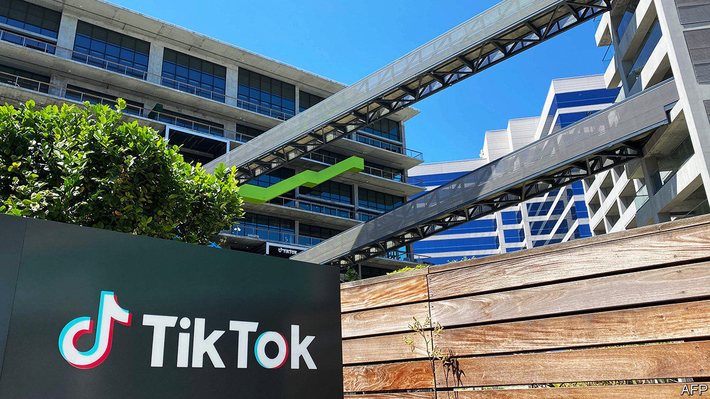

## Doing the limbo

# Will Beijing derail the TikTok deal?

> Chinese export restrictions throw a spanner in the American bidding war for the hit short-video app

> Sep 5th 2020

INVESTORS IN BYTEDANCE have got used to being caught between superpowers. They were still taken aback on August 28th, when an update to China’s export-licensing regime blocked the sale of the hot Chinese technology firm’s prize asset—the American arm of TikTok, a short-video app—to American firms and investors.

A Chinese riposte to President Donald Trump’s campaign against TikTok was inevitable. He contends it could give China’s Communist Party means to spy on Americans and conduct disinformation campaigns. TikTok’s assurances that it does not censor content unflattering to Beijing orsend personal data to China have fallen on deaf ears. Last month Mr Trump issued two executive orders aimed at TikTok, the most recent of which will ban it in the United States if it is not in American ownership by November 12th.

Microsoft and Oracle, two software giants, put in rival bids of around $25bn-30bn for TikTok’s operations in four markets—America, Canada, New Zealand and Australia. Oracle enlisted some American venture-capital backers of ByteDance, including Sequoia Capital and General Atlantic. It would be more hands-off than Microsoft and could let ByteDance or its founder, Zhang Yiming, reinvest in TikTok later on. A strategic sale to Microsoft would be more definitive. But Mr Zhang favoured it, according to people close to ByteDance. He once worked at Microsoft and is said to admire its chief executive, Satya Nadella. Microsoft also beefed up its bid by teaming up with Walmart, a retail colossus.

Then came the Beijing bombshell. China’s commerce ministry added certain types of artificial intelligence, as well as personalised information-push technology and data analysis, to a list of products critical to national security. These can no longer be sold abroad without official permission. They are also what makes TikTok tick. ByteDance quickly said it would obey the new rules.

There was always ambiguity as to whether the app’s American suitors would get its algorithm. They might have bought only the brand, its users, ad-buying platform and less advanced software. But ByteDance’s recommendation engine is a big part of TikTok’s appeal. It has been honed for years with data from millions of users around the world and displays an uncanny ability to divine peoples’ viewing tastes.

So Microsoft and Oracle structured their bids to keep access to ByteDance’s code. According to a shareholder, both are offering ByteDance $5bn-10bn upfront, then another $5bn or so a year for a few years depending on TikTok’s revenues and performance. In exchange, ByteDance would provide technological enhancements and updates every six months or so.

“ByteDance is over a barrel, so it has to earn the price,” says the shareholder. Trying to write a brand-new TikTok algorithm in America is out of the question, says another investor. It would be as difficult as starting a new company, he says. The Trump administration appeared to accept that TikTok would keep technology ties with ByteDance, so long as data security was ensured by an American owner and the link did not last for ever.

Now Microsoft and Oracle await ByteDance’s decision. They may withdraw their bids or amend them, to take account of the fresh uncertainty over what they would be getting. Once ByteDance signals its intentions and any revised bids are in, it could take 30 days to get China’s go-ahead. ByteDance could then request an extension to Mr Trump’s November deadline, perhaps hoping that he loses to Joe Biden in elections on November 3rd. 

The risk of TikTok being blocked in America remains substantial. The Chinese government may refuse to grant an export licence and buyers could walk away. This would deprive ByteDance of billions. But that may be a price China is willing to pay to prevent America from setting a bad precedent by forcing the sale of a Chinese technology to American interests.

As for Mr Zhang, taking a stand against Mr Trump would earn him kudos, and possible rewards, at home. State approval is not something the independent-minded entrepreneur has sought. He may yet have little choice but to accept it.■

## URL

https://www.economist.com/business/2020/09/05/will-beijing-derail-the-tiktok-deal
