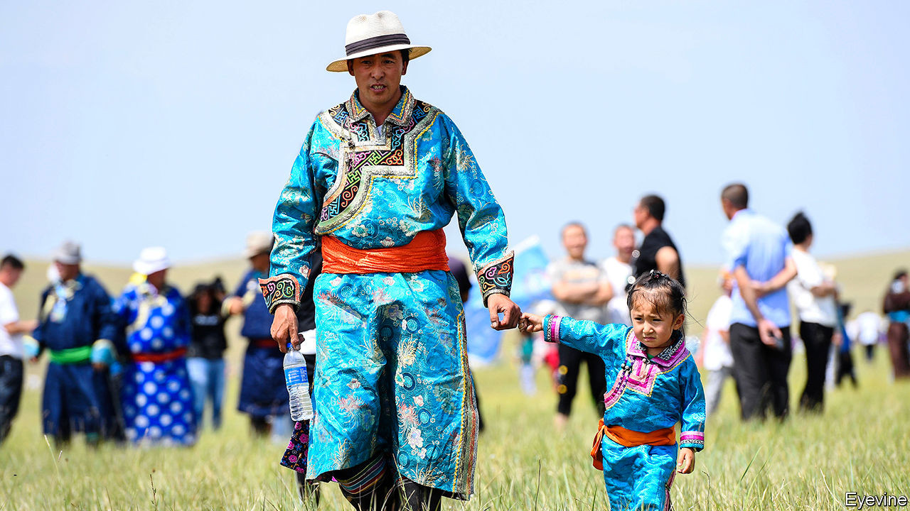

## Mongolingualism

# China’s efforts to boost Mandarin-use in schools angers ethnic Mongols

> Some parents have been staging rare protests

> Sep 5th 2020

ON THE FIRST day of the school year in Inner Mongolia, a northern province of China, some teachers in schools using the Mongolian language found their classrooms empty. To show their anger at an official order that Mandarin be used to teach history, politics and literature, parents had kept their children at home. In recent years the government has stepped up repression in parts of China with large ethnic-minority populations, making widespread protests all but impossible. In Inner Mongolia ethnic tensions have seldom reached levels seen in Tibet or Xinjiang, so the school boycott is especially remarkable.

The Communist Party has never been as fearful of unrest among Inner Mongolia’s ethnic Mongols as it is of protests by ethnic Tibetans, or Uighurs in Xinjiang. One reason is that a massive influx of ethnic-Han Chinese over the past few decades has reduced ethnic Mongols to less than a fifth of the province’s population of nearly 25m people. Their separate identity has long since been eroded. Most (unlike some Tibetans and Uighurs) are bilingual. But ethnic Mongols often still cherish their traditional culture and language. By requiring more use of Mandarin in schools, the party risks fuelling dissent.

The boycott has affected many schools across Inner Mongolia. Protesters have submitted thousands of petitions to the government, some using a traditional Mongolian format that involves signatories putting their names in a circle to avoid any one of them being perceived as a ringleader. Videos circulated online show parents singing Mongolian songs outside schools. In one clip, high-school students shout, “Mongolian is our mother tongue! We are Mongolian until death!”

Fearful of police reprisals, protesters have posted messages online warning against the use of violence, and even against any action on the streets. “We’ve all agreed to stay united by keeping our children at home,” says a herder from Xilingol League, a prefecture in Inner Mongolia. “But we know that if we take to the streets in protest, we will be thrown into jail.”

The changes under way in Inner Mongolia’s schools were rolled out in Xinjiang in 2017 and in Tibet the following year. They will eventually affect students in Inner Mongolia throughout their nine years of compulsory education. This academic year they apply only to those in the first year of secondary school and first year of primary. Parents worry that their children will lose fluency in Mongolian and grow up unable to use the classical Mongolian script. They take particular pride in this form of writing. Mongolia, an independent country to the north, more commonly uses the Cyrillic script—a hangover from its days as a satellite of the Soviet Union.

The authorities are already cracking down. The herder says two of her relatives who had spoken out against the new language policy disappeared on August 31st. Users of Inner Mongolia’s only Mongolian-language social-media platform, Bainu, have found that access to their feeds has been blocked. Censors have erased posts about the protests from other social media. Local officials have ordered teachers to press parents to send their children to school. Ethnic-Mongol party members, civil servants and teachers have been told that if they join the boycott they may lose their jobs and party membership. Tibetans and Uighurs have long been familiar with such bullying. Ethnic Mongols will have to get more used to it. ■

## URL

https://www.economist.com/china/2020/09/05/chinas-efforts-to-boost-mandarin-use-in-schools-angers-ethnic-mongols
