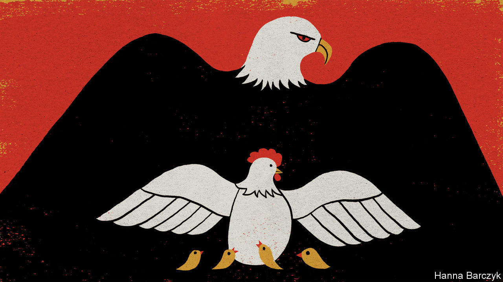

## Chaguan

# To buy peace, officials in China tolerate some forms of disobedience

> Their goal, though, is the maintenance of power

> Sep 5th 2020

FOR A BUSINESS that flouts the law in a police state, Mrs Hu’s pancake cart is not hard to find. A tiny, unlicensed kitchen on wheels, her pushcart appears each night between 11pm and dawn on a road junction in central Beijing, between a centuries-old temple and a bus station. Neither summer heat nor snow deters Mrs Hu. Only rain keeps her at home, because it clears the streets of customers. On a recent night, diners munching her egg and onion pancakes, perched outdoors on low plastic stools, ranged from young hipsters to a bus driver still in her uniform.

It is not the romance of the night that inspires Mrs Hu’s hours. Working by day would increase the risks of trouble from the chengguan—poorly paid, widely disliked city-management officers who enforce local regulations in urban areas. In Beijing the rules are ever-less tolerant of street food, deemed unhygienic and unworthy of a capital city. There has been one positive change: less than five years ago chengguan were often violent, grabbing stallholders’ goods and demanding money. Now chengguan shoo vendors away but do not hit them. Mrs Hu ascribes their improved manners to a government campaign for “civilised law-enforcement”.

A migrant from central China, she remains an outsider with few rights although she has lived in Beijing for 24 years. She and her husband once worked legally from a rented market stall. Then two markets in a row were demolished in the name of modernity, forcing the couple onto night-time streets with separate pancake carts. Worldly wise, the pair stayed calm when the prime minister, Li Keqiang, suggested this summer that encouraging street traders might boost a covid-battered economy. Food carts may be welcomed by smaller cities but not in Beijing, says Mrs Hu. Indeed, the capital is currently closing markets and sweeping away vegetable-sellers from its streets. So she and her husband survive by keeping their heads down and working hard. Like many, they live on the margins of society, navigating an authoritarian system that wields its powers more selectively than outsiders may suppose.

There is nothing kindly about that security machine, which crushes all hints of political, religious or ethnic dissent or open challenges to the Communist Party. The machine is bent on abolishing privacy, with surveillance cameras on every corner and censors and algorithms scouring the online world for forbidden ideas. Yet when public-security agencies encounter non-political rule-breakers or even protesters, they can be unexpectedly willing to turn a blind eye or make concessions to offenders.

Such haggling is common at the lowest levels of law-enforcement, where the chengguan work. As luck would have it, a remarkable documentary about these para-police has just secured a limited release in Chinese cinemas. “City Dream”, directed by Chen Weijun, follows chengguan from the central (and, since then, virus-hit) city of Wuhan, as they match wits with Wang Tiancheng, a 70-year-old street trader with a genius for staging the sorts of noisy protests that win the sympathy of a watching crowd, while humiliating officers sent to demolish his sprawling, unlawful street stall.

Cities created chengguan in the late 1990s to tackle non-criminal forms of disorder, after the dismantling of the planned economy left urbanites less dependent on the state and triggered a wave of rural migration into cities. The documentary begins in 2014, shortly after Wuhan announced a revolution in city management as part of a development drive. At the time chengguan had a grim reputation across China, following a number of deaths caused by officers as well as fatal attacks on them as they were carrying out raids to demolish homes or clear informal markets.

High-ups in the city-management bureau loathe “Old Wang”, as everyone calls him. “Close the gates! Old Wang is on his way!” they yelp, as the former farmer heads to the chengguan offices, barrel-chested, shirtless and demanding to see the boss. Sure that he makes more money than he lets on, officials send patrolmen to spy on his fruit sales (an undercover officer returns in tears, after Old Wang grabs his notebook). A senior chengguan declares that the street trader, who moved to Wuhan 14 years earlier from the central province of Henan, should be renting a clean, respectable shop. “That’s the real life of a city dweller,” the officer sniffs. In contrast, street-level chengguan are grudgingly impressed by Old Wang’s flair for drama. During several raids on his stall, the trader tells gawking onlookers about his disabled son and cancer-stricken wife. He slaps a chengguan, tears up legal notices, accuses officers of taking bribes to leave his competitors alone, threatens to commit suicide and—in an astonishing moment—appeals to his tormentors as fellow outcasts at the bottom of society. “Where is your conscience?” Old Wang asks chengguan who have penned him within a square formed of their riot shields. “A second ago you were just like me. A man with no job.” None can meet his gaze.

At one point Old Wang’s son compares his father to a hen, frantically trying to protect chicks from an eagle. It is a revealing image. In the end Old Wang loses, for he is thrashing around in the grip of a much stronger beast. But he gains a concession, too: the city’s help to stay and work in Wuhan for three more years, until his granddaughter, a good student, finishes secondary school. The price is apologising in writing for his earlier defiance. Later a chengguan is rebuked by a superior for suggesting that the Wang family are sincerely grateful. Their emotions are not of interest, snaps the official: “What we want is their obedience to our management.”

This brilliant film explains a seeming puzzle: the hard men who run China are capable of both brutality and pragmatism. The key is their obsession with social stability. To buy peace, China’s autocrats tolerate and even reward some forms of disobedience, so long as the game ends with displays of deference to their authority. Their goal, though, is the maintenance of power. Like an eagle adjusting its grip, the party is not guided by mercy. ■

## URL

https://www.economist.com/china/2020/09/05/to-buy-peace-officials-in-china-tolerate-some-forms-of-disobedience
