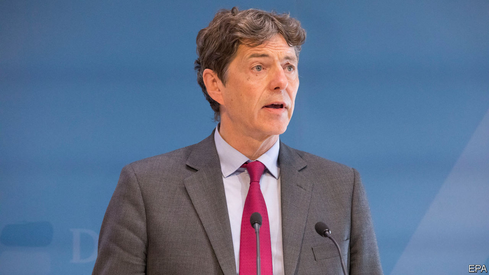

## Not much of a welcome

# A low point in German-Polish relations

> The new German ambassador’s father loomed large over his appointment

> Sep 5th 2020BERLIN

EVEN JACEK CZAPUTOWICZ, the outgoing Polish foreign minister, called the delay “strange” in an interview on August 31st with Rzeczpospolita, a Polish daily. For three months Arndt Freytag von Loringhoven was waiting in his apartment in Berlin for his agrément (official diplomatic approval) as German envoy to Warsaw, usually a swift formality. The order to procrastinate came reportedly from high up: Jaroslaw Kaczynski, chairman of the ruling Law and Justice (PiS) party, and Poland’s de facto leader, opposed Mr Freytag von Loringhoven’s appointment because his father served as a military officer in Hitler’s bunker during the last months of the second world war. (Bernd Freytag von Loringhoven was never charged with any war crime.)

It is not the first time Mr Kaczynski has sought a confrontation with Poland’s neighbour and biggest trading partner. He has accused Germany of scheming to recover land it lost to Poland after the war and Angela Merkel, the German chancellor, of being a pawn of the Stasi, the former East German secret police. Radek Sikorski, a former Polish foreign minister whose tenure was marked by improved relations with Germany, says Mr Kaczynski’s party called him a “junior German foreign minister” after he said in a speech in 2011 in Berlin that German inaction was scarier than Germans in action. (The speech was an appeal to save the euro.) The PiS, which was then in opposition, also tried to get Mr Sikorski sacked from his job.

In the past few months Andrzej Duda, Poland’s recently re-elected president, joined in, with tantrums fanning anti-German feeling that play well with older voters in the less prosperous eastern provinces of Poland, a pivotal PiS constituency. Mr Duda railed against German interference in the presidential election campaign in favour of his opponent, in particular by Fakt, a tabloid owned by Ringier Axel Springer, a German-Swiss publisher. He singled out Philipp Fritz, a correspondent for Die Welt, a German daily, who had suggested that Rafal Trzaskowski, Mr Duda’s rival, would bring calm to German-Polish relations because he was unlikely to make astronomical demands for reparations for the ravages of the war.

The German government did not withdraw the appointment of Mr Freytag von Loringhoven, one of the country’s most experienced diplomats, who had previously served as a well-liked ambassador to the Czech Republic. The standoff started to attract international attention. On the evening before the 81st anniversary of the Nazi invasion of Poland on September 1st the Polish government at last held out an olive branch. Szymon Szynkowski vel Sek, Poland’s deputy foreign minister, announced the agrément of the new envoy, but not without referring to a special Polish sensitivity related to “a great unhealed wound in the minds of the Polish nation” caused by the crimes of the second world war.

Mr Freytag von Loringhoven will not have an easy start in Warsaw. He will deal with Zbigniew Rau, the new foreign minister, an ardent supporter of PiS who has virtually no experience in foreign policy. They will need to work through complex disputes such as Nord Stream 2, a gas pipeline from western Russia to north-eastern Germany backed by the Germans but bitterly opposed by the Poles. He will also try to revive the French-German-Polish “Weimar triangle”, once a constructive forum for political and military discussions. And he will clearly have to set aside a lot of time to be hectored about the horrors that Germany once inflicted on Poland. ■

## URL

https://www.economist.com/europe/2020/09/05/a-low-point-in-german-polish-relations
