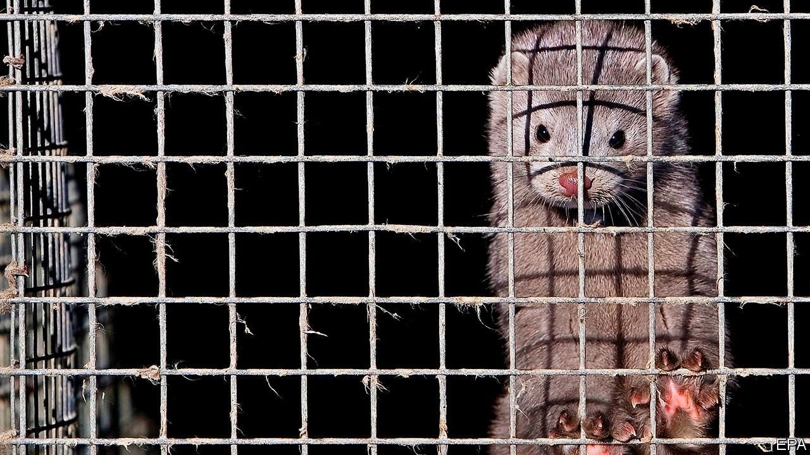

## Not fur sale

# Covid-19 ends Dutch mink farming

> An unexpected win for animal-rights activists

> Sep 5th 2020AMSTERDAM

ANIMAL-RIGHTS activists often complain that cute beasts get more sympathy than equally deserving ugly ones. If so, one would think a cuddly critter like the mink would be easy to protect. Yet in the Netherlands, mink are the only animal that can still legally be farmed for their fur. That is about to change. On August 28th the government brought forward to March a ban on mink-farming that had been scheduled to take effect in 2024. The timetable was sped up not because mink had become more adorable, but because they can contract covid-19 and spread it to humans.

Dutch farmers normally raise about 2.5m mink a year, making the Netherlands the world’s fourth-largest producer after Denmark, China and Poland. In April a clutch of mink and the farm hands who tended them were diagnosed with covid-19. Genetic tracing showed that at least two workers had probably been infected by mink, rather than the other way around. The contaminated animals were destroyed and stricter hygiene rules imposed, but by summer the virus had spread to a third of the country’s farms. In June parliament voted to shut down the industry as soon as possible, and the cabinet agreed.

That was a win for the Netherlands’ Party for the Animals, which has four seats in the 150-member parliament. In 2013 it helped pass the law that gave mink farmers until 2024 to get out of the business. Now the party and its allies object to the lavish compensation the government has offered for bringing forward the deadline: €150m ($178m), or €1m-€1.5m per farmer. Some MPs allege that the compensation paid for destroying the infected minks was higher than the market price for their fur.

Fur farmers say modern standards allow mink to be raised humanely, and that they are not a big reason for the spread of the virus. But mink are solitary predators; animal-rights advocates say they cannot be raised humanely in stacked cages. As for covid-19, the worry is that mink could serve as a reservoir for it to evade human immunisation programmes. The industry’s turnover is modest (farmers put it at €150m-200m, activists at under €100m), and polls show the public overwhelmingly opposes it. “In a democratic country, that widespread conviction has to translate into a political decision to ban fur farming,” says Esther Ouwehand, leader of the Party for the Animals. The farmers accept they are shutting down. The remaining argument is over money.

Editor’s note: Some of our covid-19 coverage is free for readers of The Economist Today, our daily [newsletter](https://www.economist.com/https://my.economist.com/user#newsletter). For more stories and our pandemic tracker, see our [hub](https://www.economist.com//news/2020/03/11/the-economists-coverage-of-the-coronavirus)

## URL

https://www.economist.com/europe/2020/09/05/covid-19-ends-dutch-mink-farming
